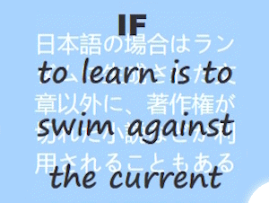
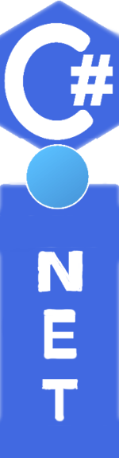
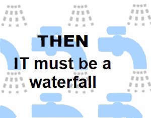

<table><tr valign="center">
    <td colspan="2" align="right">
      <picture></picture>
    </td><td>
     &nbsp; <a href="../README+/software/design/"><b>D&thinsp;e&thinsp;s&thinsp;i&thinsp;g&thinsp;n</b></a>&thinsp;∑&nbsp <i>feat.</i>
           
     <!-- -->
     <!--                               NAMES, DRIVES, SAMPLES          --!>
     <!-- -->
     &nbsp; &nbsp; &nbsp; <a href="../README+/software/design/names/README.md">Names</a>&thinsp;⚙️&thinsp;
    <a href="../README+/software/design/drive//README.md">Drives</a>&thinsp;➰&thinsp;<a href="../README+/software/design/samples/README.md">Samples</a> 
     <!-- -->
     <!--                               QA and TESTS          --!>
     <!-- -->
     &nbsp; <a href="../README+/software/QA/"><b>Q&thinsp;A</b></a>&thinsp;&nbsp;⊃&thinsp;⊂&nbsp;<a href="../README+/software/tests/"><b>T&thinsp;e&thinsp;s&thinsp;t&thinsp;s</b></a>&nbsp; &nbsp;<i>feat.</i>
      
    &nbsp; &nbsp; &nbsp; <a href="../README+/software/QA/README+/code-quality.md">Code quality</a>&nbsp; &nbsp;🧪&thinsp;<a href="../README+/software/tests/asQA/README+/tests-damp_vs_dry.md">D<samp>AMP</samp>⚔️D<samp>RY</samp></a>
     <!-- -->
     <!--                               DOCU and ORG          --!>
     <!-- -->
     <h4>&nbsp;<a href="../README+/software/docu"><b><ins>D&thinsp;o&thinsp;c&thinsp;u</ins></b></a> ➿ <a href="../README+/software/mngmnt"><b><ins>O&thinsp;r&thinsp;g&thinsp;a&thinsp;n&thinsp;i&thinsp;z&thinsp;a&thinsp;t&thinsp;i&thinsp;o&thinsp;n</ins></b></a></h4>
    <!-- -->
     <!--                              P E N C R A F T          --!>
     <!-- -->
     <a href="../README+/pencraft"><b>P&thinsp;E&thinsp;N&thinsp;C&thinsp;R&thinsp;A&thinsp;F&thinsp;T</b></a>&nbsp;∏&nbsp; &nbsp; &nbsp; &nbsp;
        :octocat:&thinsp;<mark><a href="../README+/pencraft/README+/kyrios-markdown_on_git.md">Markdown</a></mark> 
      &nbsp; 🥱<a href="../README+/pencraft/README+/essays/README.md">&thinsp;<b><samp>ESSAYS</samp></b>&thinsp;</a>&nbsp;🪝<a href="../README+/pencraft/README+/memes/README.md">Memes</a>&nbsp; 🥨<a href="../README+/pencraft/README+/quotes/README.md">Quotes</a>
     </td>
                                                                                        <!--          A r c D e c o   S I D E B A R    --!>
    <td align="center"><a href="../README+/software/ArcDeco/README.md"><picture>
</picture></a></td>
                                           <!--                   C# . N E T               --!>
</tr><tr></tr><tr><td>
    
</td><td>
<a href="../README+/.net/README.md"><b>C</b>#️⃣&nbsp;<b>I&thinsp;n&thinsp;t&thinsp;r&thinsp;o</b>&nbsp;🎼</a>&nbsp; &nbsp; 
&nbsp; &nbsp; &nbsp;<a href="../README+/.net/README+/cs-drawbacks.md">Drawbacks</a>&nbsp;✖️&nbsp;
<a href="../README+/.net/README+/cs-lacks.md">Lacks</a>&nbsp;➗&nbsp;
  
&nbsp; &nbsp; &nbsp;<a href="../README+/.net/README+/cs-malpractice.md">Malpractices</a>&nbsp;➕&nbsp;<a href="../README+/.net/README+/cs-feat_underused.md">Underused</a>
  <!--                                                C#   S I D E S    a n d    P A R T S         --!>
 &nbsp; <b>♯</b>&nbsp;<b>S&thinsp;i&thinsp;d&thinsp;e&thinsp;s&thinsp;/&thinsp;P&thinsp;a&thinsp;r&thinsp;t&thinsp;s</b>
    
&nbsp; &nbsp; &nbsp; <a href="../README+/.net/README+/parts/cs-lacks-parts.md">Nice to have</a>&nbsp;➖&nbsp;<a href="../README+/.net/README+/parts/cs-feat_shadow.md">In shadow</a> 
     <!--                               WPF          --!>
  &nbsp; 🪟&nbsp;<a href="../README+/.net/README+/wpf"><b>W&thinsp;P&thinsp;F</b></a>
    <!--                   C L O S E R  to  C O D E      --!>
   <kbd>&thinsp;<b>CLOSER to CODE</b>&thinsp;</kbd> 
  &nbsp; &nbsp;<a href="../README+/.net/README+/cs-hints.md"><b>&thinsp;Hints&thinsp;</b></a>&nbsp;➡️&nbsp;
 <a href="https://github.com/byteshaus/use-dev/tree/main/README%2B/frames">Frames</a>&nbsp; <b>.&thinsp;.&thinsp;.</b>
  
 &nbsp; &nbsp;<b>.&thinsp;.&thinsp;.</b>&nbsp; and more on <a href="https://github.com/byteshaus/use-dev/blob/main/.github/README.md"><b>&thinsp;use-dev&thinsp;</b></a>&nbsp;
</td><td colspan="2" align="left">
<picture></picture>
     </td>
</table>
🔚 ... if this navigation is baffling &rArr; start with <a href="../README+/pencraft/README+/essays/README.md"><b>&thinsp;E<samp>SSAYS</samp>&thinsp;</b></a> ... 🌔 2020-2025 ...
