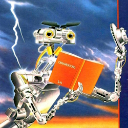
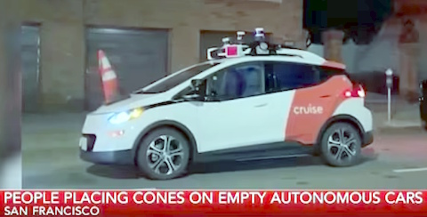
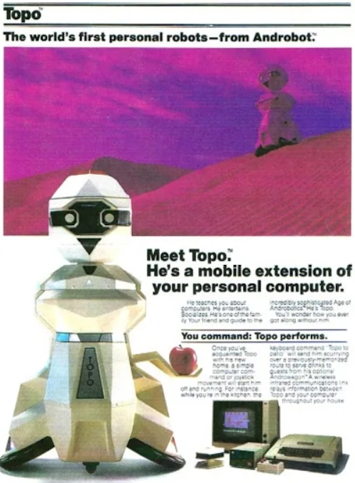

# AI Twenties. Much ado about ... fussing?

In the heat records breaking mid-2020s _Artificial Intelligence_ is on trend again. Nobody will dodge this "IntelliSteamPunk" festival - __AI__ and __GPT__ are in every other lecture, article, or product release.

Torrents of news and announcements have urged prominent software engineers, scientists, and their leads to [consider a dam](https://futureoflife.org/open-letter/pause-giant-ai-experiments/) against [AI&nbsp;dystopia](https://www.businessinsider.com/ai-extinction-risk-openai-deepmind-anthropic-ceos-sam-altman-2023-5), while other visions are:

<ins>&nbsp;<b>IMPRESSIVE MAINSTREAM</b>&nbsp;</ins>

&nbsp;

> __AI is the most profound technology humanity is working on today.__\
*Sundar Pichai*, Google CEO

> **Software is eating the world, but AI is going to eat software.**\
*Jensen Huang*, CEO of NVIDIA

> **Generative AI’s impact on productivity could add trillions of dollars [annually]...**\
MkCinsey & Company

> **By 2029, computers will have emotional intelligence and be convincing as people.**\
*Ray Kurzweil*, inventor and futurist

> **There is no reason and no way that a human mind can keep up with an artificial intelligence machine by 2035.**\
_Gray Scott_, futurist, techno-philosopher, founder and CEO of SeriousWonder

\__________________________________________

<ins>&nbsp;<b><samp>OCCASIONAL PRAGMATISM</samp></b>&nbsp;</ins>

* *Ginni Rometty*, former CEO of IBM:\
"Some people call this artificial intelligence, but the reality is this technology will enhance us. So instead of artificial intelligence, I think we'll augment our intelligence."

* *Larry Page*, Google co-founder:\
"Artificial intelligence would be the ultimate version of Google. ... Unfortunately, we’re nowhere near doing that now."\
[Well, it was in 2000]

* _Christopher Nolan_, filmmaker, questioned about AI in a 2023 interview:\
"... the real world is, by definition, infinitely complex. ... And so, any digital simulation or technology that simulates, eventually, it always hits a particular limitation."

* _Michael Atleson_, Attorney, Federal Trade Commission, 27/Feb/2023:\
"Keep your AI claims in check."

* _Sam Altman,_ [on/off] CEO of OpenAI, 04/Dec/2022:\
"**i am a stochastic parrot, and so r u**."&nbsp;🦜\
[vs. _Arikia Millikan_: [Parrots are not stochastic and neither are you](https://www.content-technologist.com/stochastic-parrots/).]

&nbsp;&nbsp;&nbsp;&nbsp;&nbsp;&nbsp;&nbsp;&nbsp;&nbsp;&nbsp;&nbsp;🦜 The term Prof. Emily M. Bender _et al_ coined in her essay "On the Dangers of Stochastic Parrots: Can Language Models Be Too Big?".

\__________________________________________

<ins>&nbsp;<b>philistine margins</b>&nbsp;</ins>

&nbsp;

 
*&nbsp;Images are for illustrative purposes only and were taken from Wiki Commons and IMLO (learncomputerscienceonline.com)

\__________________________________________

# Stumbling block

<table><tr valign="top"><td>
       <picture></picture>
  <i>Cogito, ergo sum</i>
               </td><td>
 
Neither philosophy nor natural sciences claim to credibly formulate <i>intelligence</i>. Its genesis, individual rise, and (un)consciousness behind are a bigger mystery

<b>Digitalization speaks in precise definitions &mdash; and there are none.</b>

  
Adepts of bright and heralds of dismal <samp><b>AI</b></samp> future are fain to assume its <i>self-knowledge/awareness</i> as a matter of time. &mdash; 
To brew by itself in increasingly complex code bouillon (heated by GPUs), or get all of a sudden <i>short-circuited</i>.

     </td><td>
          <picture></picture> 
           <a href="https://www.imdb.com/title/tt0091949">Short Circuit</a>🎦, 1986
</td></tr></table>

> **Judging decision-making as a relay switching of neurons preset by acquired knowledge ingenuously simplifies the free will debate.**

<b>IT</b> fantastically and reliably automates hard cogitative ops:coffee:, but not brittle abstraction, (self-)criticism, motivation &mdash; the precursors of great enlightenings in sciences and arts:art:.\
&nbsp;&nbsp;&nbsp;&nbsp;:coffee: Where humans are slow, prone to errors, lack parallelism, and finally get distracted, fatigued, or frustrated.\
&nbsp;&nbsp;&nbsp;&nbsp;:art: Fed with plain plots (keywords) bots may generate impressive video shorts, but it could be only a gifted artist who will weave a _magnum opus_ using AI tools or not.

## Evidence

* You still can think up a 🍁🅿️🪒**🇨🇭**🅰️, which a brainiac will untwist but Internet-connected AI-bot may only exhaust (unless you limit attempts)💫.\
The same fellow may create unique text, image, or script that GPT will pick in search results to quote.👓

* The progress of computing powers allowed _assisted mathematical proofs_, which were impossible before.\But neural networks of all the processors have solved no open _mathematical problem_:1234:. Humans do.🧑‍🔬

* It was a unique supercomputer (IBM Deep Blue) that finally beat the world chess champion in 1997 - now it could be amateur freeware on a trash smartphone.\
However, humanoid developers wrote C/C++ for their engines (up to _Stockfish_ and _Leela Chess Zero_), while AI can't generate a better one. 

* IDEs and assists may boost dev productivity, but if any AI claims to write the code, it will be either a predefined snippet or a rated Q&A or you need to describe the requirements closely to operators.

* _Supervised machine learning_, that nurtured the [Mechanical&nbsp;Turk](https://en.wikipedia.org/wiki/Mechanical_Turk)<b>w</b>, 
now shades significant human assistance and intervention backing many AI-claimed processes (individually by developers and by thousands in low-rate support).

* Many prolific users of creative and hosting tools and contributors to Q&A and imageboards were stunned to know that their input will "train" chatbots under updated _terms of service_.

👆 **Compare to hash functions on pure math, which had silently revolutionalized IT before the blockchain boom.**

\___________\
💫 What's more significant is that humans may judge CAPTCHAs as intentional or occasional nonsense and give up. And _vice versa_ - discern a challenge-response disguised within content or chaos.\
👓 Vice versa insert of generated or pasted content in "original" publications is predetermined to disclosure.\
:1234: Conditions for many are short and digestible enough to be a clause for a chatbot. (E.g. "Can a _perfect number_ be odd&thinsp;?")\
🧑‍🔬 As <i>Grigori Perelman</i> solved the sinlge of seven <i>Millenium Problems</i> (the <i>Poincaré conjecture</i>, announced in 2010).

<table><tr><td width="40%"><picture></picture></td><td>

Driving is a vivid subject of automation, done almost to the whole extent, and <i>machine learning</i> must have closed the little gap of less predictable hazards and blockages.

However after millions of miles in real traffic under the human safeguard no <i>deus ex machine</i> (aka <b>Full</b> Self-Driving or Auto-pilot <i>level&nbsp;5</i>) emerged &mdash; still "next year".

</td></tr></table>

## Conclusions

 «<mark>**AI**</mark>» overhypes <b>IT</b> potential and credits groundbreaking products:hammer_and_wrench: with self-learning.
 
Protagonists put the synergism of natural intelligence🧑‍🔬 on rising computing powers and wrap it with HQ videos, splendid presentations, and compelling orations.

<mark>AI bots</mark> found their rich niche in recycling terabytes of rated input from millions of users. 
Famous brands apply "AI" to everything (like TV sets), and myriad startups seize the moment to sell sn**AI**ke oil for right everything: from a toothbrush to fortune-telling (to name decent).

&nbsp;&nbsp;&nbsp;&nbsp;:hammer_and_wrench: Processing global amounts of data in real-time, finding patterns there; on-the-fly video recognition and filtering; routine translation and text generation.\
&nbsp;&nbsp;&nbsp;&nbsp;🧑‍🔬 Math, physics, and linguistics R&D (as "neural" networks, quantum mechanics, stochastic models)x

# The Appendix. Preceding AI tides

Grunting "again":top: prompts me to reminisce about other AI booms &mdash; impromptu and without any wiki.

Let me skip precursors (Timber Intelligence of Pinocchio and a bit more scientific), the times when man humanized mechanical or electrical breakthroughs, and resume on the digital era.

## The 1950s &mdash; the crucial IT decade ever &mdash; to the 1960s boom

Energized racks of metals, glass, and vacuum replaced hives of [handmade calculations](https://commons.wikimedia.org/wiki/File:Human_computers_-_Dryden.jpg#/media/File:Human_computers_-_Dryden.jpg)💡. Innovative mathematicians devised the realm and craft of **software** from the ground up and right before one's eyes.\
&nbsp;&nbsp;&nbsp;&nbsp;💡 To be pedant: digital computers emerged in 1940s and already in 1950s they began shedding vacuum tubes for transistors.

The leap in hardware and programming could surpass the wildest sci-fi, and <ins><b>two letters</b></ins> could suggest that processors will soon be peers of human brains.

<ins>&nbsp;These <b>two letters</b> were <b>not</b> <mark>AI</mark> but ...&nbsp;</ins>

 
&nbsp;&nbsp;&nbsp;&nbsp;&nbsp;&nbsp;&nbsp;&nbsp;... **`IF`**.

> High-level languages (<samp>FORTRAN</samp>, <samp>ALGOL</samp>) described algorithms close to usual English, and the <code>**IF**</code> statement (along with `GOTO`) introduced the feeling of human doubt and decision-making.

\__________________________________________

IT prognoses and concerns, even among the most mathematician masterminds, went off the scale (similar to over-optimism in space exploration)🙋. 
Many of today's headers are remakes from that generation, e.g., GPT's roots in the generative literature of that time.\
&nbsp;&nbsp;&nbsp;&nbsp;🙋 However, not everyone was on this train, like [Hubert Dreyfus](../../quotes/README+/contributors/README.md#Hubert-Dreyfus) or [Richard Bellman](../../quotes/README+/contributors/README.md#Richard-Bellman).

The bottom line is that the low tide left some wholesome paradigms, such as _object-oriented programming_ described first in AI research.

## Late 1970s &mdash; to 1980s

<table><tr><td></td><td>

Computers got thinner and gradually spread from science and government tasks to business (with a much greater audience, a spectrum of services, and a bit of private time for amusement). Operating Systems grew into a separate phenomenon.

Robotics delivered funny androids. Programs could support a kind of console dialog for consulting or entertainment (where some confidently saw sparks of sentience on both ends).

In chess, with its intellectual aura, programs could give winning hints (not for cheating as nowadays but as experiments) that grandmasters couldn't discern and that was attributed to the abrupt progress of their inferior opponents.🎲

&nbsp;&nbsp;&nbsp;&nbsp;🎲 It's AlphaGo in 2023 for another strategy game.
</td></tr></table>

## Late 1980s &mdash; early 1990s

PCs became a folk phenomenon at the office and home. Thousands of enthusiasts, fascinated by the might and ease of programming, along with top engineers, who one could hire then for symbolic rates, tried to reanimate AI.

A side-effect of that kick was backyard pseudo-sciences of _inventive problem-solving_.

---

**And here we are** when _there will be no (human) programmers in five years&nbsp;_1️⃣. — No fear, thanks to AI _you'll have universal basic income_&nbsp;2️⃣, and _AI can now make you immortal_&nbsp;3️⃣, ...\
&nbsp;&nbsp;&nbsp;&nbsp;&nbsp; /💬 &nbsp;1️⃣ *Emad Mostaque*, CEO of Stability AI, 2023
&nbsp;&nbsp;&nbsp;&nbsp;&nbsp;&nbsp;2️⃣ _Prof. Geoffrey Hinton_ ("AI godfather")
&nbsp;&nbsp;&nbsp;&nbsp;&nbsp;&nbsp;3️⃣ _Bernard Marr_, Forbes, Feb 21, 2023 &nbsp; 🗨️/

... and when the 2024the Nobel Prize in **Physics**&thinsp;(!) goes to ... "_machine learning with artificial neural networks_".

<h3 align="center">... ⌛ Let's recap in 2030s ...</h3>

\______\
 Image credits: Androbot, Wiki Commons, IMLO (learncomputerscienceonline.com), imdb.com, MeisterDrucke.de, and screengrabs of social media\

🔚 &nbsp;🌘 kyriosity 2023-2025

