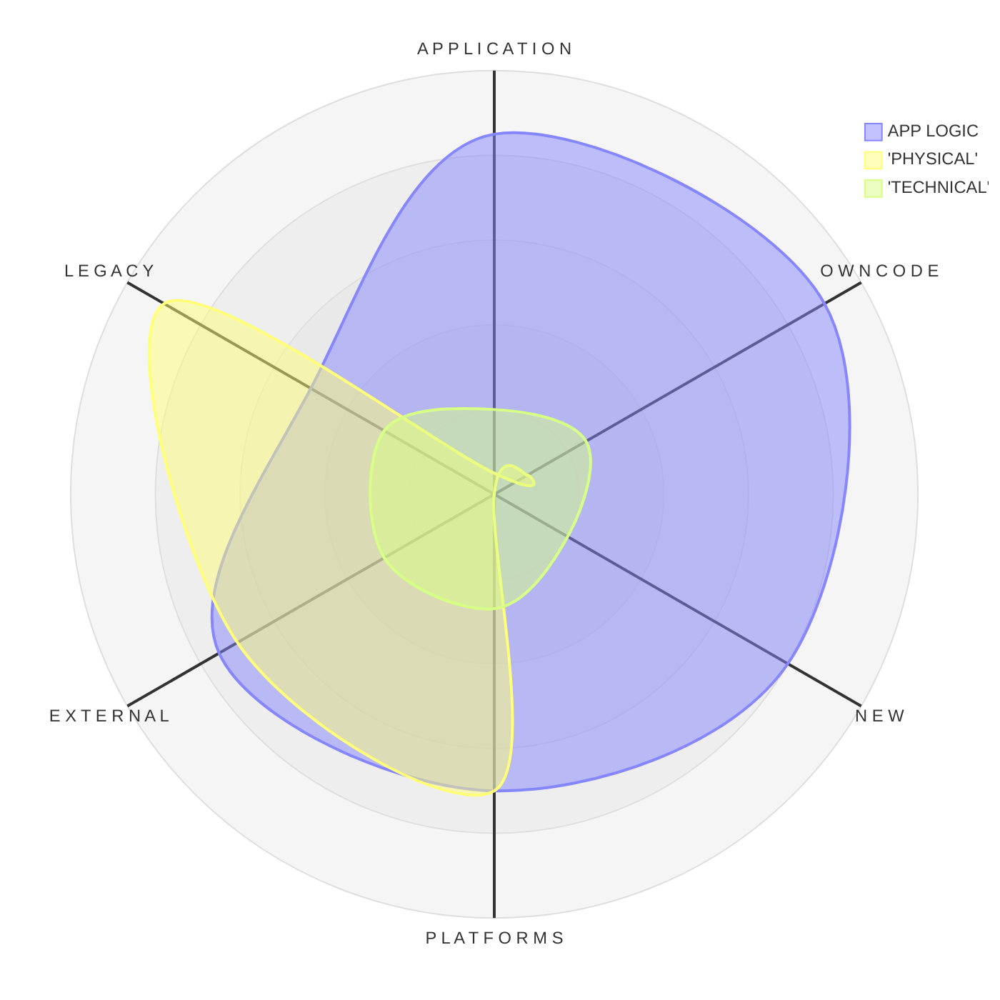

<h1 align="center"><code>Null</code>, its reference, and the Mistake<br />🔎&empty;</h1>

<table><tr valign="top"><td><picture></picture>
</td><td>

**`NullReference` earned a horrible reputation as an _exceptional_ pest.** Its outbreaks appear literally from `nothing` and are too common to be _exceptions_ &thinsp;&mdash;&thinsp; 
they strike everywhere, in safe and unmanaged code, on bolted ancient mainframes and in clouds, and have no mercy on  junior and seasoned developers.

[Sir&nbsp;Tony&nbsp;Hoare](../../quotes/README+/contributors/README.md#tony-hoare) voluntarily took the blame for being this _Frankenstein_ who brought the 
[**billion&#8209;dollar&nbsp;mistake**](https://www.infoq.com/presentations/Null-References-The-Billion-Dollar-Mistake-Tony-Hoare/)<sup>🎥</sup> into the software Eden. 

A sinister _Gordian_ blockchain that nobody great can cut to stop collecting its billion toll.

\___________\
<samp>**BEWARE**</samp>**!** `Null` may be disguised as `Nothing`, `nil`, `none`, `undef[ined]`, or even `NaN`.

</td></tr></table>

<sup>🎥</sup> If you can't make the 1950s subscripts **and** today's unassigned declarations meet &nbsp;&mdash;&nbsp; you are **not** alone. 

<h4 align="center">Let my shaky pen and subjective experience sketch the NullReference reflection:</h4>



* "**Physical**" &thinsp;&mdash;&thinsp; a pointer&thinsp;/&thinsp;reference steps out of physical&thinsp;/&thinsp;logical memory
* "**Technical**" &thinsp;&mdash;&thinsp; null as value/reference is not supposed to occur (as an extreme case, a number turns to be `null`). A system bug.
* &nbsp;**App Logic** &thinsp;&mdash;&thinsp; actually unassigned or nulled declarations. No magic, _<samp>mea culpa</samp>_.

I bet the last case prevails and promotes the worldwide concern. 
However, `null` and its reference are natural there. Exceptions from its references are only a symptom of programming mistakes and logical flaws.

<h2 align="center">Much Ado About <code>Nothing</code>&thinsp;?</h2>

<table><tr></tr><tr align="center"><td width="40%"><b>Y&thinsp;E&thinsp;S</b></td><td width="20%" >and</td><td width="40%" ><b>N&thinsp;O</b></td>
</tr><tr valign="center"><td>
  
Null references aren't CPU vulnerabilities as [Meltdown](https://en.wikipedia.org/wiki/Meltdown_(security_vulnerability))<sup><b>w</b></sup> that no software patch can fix. 
It's not even a peer to the Y2K problem, which stemmed from the explicit negligence to eliminate with explicit enhancement.

Botched global updates, blackouts, and catastrophic failures were caused by logical errors of different origins, when exception names play a secondary role. 

(Except one type &thinsp;&mdash;&thinsp; many disasters multiplied and spread because there was no sign of exception or error.)
  
</td><td><picture></picture></picture></td><td>

When a number of software installations is significant, providers continuously collect reports on errors, which crash their products, get handled, or run undercover (unnoticed).

Their statistics give `NullReference` the first place (from my experience too). Many of these errors are difficult to trace, reproduce, and debug. 
Those not regular and critical may stay for years with the lowest priority for investigation.

Time and size populate projects' closets with ghost `NullReference` errors &thinsp;&mdash;&thinsp; the syndrome of the design decadence, which often gets symptomatic treatment.

</td></tr></table>

<h2 align="center">The Mistake&thinsp;?</h2>

<p align="center"><b>Charging <code>null</code> for errors is like accusing <code>zero</code> for one can divide by it.</b></p>

First of all, `NullReference` is not a popped transistor, phantom, bug, stub, rudiment, or malware. It's a logical, initial, and valid state of objects. When neglected, it sincerely warns about a breach.

### Blaming the messenger

Errors in delivered software are annoying since **_1)_** [it worked on my machine](../../memes/README+/polyptych_works.md), and **_2)_** they could be a headache to debug. No wonder `NullReference` got a magnified reputation.

The bad approach is that ignoring or silencing may cure the problem (though sometimes it works, for a while).

### "Scapegoating" (≠ Goatscaping) 

When the source of a problem isn't evident, it's a time to explain it with the order of planets, air from bogs, bad morale, or errors of others. 
It's easier to refer the perplexed cases of `NullReference` to the peculiarities and bugs of the underlying platforms.

Based on <a href="#null-case">true stories</a>.<sup title="Read one in bottom lines">🙋</sup>

<h1 align="center">Null <mark>&thinsp;&empty;🚿</mark> Washing</h2>

<p dir="rtl">.<b><code>Null</code></b> is for programming, as <code><b>zero</b></code> is for math</p>

## Foam (Apply theory)

**Math**, as the mother of all sciences, is believed to solve all their problems. Ironically, it has no concept of _null_ to aid its firsthand employment, leaving us alone with this problem.

Null isn't a value (it may be memory 0), but agreement. 

I wouldn't like to classify _null_ traps by managed/unmanaged, pointer vs. reference vs index, but break them into three **BE**s:

* **CAN'T** BE &thinsp;&mdash;&thinsp; the assignee (field, variable, or object) can **never** be null.\
And only a peculiar glitch allowed setting it. E.g., objects coming from builders.
* **SHAN'T** BE &thinsp;&mdash;&thinsp; the assignee can take _null_ but not now or here.\
E.g. a booking request can be _null_ when returned or cancelled, but not when submitted to the invoice routine.
* **MUST** BE &thinsp;&mdash;&thinsp; Surpsisinly opposite? The value must be null there, but either falsely stubbed or set to a default.

<div align="right">&nbsp; &nbsp; <sup>&empty;</sup> <samp>Null in math means zero or empty set. As it's <i>zero</i> in German.</samp></div>
<div align="right">&nbsp; &nbsp; <sup>&empty;🖱️</sup> <samp>Hardware has a kind of &thinsp;&mdash;&thinsp; the bit or byte that state can't be read.</samp></div>

### What's the problem to debug?

<table><tr><td><picture></picture></td><td>

Besides remembering bad cases, which aren't an excuse ...
   
</td></tr></table>

## Rinse (Back to keyboard)

First and foremost, there's no magic wand to get rid of the `NullReference` errors, as clickbait titles try to sell. And there shall be none.

Besides sound logic, [quality code](../../../../software/QA/README+/code-quality.md) and apparent measures (including language aid), the following practices must prevent unexpected exceptions:

### Do not hide

Relying on default or _pro forma_ values instead of `null` obviously paves the way to epic fails.

### Every null check must be sane

<table><tr></tr><tr valign="center"><td>☝️</td><td>

If a check allows _null_ to propagate or replaces it with a value, it must be certain for the logic &thinsp;&mdash;&thinsp;\
not to avoid further exceptions or IDE warnings.
   
</td></tr></table>


In the 2020s decade, mainstream languages tempt you to chain null checks: ```Book?.Author?.Name?.Middle is null or ""```

Here, a lucid proof of the optional name builds a multi-level shelter for bugs.

### Guards

Be the first to throw.

### Do not treat as empty&thinsp;/&thinsp;zero

```if (fridge.IsNullOrEmpty) order(ice);``` // there could be no fridge and the ice will melt

Inspired by C# `string.IsNullOrWhitespace(..)`.

### Eliminating null declarations

Builders/Factories/Wizard

### Distinguish

JavaScript has a native `undefined`. In other languages, a never set value may throw a specific exception, like in this tailored property [`AbsYear`](https://github.com/Kyriosity/use-dev/blob/main/src/TuttiFrutti/AbcChrono/Timescales/Models/Hap.cs).

👎 Bad idea: setting a specific object, which will only mask `null` and make matters worse.

## <a id="null-case" />Bottom lines

<sup>🙋</sup> I find personal stories the last shelter of narrators unless it's a full match and a good backup. This must be the case.

> I can remember a contractor for a big, really big, enterprise who was assigned a sporadic **NPE** (null pointer exception) in a tailored application. 
After sacrificing a couple of hours, he addressed this pesky _null_ to the dark forces of [Lotus Notes](LN-view.md) and returned to his daily need - [NFS](https://en.wikipedia.org/wiki/Need_for_Speed)<sup><b>w</b></sup>.
>
> Occasionally, a peer developer picked this problem (for the sake of the team) to dive into the hand-obfuscated code. After making the brain function on all cylinders, the slices of Swiss cheese coincided to reveal a malicious an<i>null</i>er. Fixed.\
> &nbsp;

**Moral?** Imagining the number of cases without a happy twist, Sir Hoare may surely write off a digit from the tech debt he shouldered.

\___________\
🔚 &empty; 2025  image credits: Wiki Commons, kyriosity

