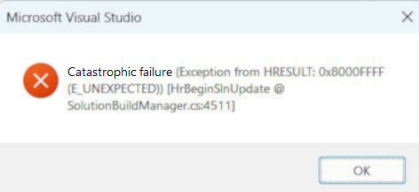
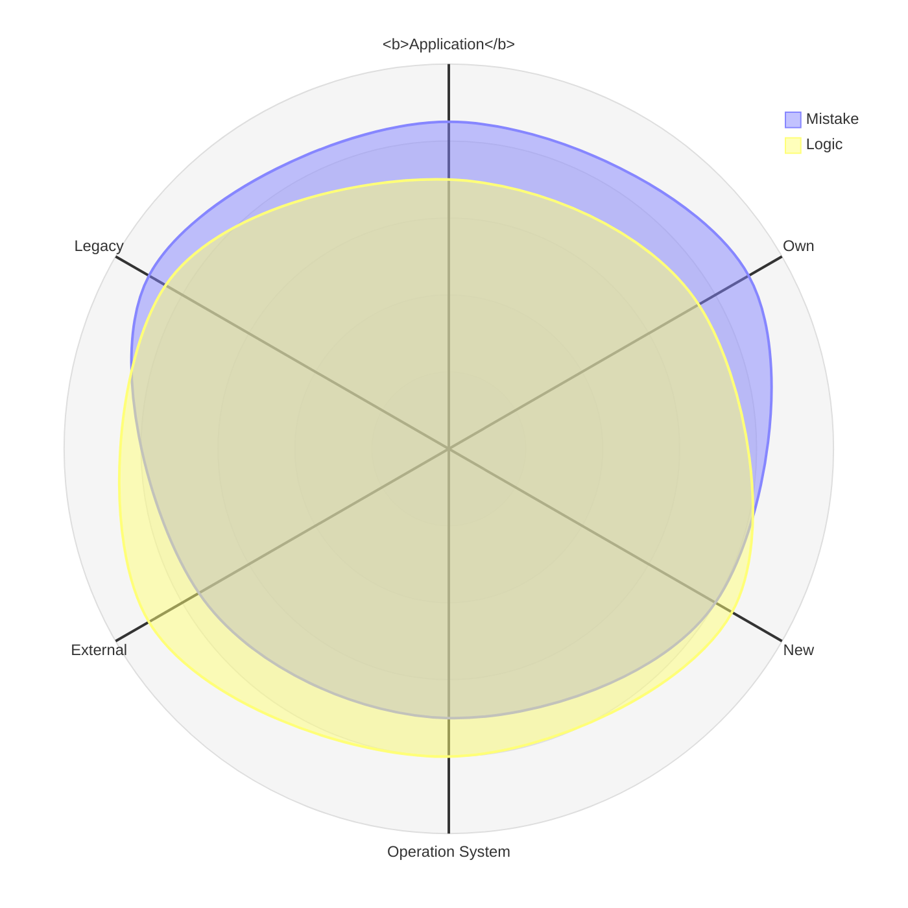

# `NullReference` error &nbsp;&mdash;&nbsp; Private investigation 🔎&empty;

<table><tr><td width="50%"><picture></picture>
</td><td>

**`NullReference`** has a horrible reputation as an _exceptional_ pest. Its outbreaks appear literally from `nothing` and are too common to be _exceptions_ &thinsp;&mdash;&thinsp; 
they fire everywhere and have mercy on neither junior developers nor mature systems.

[Sir Tony Hoare](../../quotes/README+/contributors/README.md#tony-hoare) voluntarily took the blame for being this Frankenstein who brought the 
[billion-dollar mistake](https://www.infoq.com/presentations/Null-References-The-Billion-Dollar-Mistake-Tony-Hoare/)🎥 into the software Eden. 

A sinister blockchain that no Alexander of IT Macedon can cut to stop collecting its billion toll.
  
</td></tr></table>

🎥 However, if you can't make the 1960s subscripts **and** unassigned declarations in today's software meet &nbsp;&mdash;&nbsp; you are not alone. That's for is the next narrative.

<h2 align="center">Much Ado About <code>Nothing</code>&thinsp;?</h2>

<table><tr></tr><tr align="center"><td width="40%"><b>Y&thinsp;E&thinsp;S</b></td><td width="20%" >and</td><td width="40%" ><b>N&thinsp;O</b></td>
</tr><tr valign="center"><td>
  
Null references aren't CPU vulnerabilities as [Meltdown](https://en.wikipedia.org/wiki/Meltdown_(security_vulnerability))<b>w</b> that you can't fix just by a software patch. 
It's not even similar to the Y2K problem, which had a determined source.

Botched updates, blackouts, catastrophic failures - they were caused by logical errors where this or that type of exception didn't play a dramatic role. 
What make matter twisted - many disasters spread because there was no sign of exception or error.
  
</td><td><picture></picture></picture></td><td>

Less or more big software providers collect error information, which occurs in their products.

Over 50% of them could be `NullReference` and they maybe handled under the carpet.  Much of these errors are difficult enough to trace and debug and they stay for years, unless software crashed.
  
</td></tr></table>

<h2 align="center">Null <mark>&empty;🚿</mark> Washing</h2>

> **Blaming `null` for mistakes is like blaming `zero` for one can divide by it.**

### "Scapegoating" (!= Goatscaping) 

When the source of a problem isn't evident it's easier to declare it as the order of planets, air from bogs or bad moral. It's easier to address the perplexed NullReference exceptions to the sins of IT founders, legacy software and bugs of operatings systems and platforms.

# Part 2. `NULL` 

<b>Null is for programming, as zero is for math.</b>

As the mother of all sciences, **math** is believed to solve all their problems. Comically, it has no concept of _null_&empty; as we know in programming - to SAVE its most direct offspring &thinsp;&mdash;&thinsp;. Hadrware has -- the bit which state can't be read because it's off.

&nbsp; &nbsp; &empty; <samp>Null means zero or empty set.</samp>

\___________\
🔚 &empty; 2025 
