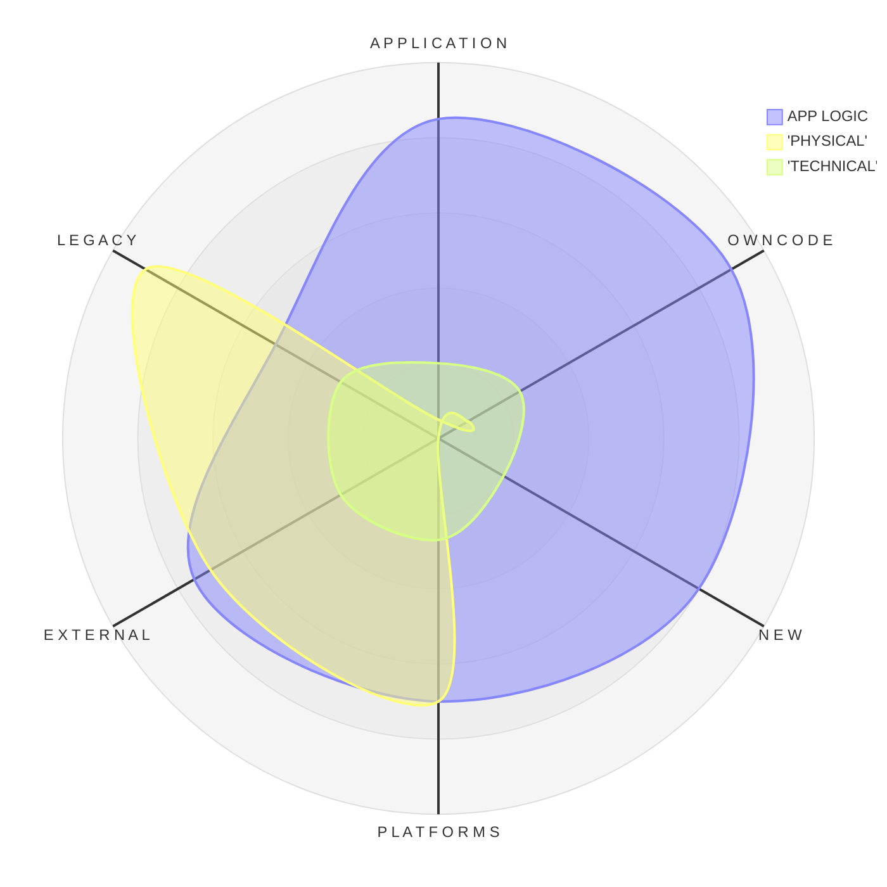

<h1 align="center"><code>Null</code>, its reference, and the Mistake 🔎&empty;</h1>

<table><tr><td><picture></picture>
</td><td>

**`NullReference`** earned a horrible reputation of an _exceptional_ pest. Its outbreaks appear literally from `nothing` and are too common to be _exceptions_ &thinsp;&mdash;&thinsp; 
they strike everywhere and have mercy on neither junior developers nor mature systems.

[Sir Tony Hoare](../../quotes/README+/contributors/README.md#tony-hoare) voluntarily took the blame for being this Frankenstein who brought the 
[billion-dollar mistake](https://www.infoq.com/presentations/Null-References-The-Billion-Dollar-Mistake-Tony-Hoare/)🎥 into the software Eden. 

A sinister _Gordian_ blockchain that nobody great can cut to stop collecting its billion toll.
  
</td></tr></table>

🎥 However, if you can't make the 1950s subscripts **and** today's unassigned declarations meet &nbsp;&mdash;&nbsp; you are not alone. 

<h4 align="center">Let my shaky pen and subjective experience sketch the NullReference reflection:</h4>

* "**Physical**" &thinsp;&mdash;&thinsp; could occur when a pointer/reference comes out of physical/logical memory
* "**Technical**" &thinsp;&mdash;&thinsp; not supposed to occur. In the extreme case, a number is `null`.
* **App Logic** &thinsp;&mdash;&thinsp; actually unassigned or nulled declarations. _<samp>Mea culpa</samp>_.

In my opinion, `NullReference` is natural, and an exception over it is only a symptom. **Charging `null` for errors is like accusing `zero` for one can divide by it.**

<h2 align="center">Much Ado About <code>Nothing</code>&thinsp;?</h2>

<table><tr></tr><tr align="center"><td width="40%"><b>Y&thinsp;E&thinsp;S</b></td><td width="20%" >and</td><td width="40%" ><b>N&thinsp;O</b></td>
</tr><tr valign="center"><td>
  
Null references aren't CPU vulnerabilities as [Meltdown](https://en.wikipedia.org/wiki/Meltdown_(security_vulnerability))<b>w</b> that no software patch can fix. 
It's not even a peer to the Y2K problem, which stemmed from the explicit negligence to eliminate with explicit enhancement.

Botched global updates, blackouts, and catastrophic failures were caused by logical errors of different origins, in which exception names played a secondary role. 

Except one type &thinsp;&mdash;&thinsp; many disasters multiplied and spread because there was no sign of exception or error.
  
</td><td><picture></picture></picture></td><td>

Middle and big software providers permanently collect reports on errors, which crash their products, get handled, or run undercover (unnoticed).

Their statistics give `NullReference` the first place (from my experience too). 
Many of these errors are difficult enough to trace, reproduce, and debug, and if they aren't regular or critical, they can stay for years with the lowest priority for investigation.

Time and size populate projects' closets with ghost `NullReference` errors &thinsp;&mdash;&thinsp; the syndrome of the design decadence, which mostly gets symptomatic treatment.

</td></tr></table>

<h2 align="center">Null <mark>&empty;🚿</mark> Washing</h2>

**Math**, as the mother of all sciences, is believed to solve all their problems. Ironically, it has no concept of _null_ to aid its closest application &thinsp;&mdash;&thinsp;. Hardware has -- the bit that state can't be read because it's off.

LET US DO THIS

.<b><code>Null</code></b> is for programming, as <code><b>zero</b></code> is for math

### Blaming the messenger

### "Scapegoating" (≠ Goatscaping) 

When the source of a problem isn't evident, it's a time to explain it with the order of planets, air from bogs, bad morale, or errors of others. 
It's easier to refer the perplexed cases of `NullReference` firing to the peculiarities and bugs of the underlying platforms.

<h1 align = "center">Part Tw&empty;. Praxis</h1>

&nbsp; &nbsp; &empty; <samp>Null means zero or empty set.</samp>

\___________\
🔚 &empty; 2025  image credits: Wiki Commons, kyriosity

- conceptual mistakes of middleware software (CLR, virtual machines, and so on)
- malware
- **programming logic**
 
and source 

It's opposite - nullable numbers

WRITE OFF from the tech debt of CAR

        INVALID MEMORY ADDRESS

          MANAGED vs UNMANAGED

ERROR
VALUE
TECH (POINTER etc)

They aren't the plague but boboes

THE REAL BLN DLR MISTAKE is PUTTING NULL under the CARPET

Some programmers discover it like ancient Greeks.

Example with fridge. With paper

Advanced languages introduce paradigms to avoid them, and IDEs with tools warn about possible nulls.

Is not reference outised the memory stick

ENUMs as the worst practice of not-null. Partial solution: default but it doesn't prevent logical error

undefined in JS

NEW PHYLO STONE

REFERENCE vs. POINTER

No Magic Wand to prevent run time null

PRX:
    Replace Null with mor specific things : NotSet
    Constructing Wizards
