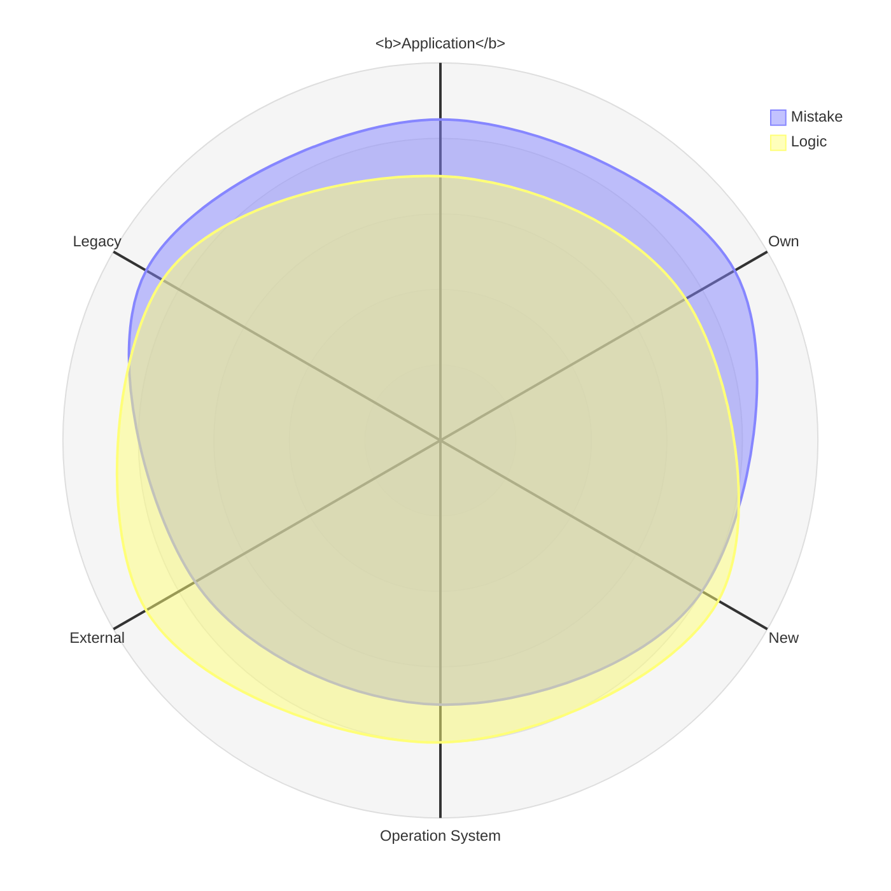

<h1 align = "center"><code>Null</code>, its reference, and the Mistake 🔎&empty;</h1>

<table><tr><td><picture></picture>
</td><td>

**`NullReference`** earned a horrible reputation of an _exceptional_ pest. Its outbreaks appear literally from `nothing` and are too common to be _exceptions_ &thinsp;&mdash;&thinsp; 
they fire everywhere and have mercy on neither junior developers nor mature systems.

[Sir Tony Hoare](../../quotes/README+/contributors/README.md#tony-hoare) voluntarily took the blame for being this Frankenstein who brought the 
[billion-dollar mistake](https://www.infoq.com/presentations/Null-References-The-Billion-Dollar-Mistake-Tony-Hoare/)🎥 into the software Eden. 

A sinister blockchain that no Alexander of IT Macedon can cut to stop collecting its billion toll.
  
</td></tr></table>

🎥 However, if you can't make the 1960s subscripts **and** unassigned declarations in today's software meet &nbsp;&mdash;&nbsp; you are not alone. That's for the next narrative in the first 🚧draft🚧 approximation.

## Much Ado About `Nothing`&thinsp;?

<table><tr></tr><tr align="center"><td width="40%"><b>Y&thinsp;E&thinsp;S</b></td><td width="20%" >and</td><td width="40%" ><b>N&thinsp;O</b></td>
</tr><tr valign="center"><td>
  
Null references aren't CPU vulnerabilities as [Meltdown](https://en.wikipedia.org/wiki/Meltdown_(security_vulnerability))<b>w</b> that can't be fixed just by a software patch. 
It's not even a peer to the Y2K problem, which stemmed from a single but massive negligence.

Botched global updates, blackouts, catastrophic failures were caused by logical errors where exception names play a secondary role. 

Except one type &thinsp;&mdash;&thinsp; many disasters multiplied and spread because there was no sign of exception or error.
  
</td><td><picture></picture></picture></td><td>

Fewer or more big software providers collect reports on error, which crash their products or run undercover.

The fruit of statistics &thinsp;&mdash;&thinsp; `NullReference` cane make up over 50%.  Many of these errors are difficult enough to trace and debug, and if they aren't regular or critical they can stay for years without investigation.

Must be evident NullReference can be most difficult to research.

</td></tr></table>

## Null <mark>&empty;🚿</mark> Washing</h2>

> **Blaming `null` for mistakes is like blaming `zero` for one can divide by it.**

### "Scapegoating" (≠ Goatscaping) 

When the source of a problem isn't evident, it's easier to declare it as the order of planets, air from bogs, or bad morale. 
It's easier to address the perplexed cases of `NullReference` firing to the peculiarities and bugs of the underlying platforms.

<h1 align = "center">Part Tw&empty;</h1>

**Math**, as the mother of all sciences, is believed to solve all their problems. Ironically, it has no concept of _null_&empty; as we know in programming &thinsp;&mdash;&thinsp; to aid its closest offspring &thinsp;&mdash;&thinsp;. Hardware has -- the bit that state can't be read because it's off.

LET US DO THIS

.<b><code>Null</code></b> is for programming, as <code><b>zero</b></code> is for math

&nbsp; &nbsp; &empty; <samp>Null means zero or empty set.</samp>

\___________\
🔚 &empty; 2025  image credits: Wiki Commons, kyriosity
