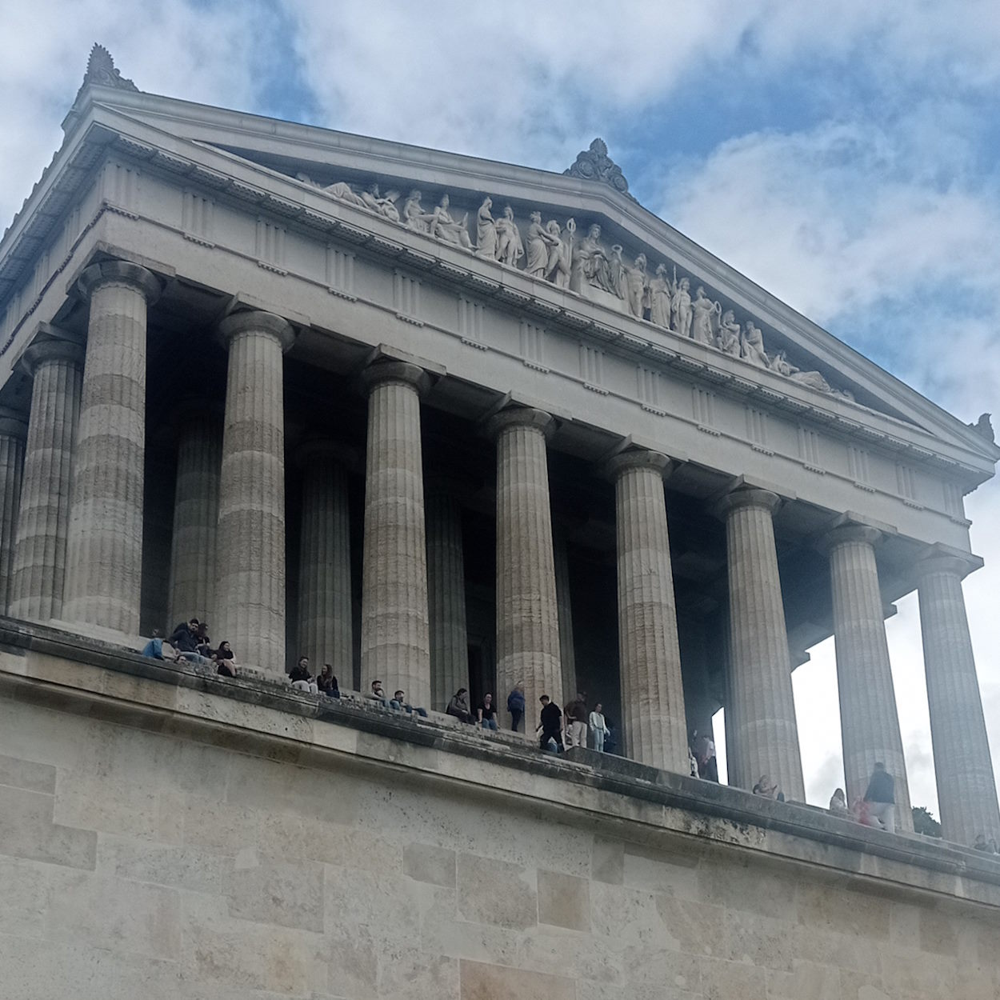

<table><tr></tr><tr>
 <td widh="39%">☝️</td>
 <td>This essay treats architecture and design together (as everything over particular and imaginary applications/systems/constructions) while
<picture></picture>
, from which this essay derives, discriminates them as <a href="../../../../software/ArcDeco/README+/03.Stripes">kin adjacent activities</a>.
 </td></tr></table>

# Architecture and Architects

<table><tr valign="top">
 <td widh="35%">
  <picture></picture> 
  <i>Walhalla</i> on the river Danube, Bavaria (built 1820-1842) is an exemplary neoclassicism.
 </td><td width="65%">

The essence of architecture appeared as folks managed to erect anything more extravagant and durable than a hut of piled branches. Some ancient Greeks were so good at it that observers coined "<i>architect</i>"🏛️ - the term romanized to <i>architecture</i> only centuries later.

Then ages passed till the art of immobile acknowledged and methodized architects as a detached trade &mdash; 
refined craftsmen exempt from routines and narrow-profile burdens to focus on vision, design, blueprints, and aesthetics.

Much later diverse spheres (from mega-vessels and supercomputers to less determinate economics and politics) loaned «architecture» to figuratively underline systematic complicacy. However, <ins><code><b>μ</b>arch</ins></code> hasn't fostered micro-architects (giga- either) and architects of détente or <em>economic miracle</em> are compliments (or flattery).

___________ 
🏛️ Greek: ἀρχιτέκτων, “master/chief builder/maker" but this occupation must have existed much prior as the Pyramids suggest (but Stonehenge refutes).
 </td></tr></table>

## Software vs. Building - much in common...

The architecture of both demands creativity and grants enough room for phantasy and missteps but must deliver functional wholes quickly rather than ripen aesthetic values. Projects in both often begin from sketching on white paper or board.

Both take advantage of the flexible plethora of tools, techniques, and skills. Both must accumulate mainstream and alternate practices and reveal patterns.

Lack of proficient abstraction work and planning can make both a mess which products loudly crash. Both can be grounds for hollow promises and sandcastles.

Both can't rely solely on generations of experience and a single mastermind but on a team (with a hierarchy or not) of pundits.

### ...but diffs are bigger

🎼«.<b><code>IF</code></b>&nbsp;
 «<ins>Architecture is a frozen music</ins> 
<b><code>THEN</code></b>&nbsp;software is a symphonic cacophony 
 🐦‍⬛.[unleashed under the wandering circus tent]

Buildings are static, conservative, and traditional &mdash; software is fluid, experimental, and with no place for neoclassicism. 

Constructions are embossed with materials and locations &mdash; software abstracts from pure boolean logic (without relay, transistor, or warm lamp vibes). However, software systems propagate the "philosophy" of a selected stack (languages/frameworks, storage, servers, communication protocols, ...) and imports.

Software is the most automated production where copying, scaling, installation, and updates are clickable. Decades, min for wood cabins, set records in mainframe software, which won't recur (till interstellar flights).

Software development gives freedom of full-scale _trial and **error**_ unthinkable in other production. Builders may only envy sustainability and seamless upgrades/swaps of hardware basements and communications (utilities). On the contrary, drawing plans months ahead of some code is adverse to software.

A construction engineer, whose modeling tasks are interlaced with stirring concrete, who is up and there on the spot to supervise the work and for master classes in laying bricks and blocks, knows tectonics vs. mechanics of materials as well as electrics with electronics, is licensed to operate excavators and cranes, may inspect constructions for cracks, interviews candidates for carpentry must be a fantastic creature but not in software teams.

Construction places for any work are laptop in the software.

Education and activities in construction are very specialized and regulated (also legally). **Ultima ratio**: slang differs.

\_______\
&nbsp;&nbsp;&nbsp;&nbsp;🎼 _Arthur Schopenhauer_ (1788-1860), missattributed to _Johann Wolfgang von Goethe_ (1749-1832)\
&nbsp;&nbsp;&nbsp;&nbsp;🐦‍⬛ or _Babylon Tower_ populated with [💬woodpeckers](../../quotes/README+/aside/controversy.md#woodpecker) 

## Finding _ᾰ̓ρχῐ_-coder

<mark>"<b>.I am the Architect</b>"</mark> 🎦<i>The Architect</i> Dr. Freud looking character) (of <i>The Matrix Reloaded</i>, 2003

*Software architecture*, whatever it means, is formalizable and veritable as a phenomenon, but not as an exercise. 

And the opposite occurs - CAN AND SHALL ZOOM IN

The complementary agents

* **allow** everybody with IT knowledge to participate in every process (from bits to top judgments).
* do **not** allow to be agnostic of implementation

It's often an alias for roles and duties:

* _domain expert_ or _business analyst_, who boils down requirements to systematic description,
* _team lead_ or _project manager_,
* _lead_/_senior developer_,
* _consultant_, extrapolating known solutions to other adaptations,
* _tutor_, or _technology evangelist_, proposing blueprints for the solution,
* "*librarian-navigator*", somebody with the utmost knowledge of the project,
* geeks from _computer science_.

## Conclusion

There was no intention to defame _software architects_ but to qualify the term as an honor rather than a job title for a bunch of avant practices with strong practical backup. Architecture is a synergy of collective and best of vision, design, and development.

And let's salt all this with a bitter reminder that most projects aren't a Pantheon but routine cast of domain issues to known and tried  solutions with quite decent contribution of design FRESH.

<mark>"<b>.Smith will suffice</b>"</mark> <i>🎦🔨Agent Smith</i>

\_______

 🔚 &nbsp;🌘 kyriosity 2023-2024&nbsp;&nbsp;&nbsp;<b>.......</b>&nbsp;&nbsp;&nbsp;🎦🔨 quotes guaranteed by [imdb.com](https://www.imdb.com/title/tt0234215/quotes/?ref_=tt_trv_qu)
