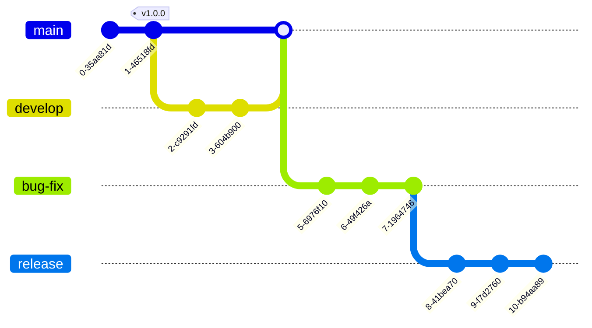

<table><tr></tr><tr>
 <td widh="39%">☝️</td><td>This essay doesn't split <i>architecture</i> and <i>design</i> (as everything over particular and imaginary applications/systems/constructions) while
<picture></picture>
 (from which this essay descends) discriminates them as <a href="../../../../software/ArcDeco/README+/03.Stripes">kin adjacent activities</a>.
 </td></tr></table>

# Architecture and Architects

<table><tr valign="top"><td><picture></picture></td><td>

The essence of architecture appeared as folks managed to erect somewhat more extravagant and durable than a hut of piled branches - say, megaliths.

Some ancient Hellenes were so good at construction sites that the impressed observers coined "<i>architect</i>"🏛️ &mdash; the term romanized to <i>architecture</i> centuries later.

Then ages passed till the art of immobile acknowledged and methodized architects as a detached trade &rarr; 
refined craftsmen exempt from chores and narrow-profile burdens to focus on vision, design, blueprints, aesthetics, and their presentation.

Much later diverse spheres (from mega-vessels and supercomputers to less determinate economics and politics) loaned «architecture» to figuratively underline systematic complicacy. 
 Nevertheless, <ins><code><b>μ</b>arch</ins></code> hasn't fostered micro-architects (neither nano- nor giga-) and architects of <em>détente</em> or <em>economic miracle</em> are compliments (or flattery).

___________ 
🏛️ Greek: <samp>ἀρχιτέκτων</samp>, “master/chief builder/maker" but this occupation must have existed much prior as the <i>Ziggurat of Ur</i> and Egyptian Pyramids suggest (but Stonehenge refutes).
 </td></tr></table>

<h1 align="right">Part&nbsp;I. Software <i>vs.</i> Building</h1>

### much in common...

<table><tr valign="top"><td width="25%">
 <picture></picture>
  <ins>Buiding CADS are similar to IDEs</ins> 
  <picture></picture>
</td><td>

🏝️ The architecture of both demands creativity and grants **leeway** and vast **playland** for phantasy and missteps, 
but to quickly define operating wholes rather than ripen aesthetic values. 

✏️ Endeavors in both often begin from sketching on white paper or chalkboards.

🎨 Both enjoy the flexibility of many tools, methodologies, and skills.

🔋 Both must accumulate mainstream and alternate practices and reveal patterns.

💥 Imperfect abstraction and planning can make both a mess which products loudly crash.

🎈 Abuse of both for hollow promises and sandcastles is more frequent than in other industries.

👯 Both don't rely solely on generations of experience and picked masterminds but on teams of versatile professionals and pundits (with a hierarchy or not).

</td><td valign="bottom">
  
 
... <ins>bestsellers too</ins> ...

 </td></tr></table>
  
### ...but diffs are bigger

<b><code>IF</code></b>&nbsp;«Architecture is a frozen music.» 
<i>Arthur Schopenhauer</i> (1788-1860) 
<b><code>THEN</code></b>&nbsp;software is a symphonic cacophony 
[unleashed under the amateur circus tent&thinsp;]. 
<b><code>OR</code></b> <i>Tower of Babel</i> populated with <a href="../../quotes/README+/aside/controversy.md#woodpecker">woodpeckers</a>💬 [on steroids].

<table><tr valign="top"><td width="35%">
 <picture></picture> 
  <i>Walhalla</i> on the river Danube, Bavaria (built 1820-1842) is an exemplary neoclassicism.
</td><td>
 Buildings are <b>immobile</b>, conservative, and traditional &mdash; software is <b>ephemeral</b>, fluid, and free of nostalgia (as neoclassicism).

 
Constructions are embossed with materials (and their costs), locations &mdash; software abstracts from pure boolean logic (without relay, transistor, or warm lamp vibes). However, software systems propagate the "philosophy" of a selected stack (languages/frameworks/libraries, storage, servers, communication protocols, ...).
 
 The software doesn't rust or erode but becomes obsolete in a few years. Decades (bare minimum for wood cabins) set lifecycle records in residual mainframe software - unlikely to recur (till interstellar flights).

Software development gives freedom of life-sized _trial and **error**_ unthinkable in other production. Builders may only envy sustainability and seamless upgrades/swaps of hardware basements and communications (libraries/services). 

Contrariwise, months of upfront planning and prototyping are adverse to software, which paces in releases and favors [Minimum Viable Product](https://en.wikipedia.org/wiki/Minimum_viable_product)<b>w</b> ASAP.
 
</td></tr></table>

Software is the most automated production that ever existed when copying, scaling, installation, and updates are one-click (or auto-scheduled) and unattended. 

<table><tr valign="top"><td width="*">
 
A construction engineer, whose modeling tasks mingle with stirring concrete, who is up and there on the spot to supervise the progress and for master classes in laying bricks and blocks, knows tectonics vs. mechanics of materials as well as electrics with electronics, is licensed to operate excavators and cranes, may inspect constructions for cracks, interviews candidates for woodworking ... 
... must be a fantastic creature &mdash; but a usual Jack-of-all-trades in software teams where construction places are open 🕙24x7 💻laptop.

  
Building education and activities are very narrow and regulated (also legally). <b>IT</b>&nbsp;is reluctant about formalities of schooling.

</td><td width="40%">
  

 </td></tr></table>

**Ultima ratio**: slang differs.

_________&thinsp;<b><samp>bottom line</samp></b>&thinsp;_________

<table><tr valign="top"><td width="50%"><picture></picture> 
      <i>Museum of Tomorrow, Rio de Janeiro</i>

<picture></picture>

</td><td>

Building rests on functional design that facilitates easy, cheap, mass construction. 
 The most advanced and creative specimen may be endowed to break the standards and create unique extraordinary pieces of aesthetics, art, and cultural heritage.

Extravagant (and still working) IT ideas don't require solid fundament however mature software design canalizes creativity into uniform mainstream: standards, patterns, and templates.

 <picture></picture> 
       <i>Lotus 1-2-3 from the previous century still defines the UX and functionality of spreadsheets.</i></a>
</td></tr></table>

<h1 align="right">Part&nbsp;II. Finding <i>ᾰ̓ρχῐ</i>-coder</h1>

<samp>"<b>.I am the Architect</b>"</samp> 🎦<i>The Architect</i> Dr. Freud looking character) (of <i>The Matrix Reloaded</i>, 2003

*Software architecture*, whatever it means, is formalizable and veritable as a phenomenon, but not as an exercise.

Contrary to the evolution of building - programming <ins>disperses the classical figure of the architect</ins> - allowing and demanding from **everybody** to **efficiently** <mark>zoom IN</mark> implementation details and <mark>zoom OUT</mark> concepts (up to top design).🔎

> **This assumes neither skills parity nor full inside of each technology and methodology.**&#8287;
> The bigger the project, the bigger the vertical&varr; and horizontal&harr; offsets of team members according to skills, talents, experience, and preferences with or without roles exchange.
> 
( &varr; between coding and design; &harr; within the technologies stack)

<ins>&nbsp;<b>"Architect" is often an alias or catch-all term for good known roles and duties:</b>&nbsp;</ins> ➡️

* _domain expert_ or _business analyst_, who boils down requirements to systematic description,
* _team lead_ or _project manager_,
* _lead_/_senior developer_,
* _consultant_, propagating portfolio of verified solutions to new applications,
* _tutor_, or _technology evangelist_, proposing blueprints for the solution,
* "*librarian-navigator*", somebody with the utmost knowledge of the design and code,
* geeks from _computer science_.

⬅️ Let alone DevOps, as a separate area in software.

<ins>&nbsp;.. <b>or for personal aptitudes:</b>&nbsp;</ins>  ➡️

 
+ memorizing big pictures in enough detail (not general diagrams),
+ ability to stay over (but not ignore) known decisions and practices,
+ ability to admit poor decisions (let alone dead-ends) on time and energy to find better and redo the work,
+ selecting the right proxies for communication on technologies,
+ definition of subtasks and delegating them without <s>micro</s><i>deci</i>-management,
+ authority to reconcile design and technological encounters/counter-opinions,
+ <ins>euphoria and frustration tolerance</ins>.

⬅️ ... easy to declare but hard to correspond to alone.

This makes up the software architecture &mdash; a synergy of collective and best vision, design, and development from multiple points. Gaps in connecting design to code will create the insulation layer of misconstruing and block potentials.

## but hold on...

**Reputable software providers hire/promote architects; they are central figures at IT events. There's certification after all.**

Above all, **_software architect_** sounds cool, distinguishes one from crowds of senior developers🙋, and impresses hiring managers, customers, and stakeholders.&#8287;
Neither <ins>_expert_</ins>, <ins>_Chief Programming Officer_</ins> nor <ins>_dev&nbsp;lord_</ins> can match it.

> There is no intention to defame _software architects_ but to qualify the term as an honor rather than a job title for a bundle of avant practices with strong practical backup.👩‍👦‍👦

And let's salt all this with a bitter reminder that major software isn't _Pantheon_ but the routine adaptation of requirements to known and tried solutions with quite a decent input of cutting-edge.

<samp>"<b>.Smith will suffice</b>"</samp> <i>🔨Agent Smith</i>

\___________

&nbsp;&nbsp;&nbsp;&nbsp;🔠To be fair, I picked "<mark>zoom IN/OUT</mark>" from <picture></picture> [What Software Architects Do That Programmers DON'T](https://youtu.be/IwrvE-wHm84?t=64) (thrivingtechnologist.com)\
&nbsp;&nbsp;&nbsp;&nbsp;🙋 The position fairly profaned by quantity growth and outsourcing.\
&nbsp;&nbsp;&nbsp;&nbsp;👩‍👦‍👦 The tops of C#.NET in Microsoft are titled _architects_ or _leads_ but all of them show fluent coding skills at presentations.\
&nbsp;&nbsp;&nbsp;&nbsp;🎦🔨 Quotes provided by [imdb.com](https://www.imdb.com/title/tt0234215/quotes/?ref_=tt_trv_qu). Images credit: AutoCAD, Microsoft, Lotus Corp., Oxford University Press, Addison-Wesley Professional, Tripadvisor, and kyriosity

<b>.......</b> &nbsp;🔚 &nbsp;🌘 kyriosity 2023-2025&nbsp;&nbsp;&nbsp;<b>.......</b>

