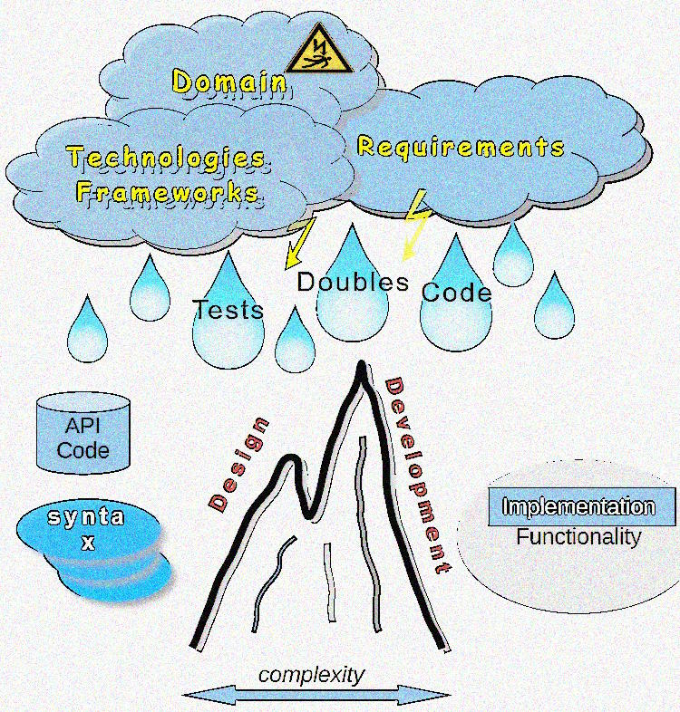

# Test Drive &mdash; Big Watershed

<table><tr valign="top"><td>
<picture></picture>    
  </td><td>
I was bicycling to hear a casual lecture on <b>TD<mark>D</mark></b> and the doubt crept in &mdash; where am I going: 

    &nbsp;&nbsp;&nbsp;Must this <mark><b>D</b></mark> be for <b><i>Design</i></b> or <b><i>Development</i></b>❓
  
It wasn't about the lecture, but the principal divergence. (For the record: the lecture regarded <a href="https://en.wikipedia.org/wiki/Test-driven_development">Test Driven Development</a>🔗 as you might have pointed.)
</td></tr></table>

Pretty worried I searched by "<mark>TDD</mark>" and retrospected popular writings and lectures found. They focused on development with desing as by-product. Nobody bothered much, and some even used both terms interchangeably.

> A software system can best be designed if the testing is interlaced with the designing instead of being used after the design.\
Alan Perlis, 1968

What did matters worse (I had to rewrite much of my stuff) - it was one on the landscape among others mountain chains with the peaks named "domain", "design", "drives", and "tests". I've exploited this theme in DRIVES but here I'd like to share the thought...

DRIVE LINKE

But let's not get sidetracked for now, and scheme this watershed.

<picture></picture>

MAY INTERCEPT BUT DIVERT !

<samp>Design Driven Development</samp>

TDD-DZN Δ
TDDx T⚙️D **T**⚙️**D**

<b><ins>&nbsp;Redo/Undo as illustration&nbsp;</ins></b>

\_______

\_______

 🔚 &nbsp;🌘 kyriosity 2024...
