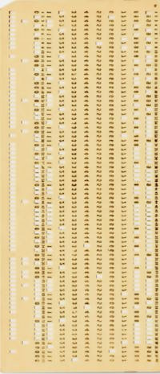
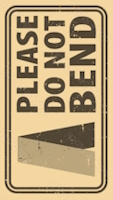

# Punched cards&nbsp;&nbsp;&mdash;&nbsp;&nbsp;Once upon a time

> **Guaranteed to be authentic** &mdash; not another paraphrase of [wiki articles](https://en.wikipedia.org/wiki/Computer_programming_in_the_punched_card_era)<b>w</b>

<table><tr valign="top"><td><picture></picture> 
       
      <picture></picture>
                  </td><td>
                        
# Intramural experience &mdash; short and vintage
                        
It was long after the decline of the punching technology and its carton carrier &mdash; to remain a legacy coursework at my university for the last year because the supply of cards became extinct.
                        
## The Task
      
It was an exercise in PL/I&nbsp;🔢 &mdash; output a curve of an assigned function (some $`ax^2 + bx + c`$ was mine). And the <i>output</i> meant <b>direct to the line printer</b> using teletype symbols for <samp>X/Y</samp> axes and the graph.

Believe it or not, this story had no electronic display.

&nbsp;&nbsp;&nbsp;&nbsp;&nbsp;&nbsp;🔢&nbsp;IBM's procedural <a href="https://en.wikipedia.org/wiki/PL/I">Programming Language One</a><b>w</b> 
&nbsp;&nbsp;&nbsp;&nbsp;&nbsp;&nbsp;&nbsp;&nbsp;&nbsp;&nbsp;&nbsp;&nbsp;&nbsp;&nbsp;&nbsp;&nbsp;&nbsp;&nbsp;<code>//</code> <b>PL/1</b>, <b>DB2</b>, <b>OS/2</b>, <b>Type-III</b>, <b>BS12</b>, ... &mdash; this Blue Giant was the Lord of imagination and naming.
 
&nbsp;&nbsp;&nbsp;&nbsp;&nbsp;&nbsp;:cinema:Fun fact: traces of PL/1 appear in the epic <a href="https://www.wired.com/story/2001-a-space-odyssey-predicted-the-future50-years-ago">2001: A Space Odyssey</a>.

## Carton in, paper out

It amazes me, in this day and age, what barely agile steps it took:

&nbsp;&nbsp;<b>1️)</b> Come up with a _programme_ and sketch it in the dedicated notebook (the paper one). 
&nbsp;&nbsp;<b>2️)</b> Fill in a lined paper form with procedural statements.🥪 
&nbsp;&nbsp;<b>3️)</b> Submit this papyrus to the punching shop, 
&nbsp;&nbsp;&nbsp;&nbsp;&nbsp;&nbsp;where good ladies were used to decypher student scribble.🛠️ 
&nbsp;&nbsp;&nbsp;&nbsp;&nbsp;&nbsp;&nbsp;&nbsp;&nbsp;&nbsp;&nbsp;&nbsp;... 🌙 one day after ⛅ ... 
&nbsp;&nbsp;<b>4️)</b>&nbsp;&thinsp;Fetch a deck of punched paperboard (~inch thick). 
&nbsp;&nbsp;<b>5)</b> Bring it to the _computing center_🏛️ where the mystery will occur. 
&nbsp;&nbsp;&nbsp;&nbsp;&nbsp;&nbsp;&nbsp;&nbsp;&nbsp;&nbsp;&nbsp;&nbsp;... 🌙 one/two days after ⛅ ... 
&nbsp;&nbsp;<b>6)</b> Pick the medieval scroll in the "print" department. 
&nbsp;&nbsp;<b>7)</b>  Search for a graph among collateral outputs. 
&nbsp;&nbsp;&nbsp;&nbsp;&nbsp;&nbsp;&nbsp;&nbsp; If fail, read errors, debug (mentally), and go to <b>(2)</b>.

The motivation was so strong (as you might feel) that many succeeded in the first approach but not me.

Between **(4)** and **(5)** a fellow disciple intruded: shuffling my deck unnoticed. Instead of the graph, I got bad (machine) language printed and a lesson learned about data integrity and security.

&nbsp;&nbsp;&nbsp;&nbsp;&nbsp;&nbsp;&nbsp;&nbsp;🥪 I wonder how it may look object-oriented. A card glued over the base one to inherit or override&thinsp;?\
&nbsp;&nbsp;&nbsp;&nbsp;&nbsp;&nbsp;&nbsp;&nbsp;🛠️ Precisionists can definitely treat their occupation as true absolute coders.\
&nbsp;&nbsp;&nbsp;&nbsp;&nbsp;&nbsp;&nbsp;&nbsp;🏛️ One who saw mainframes would advocate the name for this huge open space hall with metal cabinets.

</td></tr></table>

<h1 align="right">Extramural afterword</h1>

My mediocre story is a chance to remind the reader of the outstanding traits of this medium, despite its fast decadence predetermined by data density (it couldn't get either mini/micro or double side next).

I venture to propose punch cards as a backup if computer illiteracy ages come📚 or for extraterrestrial spam🚀. And that's why:

+ Easy to make: no rare or precious elements and the technology is as easy as for papier-mâché.
+ The cards will be intact for millennia in harsh environments.\
Any mechanical action, dirt, temperature, or humidity, that can damage them, will irreparably sweep other media.  A cheap safe box will rescue them from direct fire and chemical agents.
+ Electromagnetic emission in the whole spectrum can't bring even a tiny data loss.\
It's not about household magnets, short circuits, and solar flares. Punch cards will survive nuclear disasters and [gamma-ray bursts](https://en.wikipedia.org/wiki/Gamma-ray_burst)<b>w</b>.
+ They have a look&feel of data storage, easy to read🪢 manually or with DIY device.
+ Eco-friendly and highly utilizable. 
Even if the data remains unclaimed or safely copied, our heirs or other species may use the cards as our ancestors: bookmarks, pads, or fans.

&nbsp;&nbsp;&nbsp;&nbsp;&nbsp;&nbsp;&nbsp;&nbsp;&nbsp;&nbsp;&nbsp;&nbsp;&nbsp;&nbsp;📚 As it happened with the Writing in centuries before Homer.\
&nbsp;&nbsp;&nbsp;&nbsp;&nbsp;&nbsp;&nbsp;&nbsp;&nbsp;&nbsp;&nbsp;&nbsp;&nbsp;&nbsp;🚀 A deck of punchcards could make a better impression than naive [Pioneer plaques](https://en.wikipedia.org/wiki/Pioneer_plaque) 
and volatile mundane [phonograph records](https://en.wikipedia.org/wiki/Voyager_Golden_Record)<b>w</b>.\
&nbsp;&nbsp;&nbsp;&nbsp;&nbsp;&nbsp;&nbsp;&nbsp;&nbsp;&nbsp;&nbsp;&nbsp;&nbsp;&nbsp;🪢 Though there was a joke that IBM's positioning of holes won the US government bid for encryption.

\_______\
 🔚 &nbsp; 🌙 kyriosity 2024-2025
