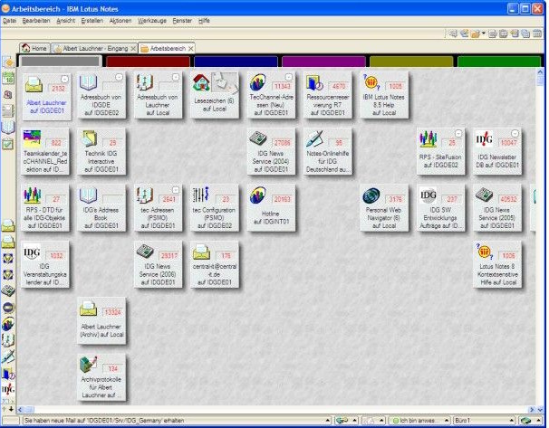

<h1 align="center">Lotus Notes: "<i>This used to be my playground</i>"</h1>

<table><tr><td>

### `Lotus Notes`<mark>LN</mark>, the multiplatform groupware, was first released at the turn of 1991. Joining the best of computer sciences from the 1980s with _laissez-faire_ IT in the 1990s, it rapidly became the core asset for companies and teams.

<mark>LN</mark> <samp>Henceforth also <b><i>LN</i></b>.</samp>

</td><td width="30%">
<picture></picture>
</td><td>

As a developer of Line-of-Business and corporate applications on Lotus Notes for over a decade<mark>#</mark>, I&nbsp;must have deserved the privilege of personal (Lotus) notes.

<mark>#</mark> <samp>Before I cast my lot with <a href="../../../../../.net">C#.NET</a>.</samp>

</td></tr></table>

### IBM PC users remember (or not) that it was a time and a <b>word</b> &thinsp;&mdash;&thinsp; not Microsoft's one or WordPerfect, but ... «<mark>&thinsp;L<samp>&thinsp;O&thinsp;T&thinsp;U&thinsp;S&thinsp;</samp></mark>» &thinsp;&mdash;&thinsp; a synonym for spreadsheet, text processor, calendar, E-Mail client, and collaboration tools.

<table><tr><td width="30%"><picture></picture>
</td><td>

Developers and admins will reminisce genuine Rapid Application Development with fluent installation/evaluation🙋 and leading-edge editors.

LN paved the public road to diverse innovations: client-server, multirole/group access, distributed/synchronized doc-oriented DB📜, **replication**⭐, asymmetric encryption from authorization down to selected fields on demand &thinsp;&mdash;&thinsp; to name a few of the extraordinary goodies.

There were similar suites &thinsp;&mdash;&thinsp; legacy, alternative, or tailor-made &thinsp;&mdash;&thinsp; but this aquatic flower dominated the market garden ... until Microsoft began to win large chunks of the office software market.
  
</td></tr></table>

* In 1995, <samp> gained Lotus in full💰</samp>.\
It was a big chance not only to gain from sales and internal installations, but also to reform at least _LN_ by leaning on the influence and technological capital of Big Blue.\
However, mediocre and inaccurately focused efforts caused Lotus to wilt.🍦

* In 2001, Microsoft released its "bird of a feather" &thinsp;&mdash;&thinsp; **SharePoint** &thinsp;&mdash;&thinsp; much more sophisticated and bulkier but promoting the next generation of a product and API.\
SharePoint was deprived of many inherent vices of the Lotus pioneer and gradually began to supersede _LN_ in the one-way migration. 

* The bargain sale of Domino/Notes and donating the office's source code to freeware pushed out _LN_ to IT margins.

\___________\
&nbsp; &nbsp; 🙋 <samp>I can't feature a newbie installing SharePoint on a notebook and writing the first useful application within a week.</samp>\
&nbsp; &nbsp; 📜 <samp>Long before NoSQL became mainstream.</samp>\
&nbsp; &nbsp; ⭐ <samp>Emphasized for rare ease, versatility, productivity, and robustness. Besides synchronizing DBs it allowed us to seamlessly use/develop LN offline, guarantee messaging, and merge design much simpler than in Git or TFS.</samp>\
&nbsp; &nbsp; 💰 <samp>For a $3.5 billion - not a big deal nowadays, while made well before the 2000s when IT procurements had skyrocketed.</samp>\
&nbsp; &nbsp; 🍦 <samp>It's not a top secret that IBM's cold shoulder urged many top Lotus contributors to leave.</samp>

## Postsriptum. Alternative history

Notes had enough outdated and weak facets to surrender to the rival from Redmond (WA), but let's dream up how "surviving" LN could look.

+ **Storage as a sound object-relational model over IBM DB2**\
Instead of an enclosed and specific Notes Storage Facility (NSF)💿 
+ **Single-Page Web-Application as the only user client**🌩️\
Akin to Angular or React, eliminating desktop premises and porting _@formula_ language to JavaScript utilities
+ **Seamless UI integration of office features**\
Either from Microsoft or those updated from Lotus🥀, in popular open formats
+ **`C++`or`Java` as a main language**☕\
Actual version as a substitute for too elementary LotusScript
+ **Better learning resources**\
  The difference between IBM's "search for" and Microsoft's "select from" was too obvious.
+ **Libraries of UX elements and utils, dev environment extensions**\
 Lotus Notes could be on the wave of Open Source

**Last but not least**, top pro and liable  _Notes_ team/community to fulfill this wishlist and prevent quality degradation🙋.

> <mark>Was it technically doable? &thinsp;&mdash;&thinsp; <b>Absolutely</b>.</mark>

\___________

&nbsp; &nbsp; 💿  E.g.. NSF didn't support _foreign keys_, thus requiring "amateurish" boilerplate for any docs relations (as hierarchy). There was a never-realized plan to put DB2 under LN (like MS SQL behind Sharepoint). \
&nbsp; &nbsp; 🌩️ Though Notes Server could render applications on HTTP since 1996, designing forms required pretty much fine-tuning with HTML/JS.\
&nbsp; &nbsp; &nbsp; &nbsp; &nbsp; &nbsp; **XPages** since R8.5 came too late and were half-response.\
&nbsp; &nbsp; 🥀 1-2-3 and Word Pro were already outmoded in 2000.\
&nbsp; &nbsp; ☕ LN supported development in Java, but its version always lagged and required knowledge of specific workarounds (like calling the garbage collector in a cycle of LN docs).\
&nbsp; &nbsp; &nbsp; &nbsp; &nbsp; &nbsp; Most developers _nolens volens_ used dated LotusScript only - a branch of Visual Basic with built-in LN API (with C++ API behind).\
&nbsp; &nbsp; 🙋 "Migrating" myself from LN to .NET, I experienced, for certain: beta versions of Visual Studio 2010 crashed less often than the release of Notes Designer.\
\___________

> Let me finish with the quote from another hit &mdash; _**Now I know what made Lotus blue**_.\
> Yes, I know &mdash; **_Otis_** but, in earnest, I was pretty sure that _Lotus_ until [proof](https://en.wikipedia.org/wiki/Now_I_Know_What_Made_Otis_Blue)&thinsp;<b>W</b>.
This must tell enough about my involvement.

______\
 🔚 &nbsp;🌘 kyriosity 2023-2025 ..

