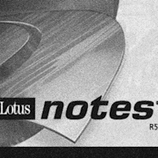
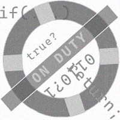
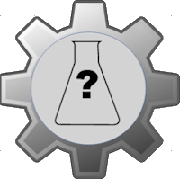

# <i>Pencraft</i> &nbsp;&mdash;&nbsp; Tries😹

<table>
  <tr align="center">
    <td>
      
       
<h4><a href="README+/AI-2020s.md">AI <samp>TWENTIES</samp></a></h4>

    </td>
      <td>
      
       
<h4><a href="README+/LN-view.md">LOTUS NOTES</a></h4>

    </td>
    <td>
      
         
<h4><a href="README+/punchcard.md">PUNCHCARDS</a></h4>

    </td>
                                            </tr><tr></tr><tr align="center">
    <td>
      
       
<h4><a href="README+/SW_architect-aTake.md">ARCHITECT(URE)</a></h4>

    </td>
        <!--                          N U L L   W A S H I N G      --!>
      <td>
        
         
<h4><a href="README+/NullRefError.md">WASHING <code>NULL</code></a></h4>

     </td>
    <td>
        
         
<h4><a href="../quotes/README+/inspirational.md">QUOTES for INSPIRATION</a></h4>

    </td>
        </tr><tr></tr><tr align="center">
    <!--                  T D D   W A T E R S H E D !-->                                              
  <td>
      
       
<h4><a href="../../../software/tests/asDrive/README+/TDD-Watershed/README.md">TD<mark>?D</mark> WATERSHED</a></h4>

    </td>
          <td>
      <picture></picture>
       
<h4>? PEN RESISTANCE ?</h4>
    </td>
    <td>
      
         
<h4><a href="../offtopic/anti-home-office.md"">ANTI-HOME-OFFICE</a></h4>

    </td>
  </tr>
</table>

🔚 🌒 2024-2025 ... a bit more freestyle ➡️ [use-dev <mark><samp><b>HIGHLIGHTS</b></samp></mark>](https://github.com/Kyriosity/use-dev/blob/main/.github/README.md#highlights)\
<i>The product of imagination AS it IS.</i>
