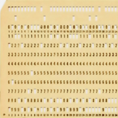
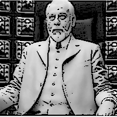

# Pencraft &mdash; Essays

<table>
  <tr>
    <td>
      
       
<h4><a href="README+/AI-2020s.md">AI <samp>TWENTIES</samp></a></h4>

    </td>
      <td>
      
       
<h4><a href="README+/LN-view.md">LOTUS NOTES</a></h4>

    </td>
        <td>
      
         
<h4><a href="README+/punchcard.md">PUNCHCARDS</a></h4>

    </td>
                                            </tr><tr></tr><tr>
    <td>
      
       
<h4><a href="README+/SW_architect-aTake.md">ARCHITECT(URE)</a></h4>

    </td>
   <td>
    
         
<h4><a href="../quotes/README+/inspirational.md">QUOTES for INSPIRATION</a></h4>

    </td>
  <td>
      
       
<h4><a href="../../../software/tests/asDrive/README+/!TestDrive-Big_Watershed.md">TD<mark>?D</mark> WATERSHED</a></h4>

    </td>                                </tr><tr></tr><tr>
      <td>

       
<h4><a href="../../../software/ArcDeco/README.md">ARC DECO</a>&thinsp; 🐝</h4>

    </td>
    <td>
      <picture></picture>
       
<h4>? PEN RESISTANCE ?</h4>
    </td>
    <td>
      
         
<h4><a href="../offtopic/anti-home-office.md"">ANTI-HOME-OFFICE</a></h4>

    </td>
  </tr>
</table>

🔚 🌒 2024-2025 ... some more freestyle ➡️ [use-dev <mark><samp><b>HIGHLIGHTS</b></samp></mark>](https://github.com/Kyriosity/use-dev/blob/main/README.md#highlights)\
<i>The product of imagination AS it IS.</i>
