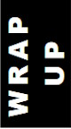

# <mark>Markdown</mark> on Git :octocat: &rarr;&thinsp; Hands-on experience <sup>😹</sup>

<p align="right"><b>&ndash;</b>&nbsp;What is the difference between<br />a <i>markdown</i> newbie and an expert?<br /><b>&ndash;</b>&nbsp;Half an hour.</p>

<sub>[](#)</sub> is lightweight to learn and use with plenty of guides and cheat sheets for advanced techniques.

Despite building it in and assigning it the role of primary documentation, <sub>[](#)</sub> alone doesn't render its site in markdown or a flavor. (This markup and its dialects were never designed to provide rich content.)

<table align="center"><tr></tr><tr><td>
    
Some <mark>markdown</mark> beyond a moderately formatted text? Here is my ounce of teaching illustrated by this repository.

</td></tr></table>

<p dir="rtl"><i>.Markdown forgives</i>»<br /><i>«.The GitHub doesn't</i><br />(for <a href="https://www.merriam-webster.com/dictionary/TL%3BDR">TL;DR</a>)</p>

<table><tr valign="top"><td>
    
## Editors and Tools

A simple markdown is readable without WYSIWYG, and no editor will support it. 
No IDE (as Visual Studio) guarantees a "native" browser experience. Thus, the editor of choice is www.github.com, switching between _Edit_ and _Preview_.

* There's no excuse to avoid grammar check browser plugins.
* View releases on browsers with different engines.
* Always preview the mobile presentation to be passable (but don't expect a nice layout on small screens).

## Limitations

### Markdown

- Markdown doesn't have codes akin to HTML or rich-text formats (to begin with, essential non-breaking elements).
- Native markdown tables are intended for small portions.
- There are no variables in markup (Remember, it's plain text).

### Git

<b>The saddest experience:</b> you can't include shared content and snippets but <samp>copy-paste</samp>. (While even elementary repositories have common headers and footers of READMEs.) Next:

- GitHub removes styles, classes, and most other formatting.\
(Thus, there are always borders in both "marked down" and HTML-made tables.)
- There's no overlay for image loading, but blank space &mdash; readers may be unaware of this and skip your beautiful illustrations.
- Many (if not most) Q&A tricks for markdown won't work on Git.
- It's easier to list what the GitHub site editor has (a few shortcut keys) rather than what's wanted: toolbars, context menus, auto-saving, and so on.
- GitHub isn't the fastest or the smartest markdown engine.

## More than text

### Diagrams

+ Good news: GitHub renders `mermaid` diagrams in markdown.\
(If you don't know them, a <a href="https://mermaid.js.org/intro/">quick tour</a><sup>🧜🏼‍♀️</sup> is worth a look).
+ Entity names can be made into HTML links (but not in every type&thinsp;**!**).
+ "Mermaids" mushrooming gives hope to see WYSIWYG tooling soon.

"Mermaids" are beautiful, but not for drawings. For a specific layout or artistic look, you need to save a drawing in another program.

### Pictures

+ There's nothing wrong with including images in documents, but their size. Also, markdown on Git won't support goodies like linkable picture areas or images in pop-ups.

### Pictograms / Symbols

GitHub markdown renders pictograms from <code>:<i>emoji</i>:</code> codes, but it's the same collection as in _emoji keyboard_ (<kbd>Win+.</kbd> for Windows users). Raw graphic symbols are better than their code names unless a document must be saved as <samp>ASCII</samp>.

To my knowledge, the only exception (inserted by code only) is a dozen of Git's custom emojis, of which I'd only consider <code>:octocat:</code>, <code>:atom:</code> and <code>:electron:</code>.

Review [HTML symbols](https://www.w3schools.com/charsets/ref_html_symbols.asp)<sup>🔗</sup> as a great enhancement of selections.

> [!WARNING]
> Browsers may show some pictograms differently. Find out the differences in this snapshot:
> 
> <a href="essays/README+/AI-2020s.md#evidence"></a>

### Miscellany

Keep in mind inherently supported `code snippets` with `diffs`, [math expressions](https://docs.github.com/en/get-started/writing-on-github/working-with-advanced-formatting/writing-mathematical-expressions)<sup>:octocat:</sup>, and [badges](https://shields.io/)<sup>🔗</sup>.

## HTML

HTML elements must be in play even for the purest text: markdown has neither a non-breaking space nor a hyphen. The richer the content, the more HTML you will use.

Surprisingly, the inevitable `<table>` can keep pure or mixed markdown in cells &thinsp;&mdash;&thinsp; put an empty line before and after.

## Tips and advice

Advice **No.1** is "don't try to hack Git-markdown." Even if you manage to style some elements one day, Git may sweep this out tomorrow.

Besides symbols, the best HTML pals of markdown writers are

+ `<details>` expandables to mitigate the volume hit and for optional parts.
+ `<table>` - needs explanation?
+ `<sub>`, `<sup>`, and `..[v]align=..`.

### Fancy footnotes

Numbered footnotes are academic and convenient, but a number itself won't tell much about its subject (when separated by enough content). Mnemonic superscript references are eye-catching<sup>🙋</sup>.\
&nbsp;&nbsp;&nbsp;&nbsp;<sup>🙋</sup> <sub>You can invent your footnotes vocabulary, as I use _raising hand_ to voice my opinion.</sub>

### Links suffixes

Named links are practiced overall, but they can distract. You may hint that a URL goes **outside**: [Docs as code](https://www.writethedocs.org/guide/docs-as-code/)<sup>🔗</sup>. 
Next, narrow mnemonics to hint at frequently referred resources, like:\
[Reactive programs](https://en.wikipedia.org/wiki/Reactive_programming)<sup><b>w</b></sup>,&nbsp;&nbsp;
[Trending C#](https://github.com/trending/c%23)<sup>:octocat:</sup>,&nbsp;&nbsp;
[charts samples](https://mermaid.js.org/syntax/examples.html)<sup>🧜‍♀️</sup>,&nbsp;&nbsp;
[co- _vs._ contravariance](https://learn.microsoft.com/en-us/dotnet/standard/generics/covariance-and-contravariance)<sup>🪟</sup>,&nbsp;&nbsp;
[`C# Lookup`](https://learn.microsoft.com/en-us/dotnet/api/system.linq.lookup-2)<sup>🪟</sup>,&nbsp;&nbsp;
[.NET conf 2024](https://www.youtube.com/watch?v=ikSNL-lxolc)<sup><picture></picture></sup>.

### <a id="link-achors" />Link🔗 anchors ⚓

Prefer `<a id="anchor_name" />` for sustained (internal) links to avoid changeable and motley `#-heading`.

```diff
-   ## Unlinkable fancy header,,🐈‍⬛!!..
+   ## <a id="feline_anchor">unlinkable fancy header,,🐈‍⬛!!..

// somewhere ...
... <a href="../animal_stories.md#feline_anchor">fancy cats</a> ...
```

### Images

Avoid clickable images unless they are links or a detailed (bigger) version: HTML `<picture>` to rescue.

</td><td><picture></picture></td></tr></table>

<table><tr valign="top"><td><picture></picture></td><td>

You may consider Git-supported dialects as [flavored markdown](https://github.github.com/gfm/)<sup>:octocat:</sup> and converters as [PanDoc](https://pandoc.org)<sup>🔗</sup>. 

There are legions of content management and site creation tools for big projects that are more suitable and pro than markdown-on-Git.

</td></tr></table>

## Appendix. "Dirty tricks"

Besides obvious gimmicks, some others require disclosure.

<details><summary><ins>&nbsp;&nbsp;&nbsp;&nbsp;&nbsp;<b>F<samp>&thinsp;O&thinsp;R&thinsp;M&thinsp;A&thinsp;T&thinsp;T&thinsp;I&thinsp;N&thinsp;G</samp></b>&nbsp;&nbsp;&nbsp;&nbsp;&nbsp;</ins></summary>

<table align="center"><tr></tr><tr><td>Centered or right-aligned block quote</td></table>

\___________</details>

<details><summary><ins>&nbsp;&nbsp;&nbsp;&nbsp;&nbsp;<b>T<samp>&thinsp;A&thinsp;B&thinsp;L&thinsp;E&thinsp;S&thinsp;</samp></b>&nbsp;&nbsp;&nbsp;&nbsp;&nbsp;</ins></summary>
&nbsp;
    
+ Markdown automatically highlights alternative rows, but by inserting `</tr><tr>` you can master it.

\___________</details>

🐝 ... _to be continued_ ... 🐝 

\___________

<div align="center"> 🔚 ... 🎉 <b>you made it to a markdown lord</b>🎈 ... 🌙 2025</div> 
