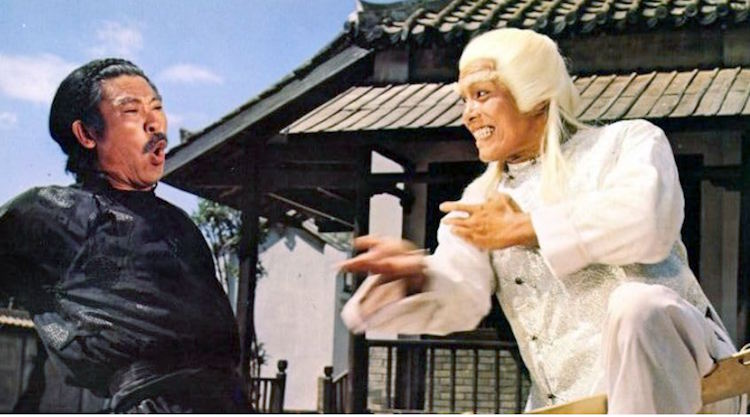
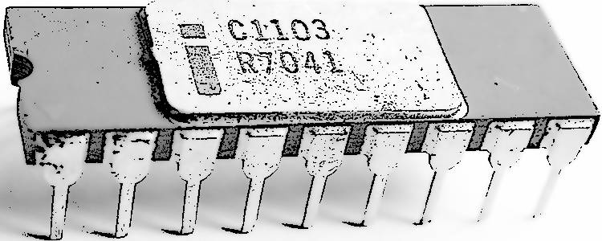

# The Legend of &nbsp; M<samp>&thinsp;E&thinsp;M&thinsp;O&thinsp;R&thinsp;Y</samp> &nbsp; M<samp>&thinsp;A&thinsp;S&thinsp;T&thinsp;E&thinsp;R&thinsp;S</samp>

> I heard it from a <code>C++</code>-gifted colleague when we exchanged [<samp><b>DOOM</b></samp>](https://en.wikipedia.org/wiki/Doom_(1993_video_game))&thinsp;<b>w</b> experience (already lores too).
> 
> His mom &thinsp;&mdash;&thinsp; who used to bе an assistant in some IT labs &thinsp;&mdash;&thinsp; was sceptical about the son's excitement about this 3D marvel and told that true multi-warrior computer games with epic wins are a thing of the past &nbsp;**.&thinsp;.&thinsp;.**\
> &nbsp;

<i>I remastered and enhanced that.</i>

<table><tr valign="top"><td width="50%"><picture></picture> 
<picture></pictire>

</td><td>
  
The lore goes in times of two-row monochrome text monitors (if not arrays of light bulbs) when every programmer was a computer scientist, or a mathematician, or both.

Those senior in age and title occupied relatively idle nighttime🌛 to connect their computer centers via antediluvian _wide-area networks_ and combat resources with all possible (for warming up) and impossible, and unthinkable hacks in _machine languages_.
    
 Only codes, only hardcore &nbsp;&mdash;&nbsp; no hardware manipulations, no dirty cheats, no vulgar social engineering.
   
The winner occupied most or all of the memory of the opponents' time slots.

These sagas remained unnoticed in the mass culture since ultra-level abstraction is required to grasp what silent battles unfolded in darkness over bits (not bytes).

🌛 <samp>Relatively, since computer time was so deficient, a couple of hours in night shifts on BIG machines was a big luck for junior fellows (daytime was out of reach for them at all).</samp>
</td></tr></table>

\___________\
🔚 🌘 2025 .&thinsp;.&thinsp;. kyriosity\
Image credits: screengrab, imdb.com: <i>Born Invincible</i>, 1978; Wiki media: Intel 1103 memory
