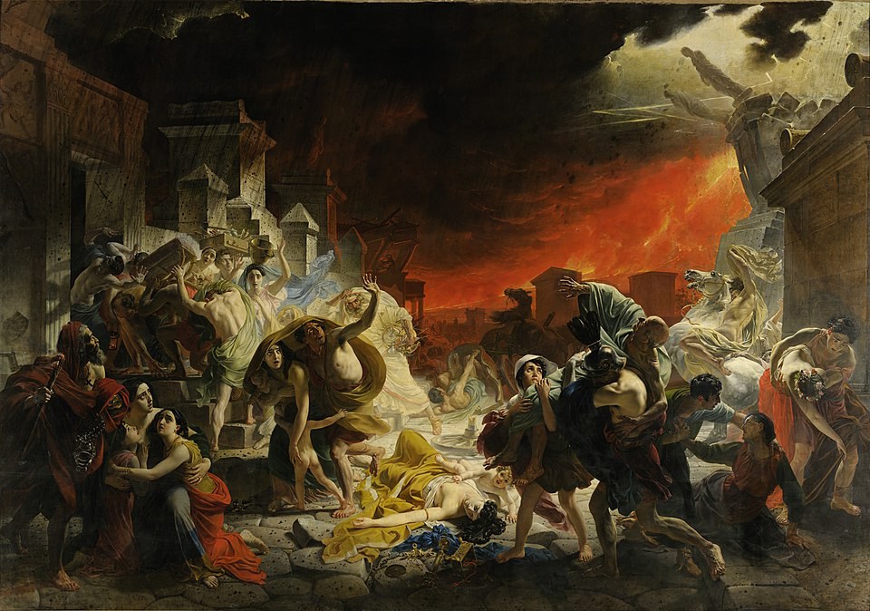
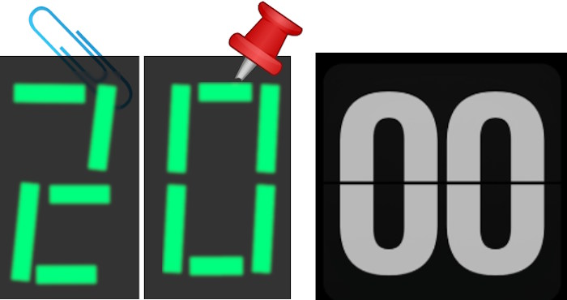

# Memes from templates

## Expectation vs. Reality

### Year 2000 problem

<table><tr></tr><tr align="center"><td><b>E&thinsp;X&thinsp;P&thinsp;E&thinsp;C&thinsp;T&thinsp;A&thinsp;T&thinsp;I&thinsp;O&thinsp;N</b></td><td><b>R&thinsp;E&thinsp;A&thinsp;L&thinsp;I&thinsp;T&thinsp;Y</b></td></tr><tr>
  <td></td>
  <td><picture></picture></td>
</tr></table>

Billions spent to prevent [Y2K](https://en.wikipedia.org/wiki/Year_2000_problem) could seem exaggerated, but they went to modernization and sanitation of the software worldwide.

### Philosophisaurus

### Outstanding move

## Cesspit

\___________\
it can't 🔚 
