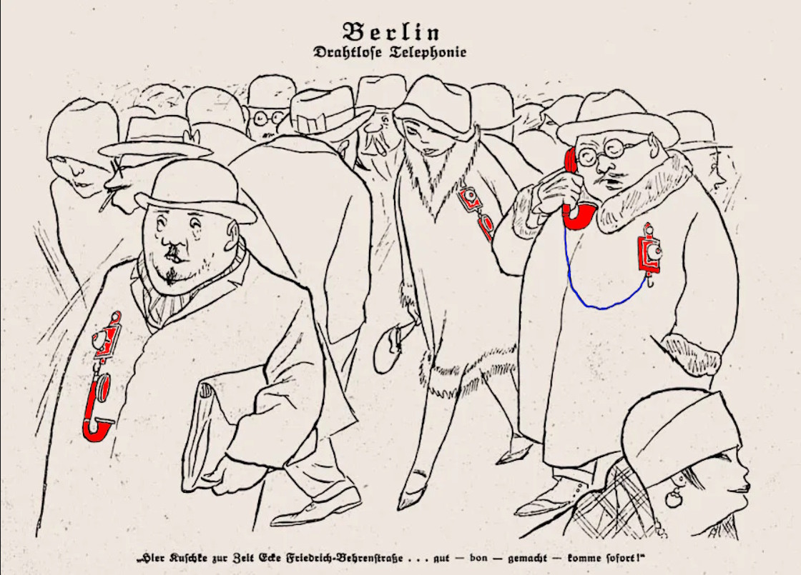
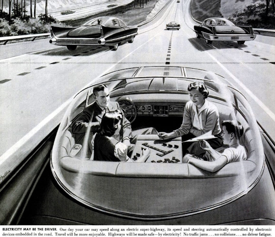
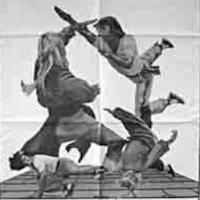

#  IT memes&nbsp;&nbsp;&mdash;&nbsp;&nbsp;Idiomatic collection

<div dir="rtl"><i>I like epigraphs for<br/>magnificent look and<br>.vertical indent</i></div>

## Primus

<details><summary><ins>&nbsp;<b>West meets east</b>&nbsp;</ins></summary>
&nbsp;
  


[](../../../software/)

The grains of truth in this wisdom:

* No other knowledge erodes so quickly as the IT tech stack - languages/scripts, markup, frameworks, and their IDEs, UX styles emerge, submerge, and mutate with the year's pace.<sup>:violin:</sup>
* In the orthogonal (to time) dimension, a developer can't stick to a favorite syntax and must be fluent in a wide techno spectrum.

&nbsp;&nbsp;&nbsp;&nbsp;&nbsp;&nbsp;<sup>:violin:</sup> <sub>Javascript/HTML, which one learned in 2000, remains only as kernel syntax. 
It went through numerous libs, polyfills, jQuery, and other cool tools and transformed into single-page-application frameworks, which now govern the web dev.</sub>

**Escape?**

> Don't swim against the current. Stay in the river, become the river; and the river is already going to the sea. This is the great teaching.\
— _Rajneesh, aka Osho_ (1931-1990)

Translated east-to-west this means: find a sinecure in a big company.

\___________</details>

<details><summary><ins>&nbsp;<b>AI</b>&nbsp;</ins><code>xor</code><ins>&nbsp;<b>IT</b>&nbsp;</ins></summary>
<a name="AIxorIT"></a>&nbsp;

   

[](../essays/README+/AI-2020s.md)\
<sub>(Answer: Homunculus shows the middle finger on the left hand.)</sub>

<mark><b>P.S.</b></mark> Honestly, I concocted this collage before coming on "Alchemy and AI", 1965, by [Hubert Dreyfus](../quotes/README+/contributors/README.md#Hubert-Dreyfus). 

\___________</details>

## Programming techniques

<details><summary><ins>&nbsp;<b>Fair random</b>&nbsp;</ins></summary>
&nbsp;
  


<picture></picture><br/><br/>

And ... the twist! It was a real random number, while algorithms generate pseudo-random ones.

As the extraordinary [John von&nbsp;Neumann](../quotes/README+/contributors/README.md#John-von-Neumann) stressed:

> Anyone who considers arithmetical methods of producing random digits is, of course, in a state of sin.

\___________</details>

<details><summary><ins>&nbsp;<b>Programmer in a math class</b>&nbsp;</ins></summary>
&nbsp;

 

<picture></picture><br/><br/>

This is justified because of the changed requirements as discussed a bit in [quotes](../quotes/README+/aside/sour_quotes.md#math).

\___________</details>

## Historic snapshots

<details><summary>📱 <b><ins>&nbsp;<mark>1926</mark>: Mobile phones rock Berlin&nbsp;</ins></b></summary>
&nbsp;

<picture></picture>
<div dir="rtl">,<b><i>Berlin Drahtlose Telephonie</i></b> <kbd><b>DE</b>&thinsp;->&thinsp;<b>EN</b></kbd> Berlin wireless telephony<br />
<b><i>Bier Ausable zur Zeit Cafe Friedrich-Behrenstraße .&thinsp;.&thinsp;. gut &mdash; bon &mdash; gemacht &mdash; comme sofort</i></b><br />
<i>a fellow shares the location of cafe</i>] .&thinsp;.&thinsp;. good, <i>bon</i>, agreed, &mdash; be there in a moment] <kbd><b>DE</b>&thinsp;->&thinsp;<b>EN</b></kbd>
</div><br />

The caricature may look sloppy, but its author Karl Arnold had astonishingly escaped futuristic cringe: [Simplicissimus](http://www.simplicissimus.info/uploads/tx_lombkswjournaldb/pdf/1/31/31_38.pdf#page=2), 1926 (the Roaring Twenties).

</details>

1956: IT conquered the world

<details><summary>💿<ins>&nbsp;<b><mark>1956</mark>: When disks were indeed hard and strong skills in IT for real...</b>&nbsp;</ins></summary>
&nbsp;

<picture></picture><br/><br/>

</details>

<details><summary>🚗 <b><ins>&nbsp;<mark>19<i>nn</i></mark>: Full self-drive "next year" since 2014? Buckle up...&nbsp;</ins></b></summary>
&nbsp;

<picture></picture><br/>

> ELECTRICITY MAY BE THE DRIVER. One day your car may speed along an electric highway, its speed and steering automatically controlled by electronic devices embedded in the road.\
_LIFE Magazine, 25 Feb 1957, Page&nbsp;8 (Available on Google Books)_

</details>

<details><summary>🗃️ <b><ins>&nbsp;<mark>1966</mark>: Pile or stack?&nbsp;</ins></b></summary>
&nbsp;

<picture></picture><br/>
_(Tell grandma how much space your source files take ...)_

A store of punched cards for a casual program. I'm proud to have a [little experience](../essays/README+/punchcard.md) of dealing with them.

</details>

## Mosaic

<table><tr align="center"><td>
  
  ```mermaid
flowchart TD
    Start --> Continue
  ```
  
  <a href="README+/prj_cases.md"><b>PROJECT STORIES</b></a>
</td><td>
    <a href="README+/tale-memory_masters.md"><br />
  <b>MEMORY MASTERS</b></a>
</td><td>
  <samp><b>IT WORKS</b></samp><br />
  <mark>&thinsp;<b>¯\_(ツ)_/¯</b>&thinsp;</mark><br />
  on my MACHINE<br />
  <mark>&thinsp;<b>☁️ ¯\_(ツ)_/¯ ☁️</b>&thinsp;</mark><br />
  in my CLOUD<br />
<br /><a href="README+/polyptych_works.md"><b>POLYPTYCH</b></a>
</td><td>
  <picture></picture><br />
  <a href="README+/extra_read.md"><b>EXTRA READING</b></a>
</td></tr></table>

## **Volume&nbsp;II.** [**Inspirational quotes**](../quotes/README+/inspirational.md) 

\___________\
🔚 🌒 2024-2025 .. [Notes/disclaimer](../../../_rsc/README.md) about graphic resources<br />
<sub>Image credits: [The Mystery of Chess Boxing](https://www.imdb.com/title/tt0199813/?ref_=nm_flmg_job_1_cdt_t_13)</sub>
