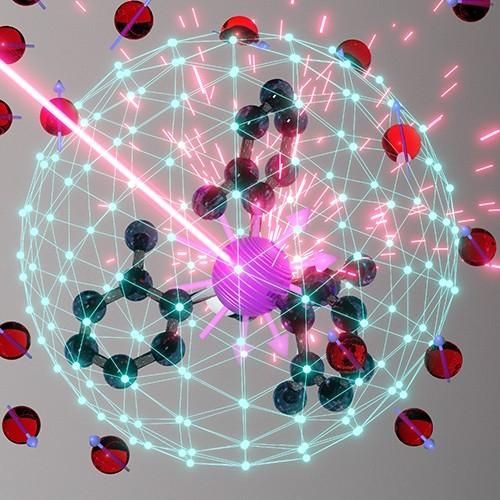

# Idiomatic collection - IT memes

<i>I like epigraphs for magnificent look and .vertical indent</i>

## Primus

<ins>&nbsp;<b>West meets east</b>&nbsp;</ins>

&nbsp;
  

The grains of truth in this wisdom:

* No other knowledge erodes so quickly as the IT tech stack - languages/scripts, markup, frameworks, and their IDEs, UX styles emerge, submerge, and mutate with the year's pace.:violin:
* In the orthogonal  (to time) dimension a developer can't stick to a favorite syntax and must be fluent in a wide techno spectrum.

&nbsp;&nbsp;&nbsp;&nbsp;&nbsp;&nbsp;:violin: Javascript/HTML, which one learned in 2000, remains only as kernel syntax. It went through numerous libs, polyfills, jQuery, and other cool tools and at the moment transformed into single-page frameworks, which rule the web dev.

**Escape?**

> Don't swim against the current. Stay in the river, become the river; and the river is already going to the sea. This is the great teaching.\
— _Rajneesh, aka Osho_ (1931-1990)

Translated east-to-west this means: find a sinecure in a big company.

\___________

<ins>&nbsp;<b>AI</b>&nbsp;</ins><code>xor</code><ins>&nbsp;<b>IT</b>&nbsp;</ins>

&nbsp;

   

Answer: Homunculus shows the middle finger on the left hand.

<mark><b>P.S.</b></mark> Honestly, I concocted this collage before coming on "Alchemy and AI", 1965, by [Hubert Dreyfus](../quotes/README+/contributors/README.md#Hubert-Dreyfus). 

\___________

## Programming techniques

<ins>&nbsp;<b>Fair random</b>&nbsp;</ins>

&nbsp;
  

<picture></picture>  

And ... the twist! It was a real random number, while algorithms generate only pseudo-random ones.

As the extraordinary [John von&nbsp;Neumann](../quotes/README+/contributors/README.md#John-von-Neumann) stressed:

> Anyone who considers arithmetical methods of producing random digits is, of course, in a state of sin.

\___________

<ins>&nbsp;<b>Programmer in a math class</b>&nbsp;</ins>

&nbsp;

 

<picture></picture>  

Justified: abilities in exact sciences are no longer a prerequisite for applied programming. 
It's normal to neglect a triage algorithm implementation (that a platform provides) rather than to write one's own or even comprehend/differentiate one.

\___________

## Urban legends / Tales from the Crypt

<ins>&nbsp;<b>Marsupial covariance</b>&nbsp;</ins>

&nbsp;

     

<table>
  <tr>
    <td width="50%">
      <a href="https://www.snopes.com/fact-check/shoot-me-kangaroo-down-sport/"><b>&nbsp;🦘Object-oriented kangaroos 🇦🇺&nbsp;</b></a>
    </td>
    <td><samp>Just for illustration</samp></td>
  </tr><tr valign="top">
    <td>
      <a href="../../../_rsc/_backup/ref/Marsupial/">downloaded safe-copy</a>  if the URL above doesn't work
    </td>
    <td>
      
    </td>
  </tr>
</table>

\___________

## Historic snapshots

📱 <b><ins>&nbsp;<mark>1926</mark>: Mobile phones rock Berlin&nbsp;</ins></b>

&nbsp;

<picture></picture>

,<b><i>Berlin Drahtlose Telephonie</i></b> <kbd><b>DE</b>&thinsp;->&thinsp;<b>EN</b></kbd> Berlin wireless telephony 
<b><i>Bier Ausable zur Zeit Cafe Friedrich-Behrenstraße .&thinsp;.&thinsp;. gut &mdash; bon &mdash; gemacht &mdash; comme sofort</i></b> 
<i>a fellow shares the location of cafe</i>] .&thinsp;.&thinsp;. good, <i>bon</i>, agreed, &mdash; be there in a moment] <kbd><b>DE</b>&thinsp;->&thinsp;<b>EN</b></kbd>

 

The caricature may look sloppy, but the vision of its author Karl Arnold impresses: [Simplicissimus](http://www.simplicissimus.info/uploads/tx_lombkswjournaldb/pdf/1/31/31_38.pdf#page=2), 1926 (the Roaring Twenties).

💿<ins>&nbsp;<b><mark>1956</mark>: When disks were indeed hard and strong skills in IT were in no way exaggerated requirements...</b>&nbsp;</ins>

&nbsp;

<picture></picture>  

🚗 <b><ins>&nbsp;<mark>1957</mark>: Full self-drive "next year" since 2014. Sure?&nbsp;</ins></b>

&nbsp;

<picture></picture> 

> ELECTRICITY MAY BE THE DRIVER. One day your car may speed along an electric highway, its speed and steering automatically controlled by electronic devices embedded in the road.\
_LIFE Magazine, 25 Feb 1957, Page&nbsp;8 (Available on Google Books)_

🗃️ <b><ins>&nbsp;<mark>1966</mark>: Tell her how much space your source files take&nbsp;</ins></b>

&nbsp;

<picture></picture> 

A stack of punch cards for a casual program. I'm proud to have a [little experience](../essays/README+/punchcard.md) of dealing with them

## Cooked up metaphors

<ins>&nbsp;<b>Deployment tenses</b>&nbsp;</ins>

🚧🐝🚧 ... WORK in PROGRESS ... 🚧🐝🚧

<table>
  <tr>
    <td>PAST was PERFECT</td>
  </tr>
  <tr>
     <td><picture></picture></td>
    <td><picture></picture></td>
    <td><picture></picture></td>
    <td><picture></picture></td>
    <td><picture></picture></td>
  </tr>
  <tr>
    <td>It worked in my convent</td>
    <td>It worked on my floor</td>
    <td><b>It worked on my PC</b></td>
    <td>It's working in my cloud</td>
    <td>It will work on my qubits</td>
  </tr>

VOAYGER

 1 / 0 COMMAND !

</table>

\___________

## Recommended reading 

<ins>&nbsp;<b>Drive and let drive</b>&nbsp;</ins>

&nbsp;

🚧 COMING...NEXT

\___________

# [**Volume&nbsp;II. Inspirational quotes**](../quotes/README+/inspirational.md) 

🔚 [Notes/disclaimer](../../../_rsc) about graphic resources here 🌘 2024
