# Photoblog&nbsp;&nbsp;&mdash;&nbsp;&nbsp;Anti-home-office

❗🏠 && ❗🏢 = 🏞️ 🚋🛸

<b><samp>NOT HOME, NOT OFFICE</samp></b>

## Planes, Trains & ... whatever

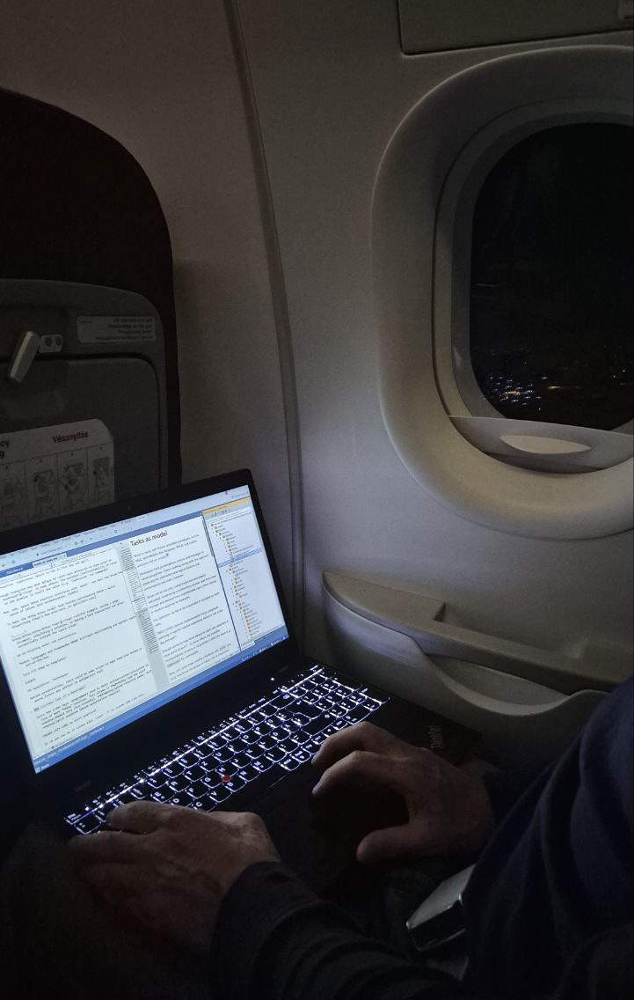

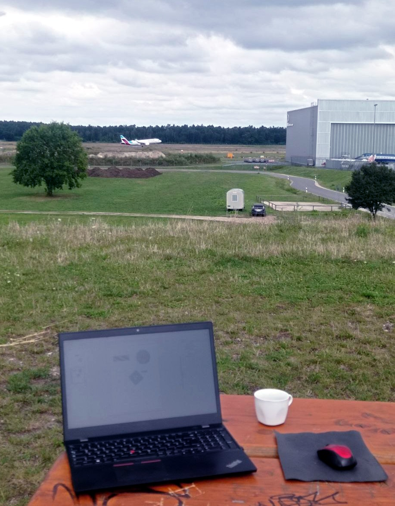
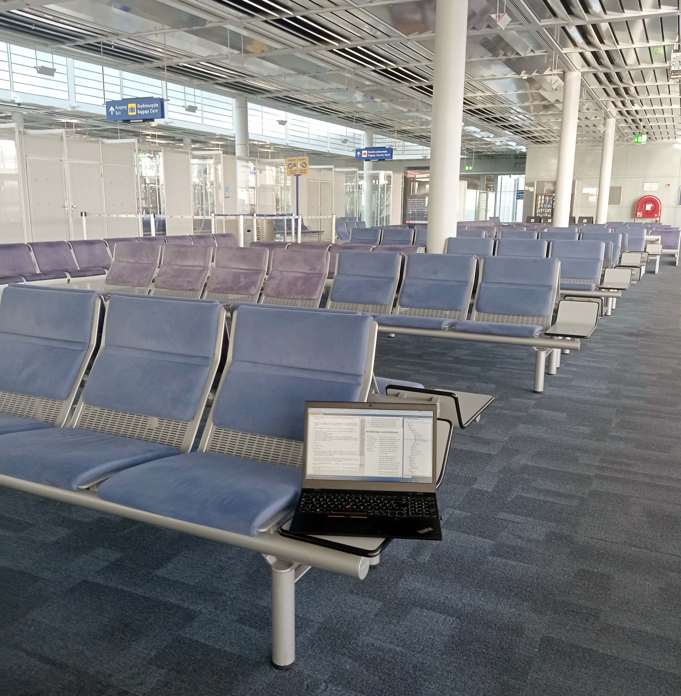

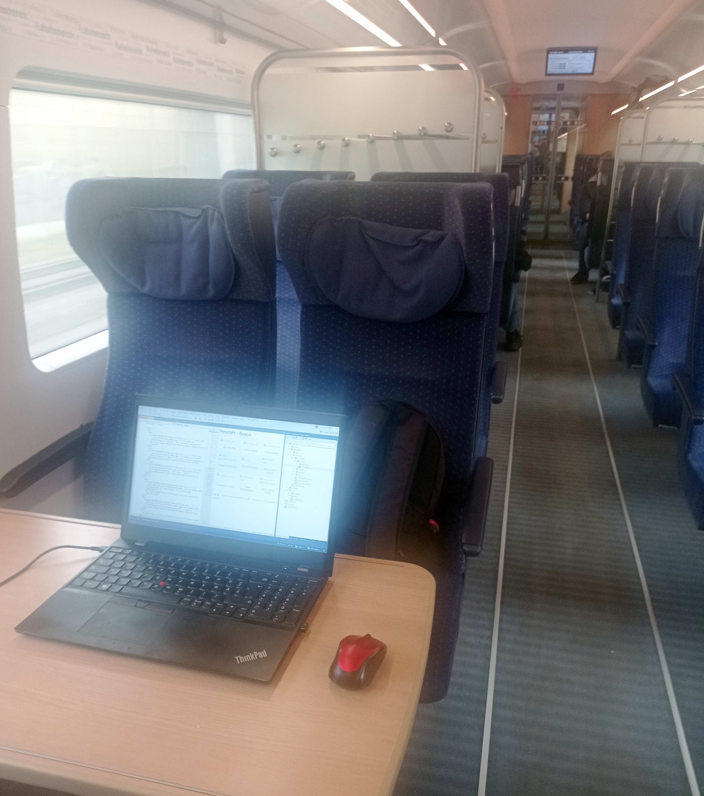Hamburg" width="300"/>
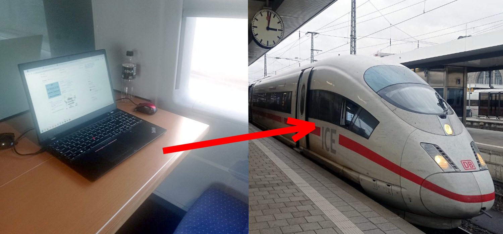

... not that convenient always ...

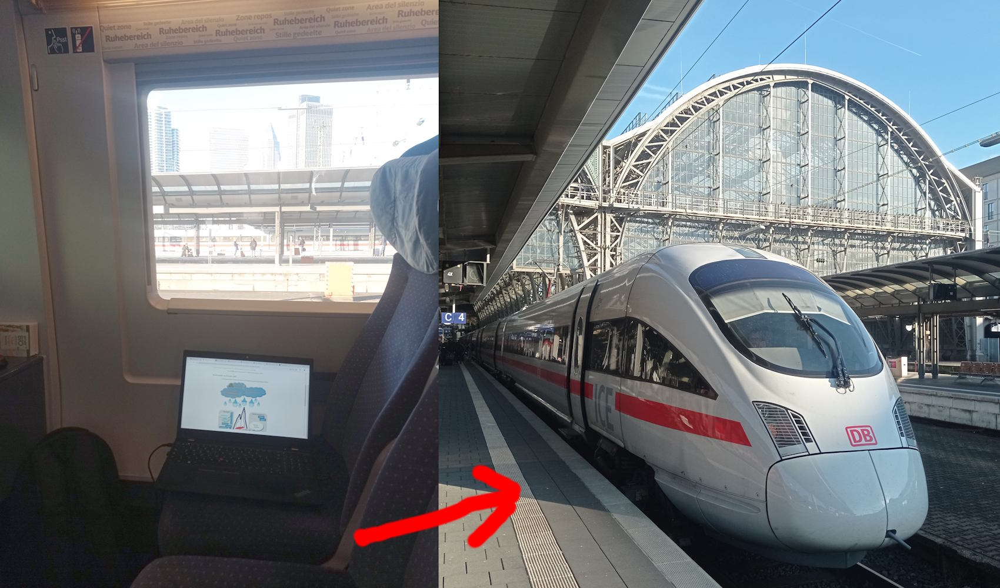

## Nature

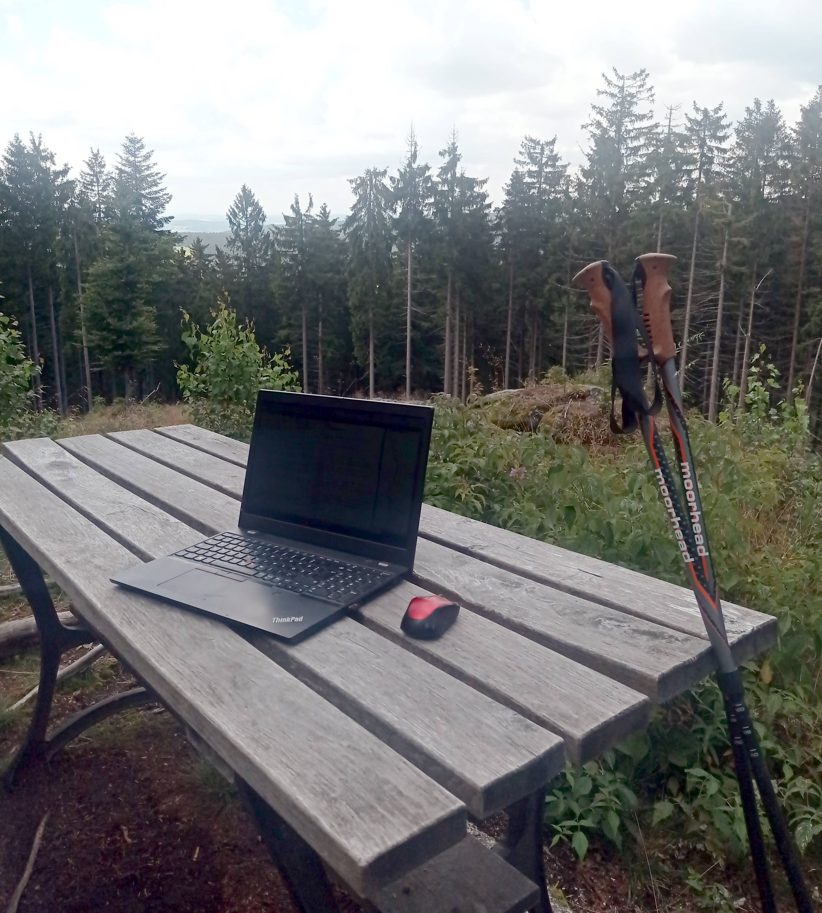
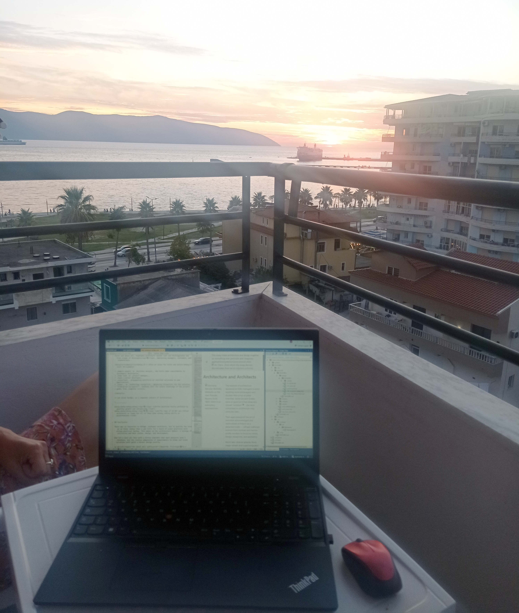
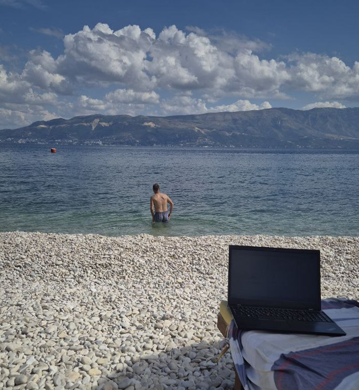
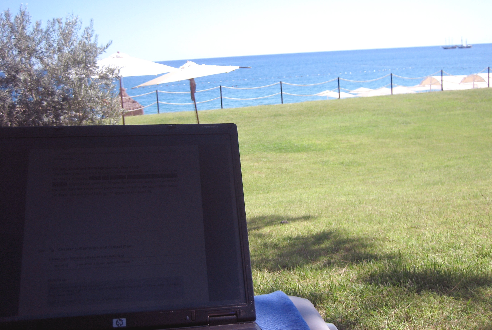
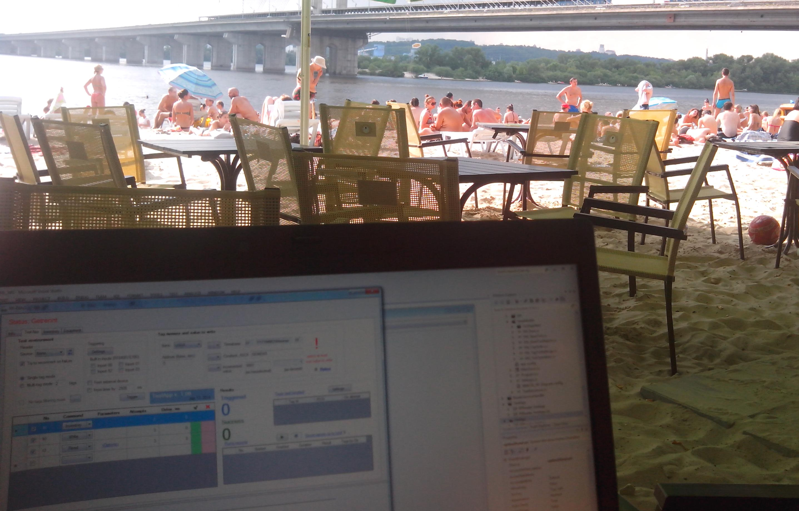

## Public spots

### Biblio

### Coffee

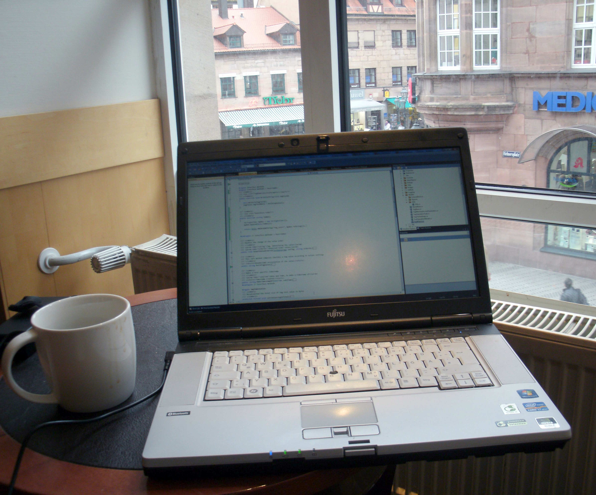
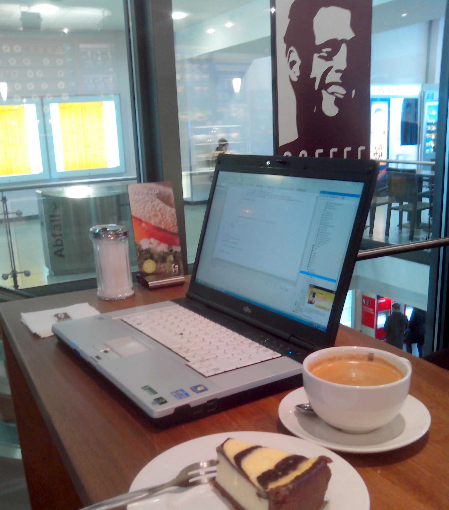

### <ins>&thinsp;Bottom line&thinsp;</ins> - how without cats?

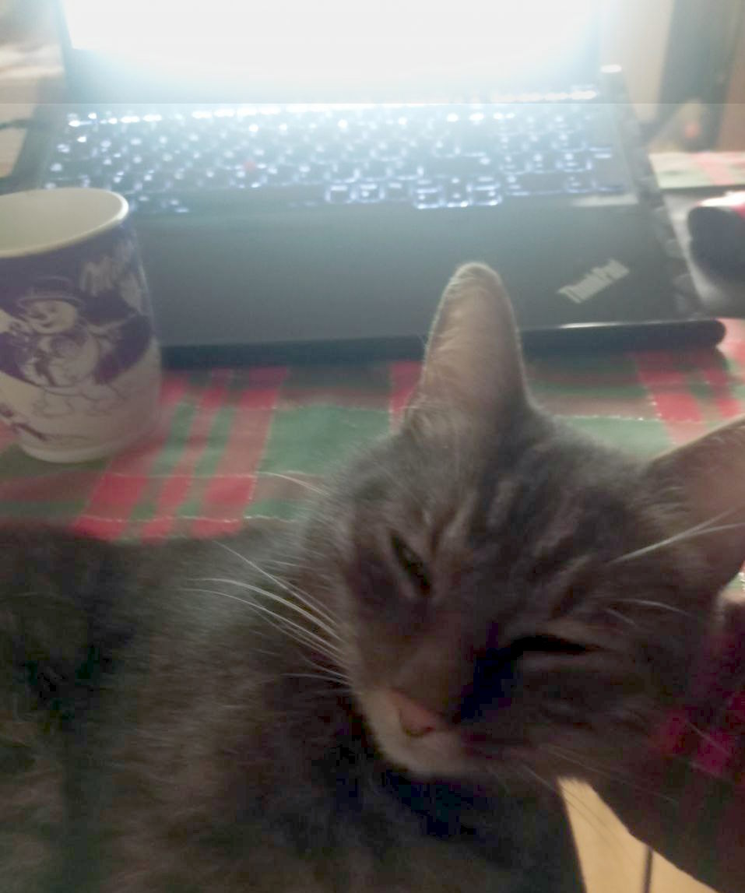

\___________

🔚 ... All snapshots are genuine and feature my programming and writing activity 🌘2000-2025
