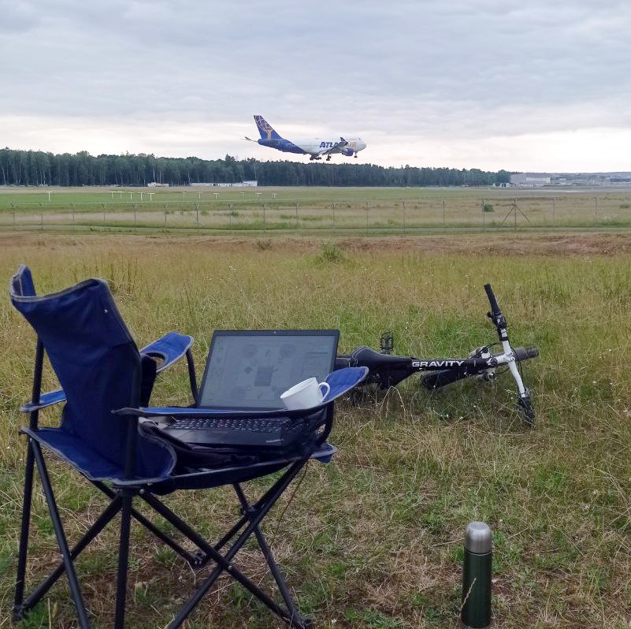
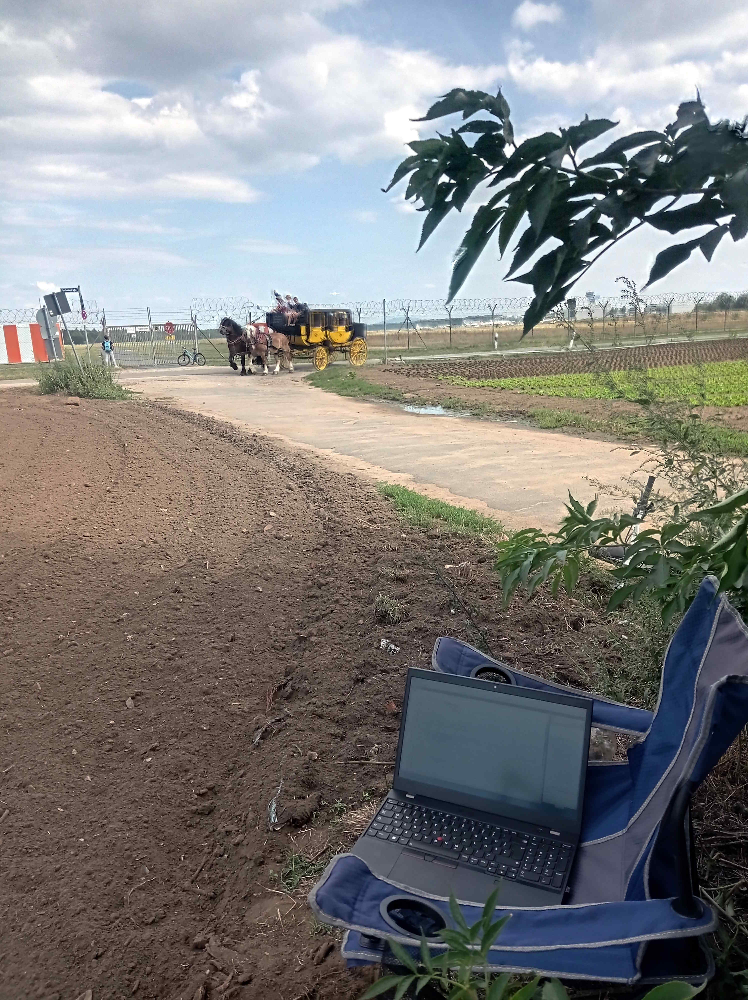

# Photoblog &mdash; Anti-home-office

❗🏠 && ❗🏢 = 🏞️ 🚋🛸

All the photos here were staged when contributing to the repositories.

## Transporation

## Nature

\___________\
🔚 ... to be continued ...
