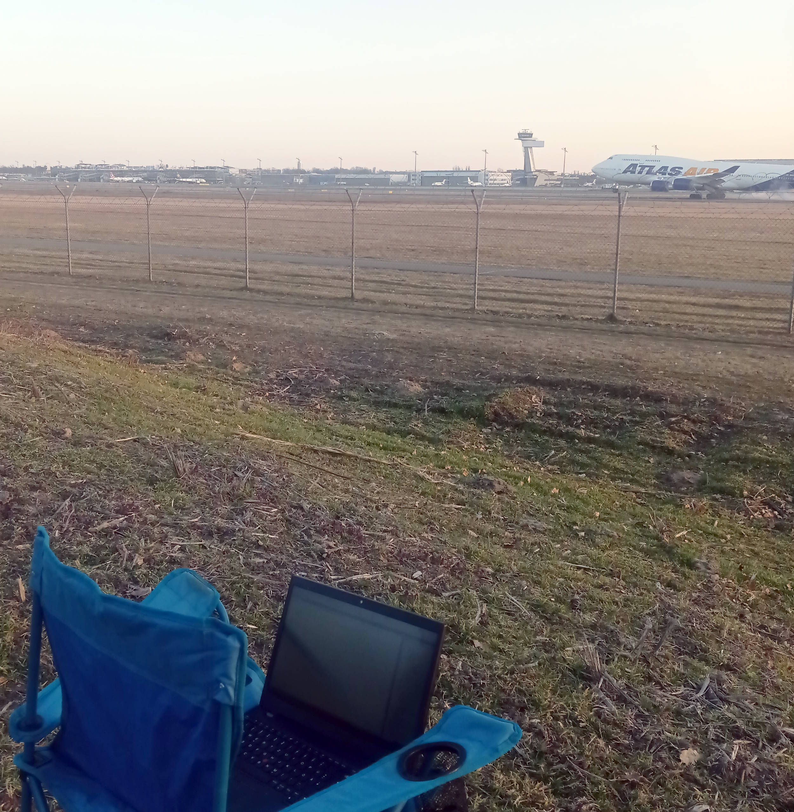
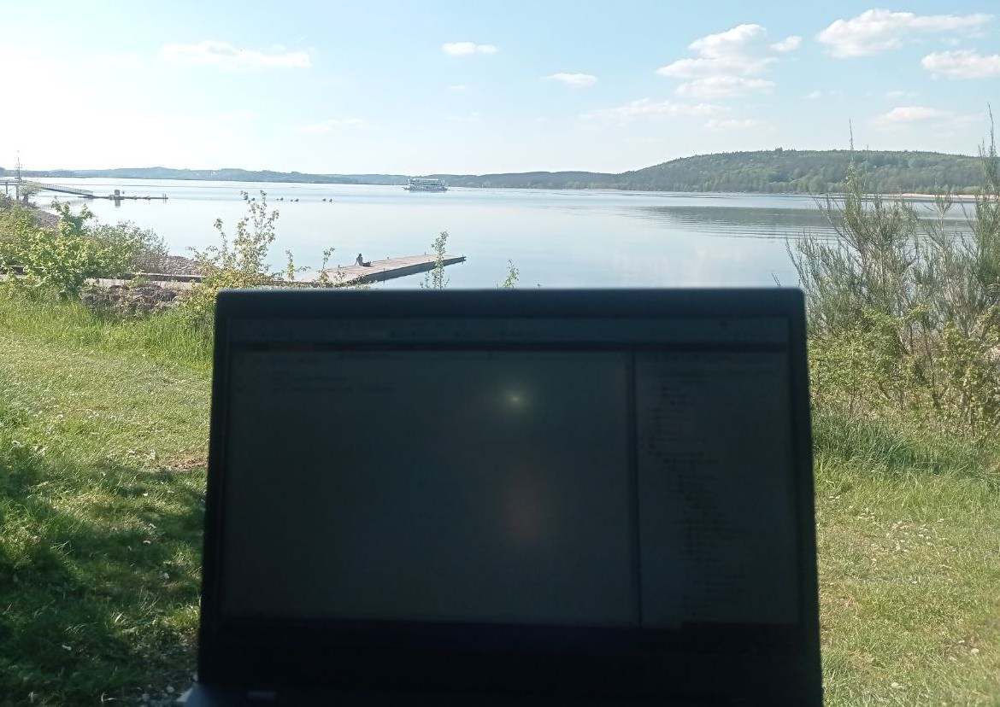
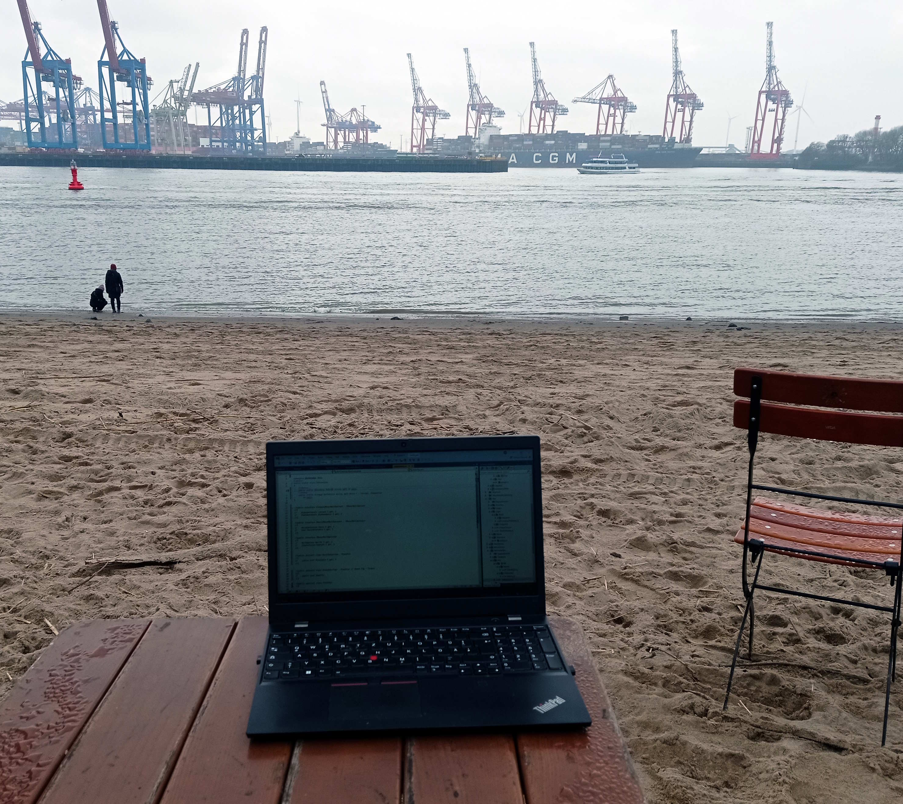
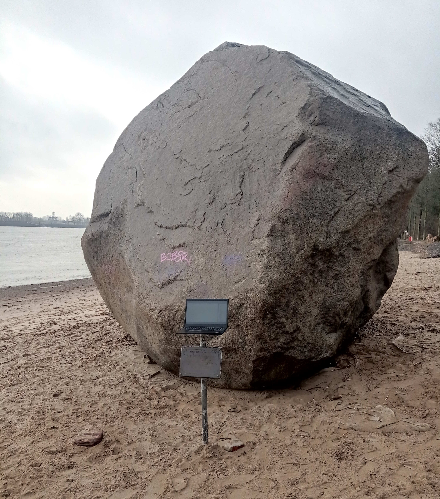
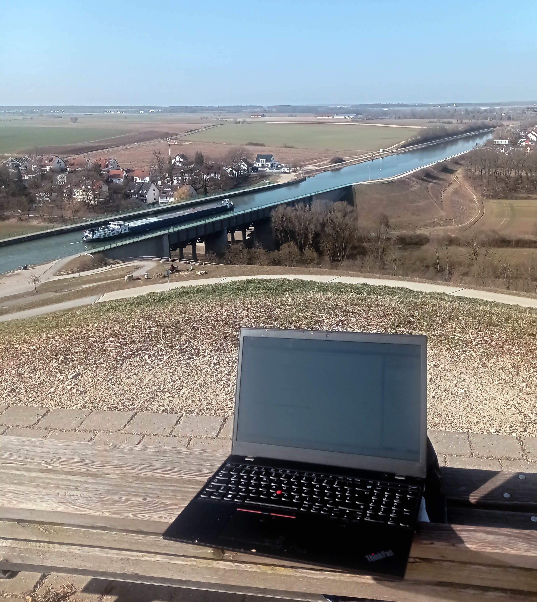
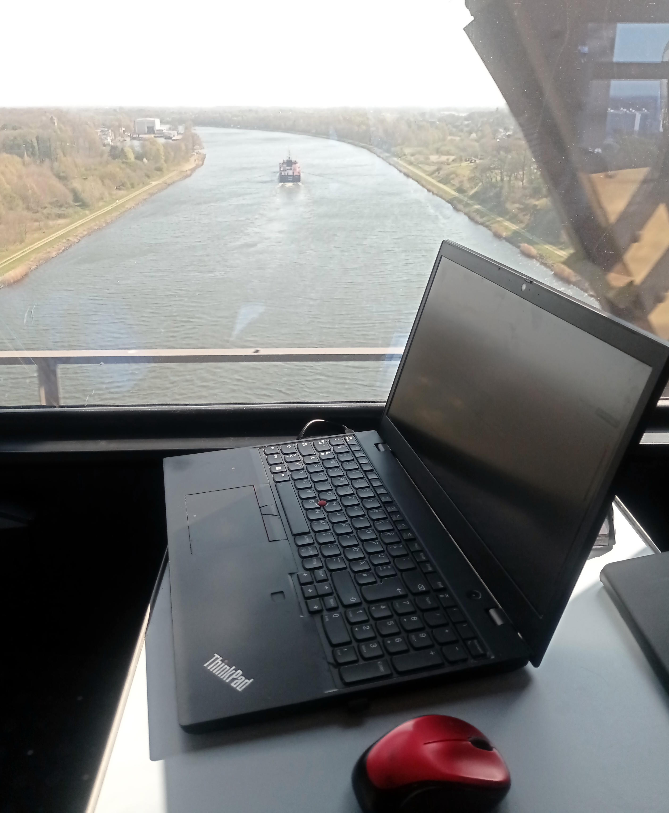
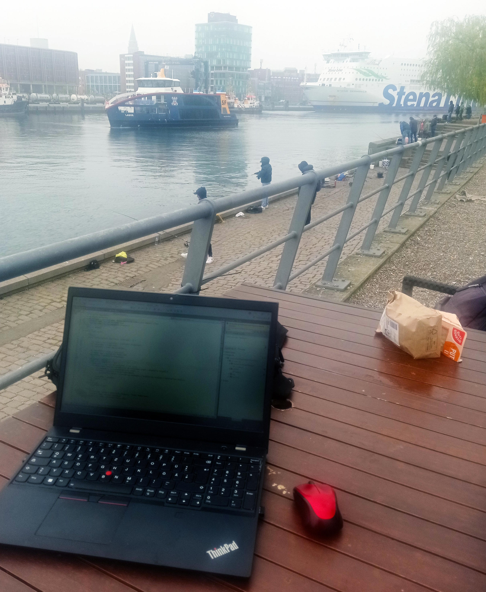

# Photoblog&nbsp;&nbsp;&mdash;&nbsp;&nbsp;Anti-home-office

<b><samp>NOT HOME, NOT OFFICE</samp></b> &nbsp; &nbsp; &nbsp; &nbsp; &nbsp;❗🏠 && ❗🏢 = 🏞️ 🚋🛸

## Planes, Trains & ... whatever

Hamburg" width="300"/>

... not that convenient always ... ⚠️

## Nature

## Public spots

### Biblio

### Java beans for C#

### <ins>&thinsp;Bottom line:&thinsp;</ins> Blog without cats would be _für die Katz_&thinsp;🐈‍⬛

\___________

&nbsp; &nbsp; 🚝 <samp>These photos are for entertainment only and in no way promote Deutsche Bahn.</samp>\
&nbsp; &nbsp; &nbsp; &nbsp; &nbsp;⚠️ You may miss important meetings or connections because of regular delays and cancellations of this service!

&nbsp; &nbsp; 🐈‍⬛ <samp>_German_ "for cat" &mdash; idiomatically "for nothing"</samp>

🔚 ... All snapshots are mine and genuine .. 🌘2000-2025 ...

