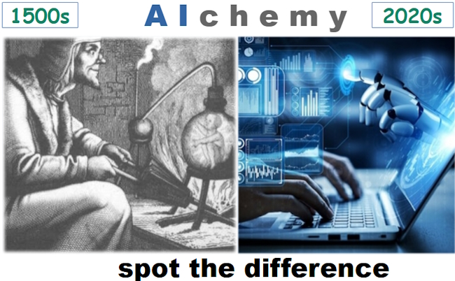

# IT memes - Idiomatic collection

<i>I like epigraphs for magnificent look and .vertical indent</i>

|- [**PART&nbsp;II. Seasoned quotes**](#part-ii-seasoned-quotes) ⬇️

## PART I

<ins>&nbsp;<b>First and foremost ...</b>&nbsp;</ins>

&nbsp;
  
 

The grains of truth in this wisdom:

* No other knowledge erodes so quickly as the IT tech stack - languages/scripts, markup, frameworks, and their IDEs, UX styles emerge, submerge, and mutate with the year's pace.:violin:
* In the orthogonal  (to time) dimension a developer can't stick to a favorite syntax and must be fluent in a wide techno spectrum.

&nbsp;&nbsp;&nbsp;&nbsp;&nbsp;&nbsp;:violin: Javascript/HTML, which one learned in 2000, remains only as basic syntax. It went through numerous libs, polyfills, jQuery, and other cool tools and at the moment transformed into single-page frameworks, which rule the web dev.

**Escape?**

> Don't swim against the current. Stay in the river, become the river; and the river is already going to the sea. This is the great teaching.\
— Rajneesh, aka Osho (1931-1990)

Translated east-to-west this means: find a sinecure in a big company.

---------

<ins>&nbsp;<b>Fair random</b>&nbsp;</ins>

&nbsp;

  

---------

<ins>&nbsp;<b>Marsupial covariance</b>&nbsp;</ins>

&nbsp;

     

Original study: https://www.snopes.com/fact-check/shoot-me-kangaroo-down-sport/

([downloaded copy](../_rsc/_backup/ref/Marsupial/) if the URL doesn't work)

---------

<ins>&nbsp;<b>Programmer in a math class</b>&nbsp;</ins>

&nbsp;

 

Justified, ability in exact sciences is no longer a prerequisite for applied programming. It's right to find a sorting algorithm implementation rather than to write one own.

---------

<ins>&nbsp;<b>AI</b>&nbsp;</ins><code>xor</code><ins>&nbsp;<b>IT</b>&nbsp;</ins>

&nbsp;

   

P.S. I swear that concocting this collage I was unaware of _Hubert Dreyfus_'s "Alchemy and AI", 1965. 

---

## PART II. Seasoned quotes

<ins>&nbsp;<b>Philosophy and IT</b>&nbsp;</ins>

&nbsp;

_Immanuel Kant_ for domain-driven design
> The only **objects** of practical reason are therefore those of good and evil.\
> For by the former is meant an object necessarily desired according to a principle of reason;\
by the latter one necessarily shunned, also according to a principle of reason.

No mockery but a modest tribute to the 300th birthday of the considered one of the greatest philosophers.

🇩🇪 Original: _Die alleinigen Objekte einer praktischen Vernunft sind also die vom Guten und Bösen. 
Denn durch das erstere versteht man einen notwendigen Gegenstand des Begehrungs-, 
durch das zweite des Verabscheuungsvermögens, beides aber nach einem Prinzip der Vernunft._\
_**Kritik der praktischen Vernunft, 1788**_

---------

<ins>&nbsp;<b>Full story matters</b>&nbsp;</ins>

  &nbsp;
  
> Where a calculator like ENIAC today is equipped with 18'000 vacuum tubes and weighs 30 tons, **computers in the future may** have only 1'000 vacuum tubes and perhaps **weigh only 1½ tons**.\
_Popular Mechanics, March 1949_

Wrongly quoted as futuristic cringe, it wasn't.

The same magazine over seven decades later: "Fully transistorized computer, the IBM 608, hit the market in late 1957. It weighed 1.2 tons."

---

<ins>&nbsp;<b>Inspiring quotes to write the documentation</b>&nbsp;</ins>

  &nbsp;

> **There's no such freak who wouldn't find a mate and there's**\
**no such nonsense that can't find a proper reader.**\
_Anton Chekhov_ (1860-1904), "Rules for novice writers"

> **Epistula non erubescit**\
_Marcus Tullius Cicero_ (106-43 BC)

> **Write what you <s>want</s> know.**\
_Mark Twain_ (1835-1910)

> **If they give you lined paper, write the other way.**\
_Juan Ramón Jiménez_ (1881-1958), 1956 Nobel Prize in Literature\
**So I invented the Monospace.**\
_George Williams_ (*assumed)

> **Gimme that torch, now!**\
_Ray Bradbury_ (1920-2012)\
after reading the _Twilight_ novel series,\
*assumed

---

<ins>&nbsp;<b>Inspiring quotes for procrastination and perfectionism</b>&nbsp;</ins>

#### Relief in the great

a) Pick a da Vinci quote, that backs your best work.\
b) Remember he was Leonardo the Great Procrastinator (documented).

#### Think like a grandmaster

**... bear in mind these prudential rules, _viz._: having a good move, to seek for a better.**\
_Domenico Lorenzo Ponziani_ (1719-1796), best known for chess writing\
Misattributed to _Emanuel Lasker_

#### East meets West

> **Do only what only you can do.**\
_Edsger W. Dijkstra (1930-2002),_\
_computer scientist, known i.a. for Dijkstra's algorithm._

Not only the East grant us profound and eloquent teaching! What about this Mr. Kipling*? 

&nbsp;&nbsp;&nbsp;&nbsp;* "East is East, and West is West, and never the twain shall meet..."

#### Amulet against refactoring ⬇️

> Sometimes it's better to curse in the darkness than to light a single candle.\
(Attributed to _Ferdinand von Zepellin_ or _von Hindenburg_)

#### Handshake thru generations

> **There are many things a man can watch forever: water, fire, starry sky**\
**and only one to do: phantasy tasks, which others will commit**.\
_Earliest humans_ (ca. 300`000 ago)

---

&nbsp;\
 &nbsp; &nbsp; &nbsp; &nbsp; &nbsp;... :pen: TO BE CONTINUED :pen: ...
