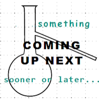

# Pencraft - Freestyle - Essays

<table>
  <tr>
    <td>
      <a href="README+/punchcard.md">
         
<h4>PUNCHCARDS</h4>
</a>
    </td>
      <td>
      <a href="README+/LN-view.md">
       
<h4>LOTUS NOTES</h4>
</a>
    </td>
    <td>
      <a href="README+/AI-2020s.md">
       
<h4>AI TWENTIES</h4>
</a>
    </td>
  </tr>
  <tr>
    <td>
      <a href="README+/Tests-Big_Watershed.md">
       
<b>TESTS vs. DRIVES</b>
</a>
    </td>
    <td>
      <a href="README+/SW_architect-aTake.md">
       
<b>SOFTWARE ARCHITECT</b>
</a>
    </td>
    <td>
      <picture></picture>
    </td>
  </tr>
</table>

🔚 🌔 -2024+ <i>These are fresstyle essays - the product of imagination AS IS.</i>
