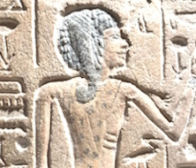

# Punched cards - Once upon a time

> Not another paraphrase of [wiki files](https://en.wikipedia.org/wiki/Computer_programming_in_the_punched_card_era)🔗

<table><tr><td>
<picture>
  
</picture>
</td><td>
      

</td><td>
<picture>
  
</picture>
</td></tr></table>

## Intramural experience - short and vintage

It was long after the punch decline and they were legacy coursework at my university for the last year - I guess because the supply of this carton product was extinct.

### The task

It was an exercise in PL/I&nbsp;🔢 - output a curve of an assigned function (some $`ax^2 + bx + c`$ was mine). And the _output_ meant **direct to the line printer** using teletype symbols for X/Y axes and the graph.

Believe it or not, there was no electronic display in this story.

&nbsp;&nbsp;&nbsp;&nbsp;🔢&nbsp;IBM's procedural [Programming Language One](https://en.wikipedia.org/wiki/PL/I)🔗 
PL/1, DB2, OS/2, Type-III, BS12,... - the Blue Giant was also a names' lord.\
&nbsp;&nbsp;&nbsp;&nbsp;:cinema:Fun fact: traces of PL/1 appear in the epic [2001: A Space Odyssey](https://www.wired.com/story/2001-a-space-odyssey-predicted-the-future50-years-ago/).

### Carton in, paper out

It looks bizarre in this day and age what barely agile steps it took:

&nbsp;&nbsp;**1️⃣** Think over the _programme_ and sketch it in the dedicated notebook (the paper one).\
&nbsp;&nbsp;**2️⃣** Fill in a lined paper form with procedural statements.🥪\
&nbsp;&nbsp;**3️⃣** Submit this papyrus to the punching shop - where good ladies were used to decypher student scribble.🛠️\
&nbsp;&nbsp;... 🌙 one day after ⛅ ...\
&nbsp;&nbsp;**4️⃣** Fetch a deck of punched paperboard (~inch thick).\
&nbsp;&nbsp;**5️⃣** Bring it to the _computing center_🏛️ where the mystery will occur.\
&nbsp;&nbsp;... 🌙 one/two days after ⛅ ...\
&nbsp;&nbsp;**6️⃣** Pick the medieval scroll in the "print" dprt.\
&nbsp;&nbsp;**7️⃣**  Search for a graph among collateral outputs.\
&nbsp;&nbsp;&nbsp;&nbsp;&nbsp;&nbsp;&nbsp;&nbsp;If fail, read errors, debug (mentally), and go to **2️⃣**.

The motivation was so strong (as you might feel) that many succeeded in the first approach but not me.

Between **4️⃣** and **5️⃣** a fellow disciple intruded: shuffling my deck unnoticed. Instead of the graph, I got bad (machine) language printed and a lesson learned about data integrity and security.

&nbsp;&nbsp;&nbsp;&nbsp;🥪 I wonder how it may look object-oriented. A card glued over the base one to inherit or override?\
&nbsp;&nbsp;&nbsp;&nbsp;🛠️ Precisionists can definitely treat their occupation as true pure coders.\
&nbsp;&nbsp;&nbsp;&nbsp;🏛️ One who saw mainframes would advocate the name for this huge open space hall with metal cabinets.

## Extramural afterword

My mediocre story is a chance to remind the reader of the outstanding traits of this medium, despite its fast decadence💾.

I venture to propose punch cards as a backup if computer illiteracy ages come📚 or for extraterrestrial spam🚀. 

And that's why.

+ Easy to make: no rare or precious elements and the techno processes are not harder than for papier-mâché.
+ The cards will be intact for millennia in harsh environments.\
Any mechanical action, dirt, temperature, or humidity, that can damage them, will irreparably sweep other media.  A cheap safe box will rescue them from direct fire and chemical agents.
+ Electromagnetic emission in the whole spectrum can't bring even a tiny data loss.\
It's not about household magnets, short circuits, and solar flares. Punch cards will survive nuclear disasters and [gamma-ray bursts](https://en.wikipedia.org/wiki/Gamma-ray_burst).
+ They have a look&feel of data storage, easy to read🪢 manually or with DIY device.
+ Eco-friendly and highly utilizable.\
Even if the data remains unclaimed or safely copied, our heirs or other species may use the cards as our ancestors: bookmarks, pads, or fans.

💾 Prederemined by data density: there could be no mini and micro, or double side next.\
📚 As it happened with the Writing in centuries before Homer.\
🚀 A deck of punchcards could make a better impression than naive [Pioneer plaques](https://en.wikipedia.org/wiki/Pioneer_plaque) 
and volatile mundane [phonograph records](https://en.wikipedia.org/wiki/Voyager_Golden_Record).🔗\
🪢 Though there was a joke that IBM's positioning of holes won the US government bid for encryption.

 🔚
