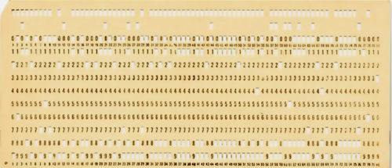

# Punched cards - Once upon a time

> Not a paraphrase of [punchcards story](https://en.wikipedia.org/wiki/Computer_programming_in_the_punched_card_era)🔗

## Personal SYN0 experience - short and vintage

It was long after the punch decline and the last year they were legacy PL/I coursework at my university🙋‍♂️. 

## The Task

It was an exercise in PL/I&nbsp;1️⃣ - print a curve of a simple exponential function: X-Y 2D with teletype symbols.\
&nbsp;&nbsp;&nbsp;&nbsp;🙋‍♂️&nbsp;I guess because of the end of the "carton" supply.\
&nbsp;&nbsp;&nbsp;&nbsp;1️⃣&nbsp;IBM's [Programming Language One](https://en.wikipedia.org/wiki/PL/I)🔗 - perhaps the best name reserved.

[DRAWING REQUIRED] ax^2 + bx + c

## Paper in, paper out

It looks bizarre in this day and age what barely agile steps it took:

1. Think over the _programme_ and sketch it in the dedicated notebook (the paper one).\
The fastest and least trouble. 
2. Fill in a lined paper form with procedural statements. (I wonder how this would be object-oriented.)
3. Submit this papyrus to the "input" department - a room where good ladies will punch the cards.\
... 🌙 one day after ⛅ ... 
4. Pick a deck of the punched stuff. SYN0
5. Bring it to the computing center (it deserved the name while in today's computing, it would be just a box).\
... 🌙 one day after ⛅ ... 
6. Fetch the medieval scroll in the "print" dprt. 
7. Search for a graph there among collateral outputs. If fail, debug (mentally) and go to step&nbsp;(2).

Between steps 3 and 4 a fellow disciple intruded: shuffling my deck unnoticed.

## Footnote. The best storage ? 

Enough crypto [footnote ] to proof of work punch

NOW, SERIOUS

Domestic use

make them great again ?
Mini/micro ? OOP/OOD

Best media ever by pros and cons: eco, resistance (electromagnetic)
