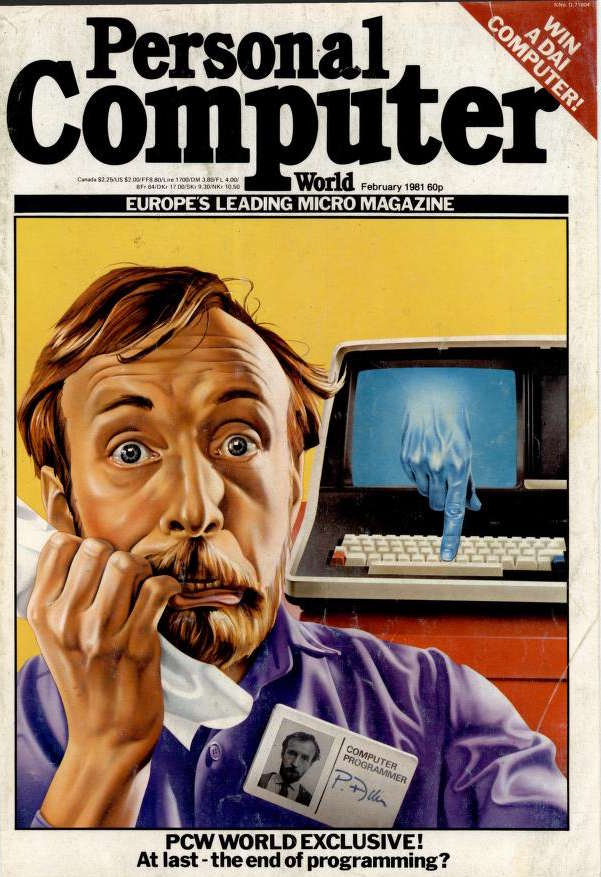
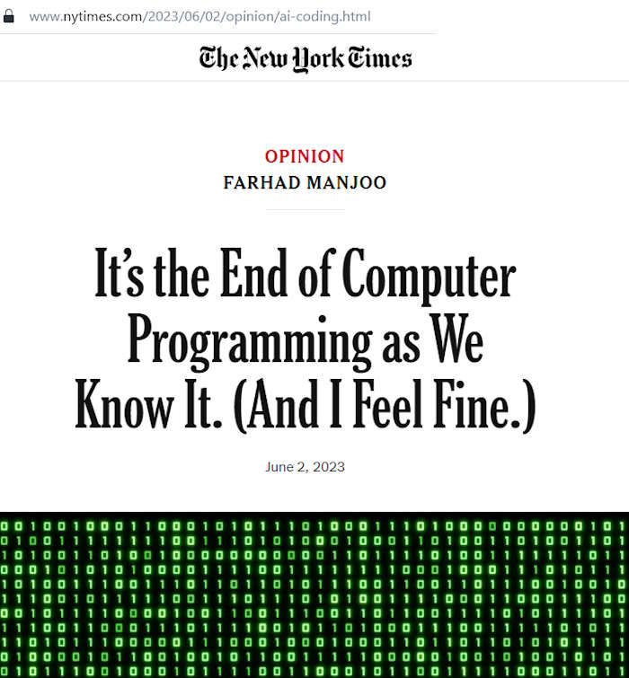

# IT Quotes &nbsp; &mdash; &nbsp; Aged not that good

## Skills

### Math
 
> Prolonged contact with the computer turns mathematicians into clerks and vice versa.\
[Alan Perlis](../contributors/README.md#Alan-Perlis)

> Programming is one of the most difficult branches of applied mathematics; the poorer mathematicians had better remain pure mathematicians.\
[Edsger W. Dijkstra](../contributors/README.md#Edsger-W-Dijkstra), 1975

The respected masters couldn't foresee the exponential growth of "applied" development and the dramatic sinking of the entry threshold.

I venture to reformulate: "Most advanced in exact sciences can be good programmers (unless they already are), but not vice versa." 

Nevertheless, capabilities are not the only ones to blame — the load of learning and abstraction in IT doesn't leave much time for a deep dive into other studies.

## Software

### Languages

> **In 30 years <mark>Lisp</mark> will likely be ahead of C++/Java (but behind something else).**\
_Peter Norvig_, computer scientist at Google, **1999**

With the elapsed **25** of 30 popular metrics put __`Java`__ in the top five, and __`C++`__ - in ten. __`Lisp`__ remains on the margins.

## Hardware

### Performance 

> The programmer's primary weapon in the **never-ending battle against slow system** is to change the intramodular structure.\
[Fred Brooks](../contributors/README.md#Fred-Brooks)

I dare say that this battle is over, and resource starvation with performance hits is no longer a headache for the majority of applications.

> **Software gets slower faster than hardware gets faster.**\
[Niklaus Wirth](../contributors/README.md#Niklaus-Wirth), 1995, "A Plea for Lean Software" (aka Wirth's law)

Much has changed since the 1990s, when sparing half a byte in a DOS program was a worthy trick. The grace of auto memory allocation with garbage collection and intermediate languages spread only because the hardware could facilitate them.

## Doomsday for nerds

<table><tr valign="top" align="center">
 <td><h1>1981</h1></td>
 <td><h1>1 Jan 2023</h1><h3>COMMUNICATIONS of the ACM</h3><h4>The End of Programming</h4>
  </td>
 <td><h1>June 2023</h1>
</td>
</tr> </table>

\___________\
🔚 ... to be continued ...
