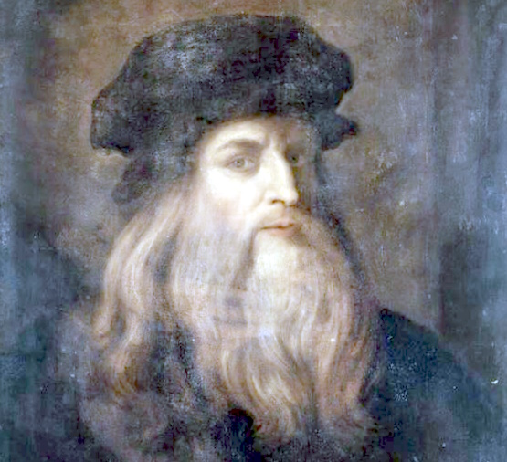
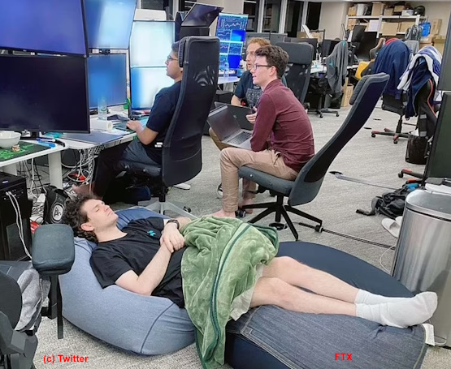
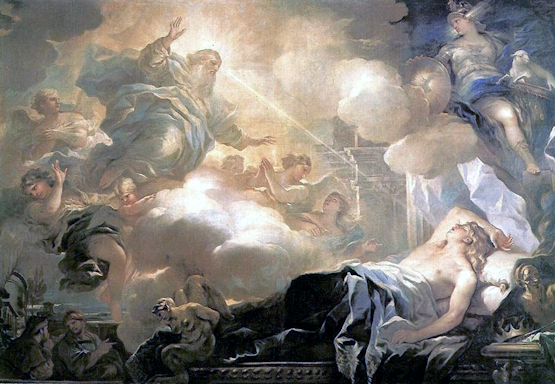
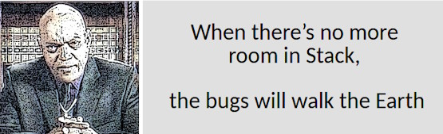

# Quotes store &mdash; Inspiration department

## Incite ...

<ins>&nbsp;<b>...to write and document</b>&nbsp;</ins>
&nbsp;

> **Epistula non erubescit**\
― _Marcus Tullius Cicero (106-43 BC)_\
[Compiler too]

> **There's no such freak who wouldn't find a mate and there's**\
**no such nonsense that won't find a proper reader.**\
― _Anton Chekhov (1860-1904)_, "Rules for novice writers"

> **Write what you know.**\
― _Mark Twain (1835-1910)_

> **_If you could know in what a dirty drain_**\
> **_The verse does grow without having shame,_** ...\
― _Anna Akhmatova (1889-1866)_, 1964 Nobel Prize in Literature nominee\
"I have no use for odes in battles...", 1964

> **If they give you lined paper, write the other way.**\
― _Juan Ramón Jiménez (1881-1958)_, 1956 Nobel Prize in Literature awardee\
**And so I invented the Monospace.**\
― _George Williams_ (*assumed)

<b>!Gimme that torch, FAST</b> <i>Ray Bradbury (1920-2012)</i> after reading the <i>Twilight</i> novel series (*assumed)

---

<ins>&nbsp;<b>...to procrastinate</b>&nbsp;</ins>
&nbsp;
 
<mark><b>&nbsp;Presented to you by ...</b></mark>
 <picture></picture> 
<mark><b>...Leonardo the Great Procrastinator</b></mark> ([widely known](https://interactions.acm.org/blog/view/leonardo-da-vinci-the-great-procrastinator) and "certified" by court)

#### Idioms and proverbs

> **Nice guys finish last**.\
From the baseball world of the late 1940s - [learn more](https://crossidiomas.com/nice-guys-finish-last/)

> **The bird catches the early worm.**\
(The late cat catches the dozy bird.)

#### Scientifically proven

> **One never notices what has been done; one can only see what remains to be done.**\
_― Maria Skłodowska-Curie (1867-1934)_, Nobel prize awardee\
Letter to her brother (1894)

PL Original: "Człowiek nigdy nie ogląda się na to, co zrobione, ale na to patrzy, co ma przed sobą do zrobienia."

#### Add to calendar

_Procrastinators' Club of America_ (with international membership) established [Be Late for Something Day](https://nationaltoday.com/national-be-late-for-something-day/) on **5h&nbsp;September**. As an honest sympathizer, I appended this reminder a day later&mdash;**September&nbsp;6th**, 2024 which surprisingly is [Fight Procrastination Day](https://www.daysoftheyear.com/days/fight-procrastination-day).

Comming next&mdash;[National Procrastination Week](https://en.wikipedia.org/wiki/National_Procrastination_Week).

---

<ins>&nbsp;<b>...for perfectionism</b>&nbsp;</ins>
&nbsp;
 
<mark><b>&nbsp;Presented to you by ...</b></mark>
 <picture></picture> 

#### Classics

> **Trifles make perfection, and perfection is no trifle.**\
attributed to _Michelangelo_ (1475-1564) about his David statue\
(for which allegedly the Master surveyed the marble piece for two years)

 #### Naturalism 
 
> The role of the infinitely small in nature is infinitely great.\
― _Louis Pasteur (1822-1895)_\
🇫🇷 Original: “Le rôle de l’infiniment petit dans la nature est infiniment grand.”

#### Think like a grandmaster

> **... bear in mind these prudential rules, _viz._:\
having a good move, to seek for a better.**\
― _Domenico Lorenzo Ponziani (1719-1796)_, best known for chess writing\
Misattributed to _Emanuel Lasker_

#### East meets West

> **Do only what only you can do.**\
― [Edsger W. Dijkstra](contributors/README.md#Edsger-W-Dijkstra)

Not only the East grant us profound and eloquent teaching! Whatever Mr. Kipling* did say.©️

&nbsp;&nbsp;&nbsp;&nbsp;©️ "East is East, and West is West, and never the twain shall meet..."

---

<ins>&nbsp;<b>...to take a break</b>&nbsp;</ins>
&nbsp;
 
<mark><b>&nbsp;Presented to you by ...</b></mark>
 <picture></picture> 
<mark><b>... Sam&nbsp;</b></mark> who [Fried Bankm**e**n](https://www.techtarget.com/whatis/feature/FTX-scam-explained-Everything-you-need-to-know) and not only.
 
#### German philosophy always rules

> **Don't believe any thought that wasn't born in the open air and with free movement.**🚶\
― _Friedrich Wilhelm Nietzsche_ (1844-1900)\
> &nbsp;\
> **We should consider every day lost on which we have not danced at least once**.👯\
> _\*idem*_

&nbsp;&nbsp;&nbsp;&nbsp;&nbsp;&nbsp;&nbsp;🚶 Full original: „So wenig als möglich sitzen; keinem Gedanken Glauben schenken, der nicht im Freien geboren ist und bei freier Bewegung – in dem nicht auch die Muskeln ein Fest feiern. Alle Vorteile kommen aus den Eingeweiden. – Das Sitzfleisch – ich sagte es schon einmal – die eigentliche Sünde wider den heiligen Geist.“\
 Ecce Homo. Wie man wird, was man ist (1889),\
&nbsp;&nbsp;&nbsp;&nbsp;&nbsp;&nbsp;&nbsp;👯 Original: „Wir sollten jeden Tag als verloren betrachten, an dem wir nicht mindestens einmal getanzt haben.“

#### Great ideas that came in the sleep

To name a few of the officially recognized:

+ _The principles of analytical geometry_, René Descartes (1596-1650)
+ _The periodic table of chemical elements_, Dmitri Mendeleev (1834-1907)
+ _Special relativity theory_, Albert Einstein (1879-1955)
+ _The model of the atom_, Neils Bohr (1885-1962)
+ _Structure of the benzene molecule_, August Kekulé (1829-1896)
+ _Sewing machine_, Elias Howe (1819-1867)

---

<ins>&nbsp;<b>...to acquit not doing/learning</b>&nbsp;</ins>
&nbsp;
 
<mark><b>&nbsp;Presented to you by ...</b></mark>
 <picture></picture> 
<mark><b>...King Solomon</b></mark>, who said:

> **For in much wisdom is much grief: and he that increaseth knowledge increaseth sorrow.**\
Ecclesiastes 1:18, Webster's Bible Translation.

#### Laws of nature

> **Nature uses as little as possible of anything.**\
_Johannes Kepler_ (1571-1630), key prolific astronomer

#### F.A.Q.

> **That question is too good to spoil with an answer.**\
― _Harry Mulisch (1927-2010)_, The Discovery of Heaven\
This quote is also known from earlier authors.

#### Forbes talent selection

> **Every time you create something new, there should be questions**...\
― _Elizabeth Holmes_, one of the 100 most influential people by Time magazine in 2015\
(April 2015 interview with CBS News)

> **I was a really negligent student.**\
_Sam Bankman-Fried_, FTX cofounder, [only Zuck has been this rich young](https://www.forbes.com/sites/stevenehrlich/2021/10/06/the-richest-under-30-in-the-world-all-thanks-to-crypto/)

#### Amulets against refactoring

> Somewhere it's better to curse in the darkness than to light a single candle.\
(Attributed to _Ferdinand von Zepellin_ or _von Hindenburg_)

#### Hammer❗

> If you wish to be a success in the world, promise everything, deliver nothing.\
― _Napoleon Bonaparte (1769-1821)_\
He failed as a result of being inconsistent with his own saying.

🇫🇷 Original: "Si vous escomptez avoir du succès dans le monde, promettez tout, ne donnez rien."

#### Handshake thru generations

> **There are four things to watch forever:\
falling water, burning fire, starry sky,** and **tasks, you define and others commit**.\
_Earliest humans_ (ca. 300`000 ago)

---

<ins>&nbsp;<b>...to interpret errors right...</b>&nbsp;</ins>
&nbsp;
 
<mark><b>&nbsp;Presented to you by ...</b></mark>
 <picture></picture> 
(This **BSoD** must be an XX-century [history](https://en.wikipedia.org/wiki/Blue_screen_of_death) but it [struck](https://www.msn.com/en-us/news/technology/a-blue-screen-of-death-loop-how-a-crowdstrike-update-crashed-microsoft-systems-around-the-world/ar-BB1qgFNC) again in 2024.)

#### Customer gets the King

> _après nous le déluge_\
(fr: "After us the deluge may come for aught we care")\
attributed to Louis XV (1710-1774)

The motto under which some (rare) fix-budget outsourced projects are delivered.

#### Medieval

> Not he is unmannered who falls beneath the table\
but one who notices this.

The rule of medieval feasts and merciful testers

#### Moralité 

"Errare humanum est, perseverare autem diabolicum." 

"To err is human, to forgive divine"\
_Alexander Pope_, poet (1688-1744)

---

<ins>&nbsp;<b>...but to debug</b>&nbsp;</ins>

&nbsp;
 
<mark><b>&nbsp;Presented to you by ...</b></mark>
 <picture></picture> 
<mark><b>...Ken Foree fandom</b></mark>

 #### Already classics

> **Never allow the same bug to bite you twice.**\
_Steve Maguire_, programmer and author

#### Recent

> **I find it very odd. I’m a fairly private person who just sits in front of the computer and hacks on code.**\
_Andres Freund_, a programmer who occasionally prevented the ["century" cyberattack](https://en.wikipedia.org/wiki/XZ_Utils_backdoor), in <a href="https://www.nytimes.com/2024/04/03/technology/prevent-cyberattack-linux.html">NYT inteview</a>, 2024.

\_________________________________

<ins>&nbsp;...and <b>... to quote&nbsp;</b></ins>❗
&nbsp;

> **I always have a quotation for everything. It saves original thinking.**\
_Dorothy L. Sayers_ (1893-1957), novelist, translator and critic

\_________________________________

\___________\
🔚 ... subject of continuous delivery ...
