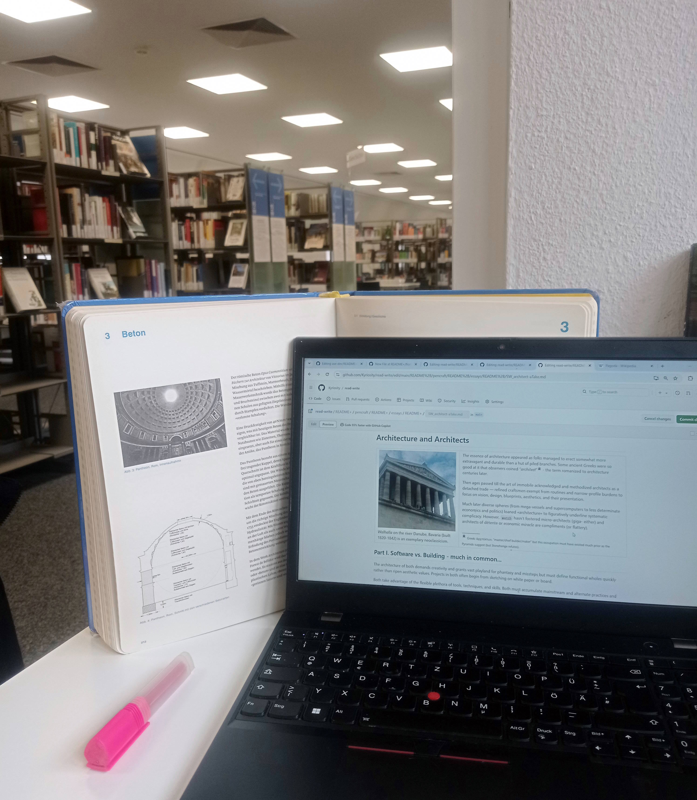

# Technical authoring

?<i>Need to write fast, catching, and pro .Hire a ghostwriter</i> 
[Best author advice]

Certain software products, and technologies deserve the work of a pen or brush. The rank of such work may be a decision factor Nr&nbsp;1 for the usage of/funding for its subject: either attract or divert for good.

Technical authoring lies between documentation and literature and must have an artistic feel, rich vocabulary, and allure of the latter in frames of technical topics.

For technically smart heads freestyle authoring may seem deceptively easygoing: 

* Tongue is the only tool sharpened in use.
* Creative opus won't produce compilation errors.
* Illustration is what one learns in early childhood.
* You shall not invent themes of the writing.
  
<ins>WYSIWYG</ins> of the opus and rapidity of writing can create square miles of 'pulp'. However noble lines of words are much more sophisticated and painful than excellent code. And a smart reader will notice poor or mediocre style from the very first sight.

In the decade of LLM-generated content criteria for the good word and syllable are getting stricter.

## Recipies 

### Card driven

...

## Dev driven writing

🚧TO BE WRITTEN

Thesis + Struct + Phrases

## Tips

Internet swarms with advice, hints, and guidelines for writing - useful, practical - but which you could formulate yourself. May I add up a few?

### Lectures/Courses

Listening to any lecture (live or recorded), course, or discussion can rescue you from stagnation. It forces you to accept other points of view and urges you to contend and generate your arguments mentally.

It's no way about plagiarism - just the opposite. You may find that your idea is already covered, so restrain it to a source reference.

### Library

<table><tr valign="top"><td>
  <picture></picture>
</td><td>
  For less or more creative activity in both code and word going to a library, picking engaging offtopic books, looking in them, and returning to the own production can be a real booster.
</td></tr></table>

## Pitfalls

The worst enemies of authorship are:

- repetitions (even of words),
- flood wordiness/big volumes,
- formalism/monotony,
- no critique/indifference.
- 🚧🚧🚧🖋️🚧🚧🚧 

🔚 ✴️ The epigraph won't be caustic if you know about the "ghostwriting" marketing.
