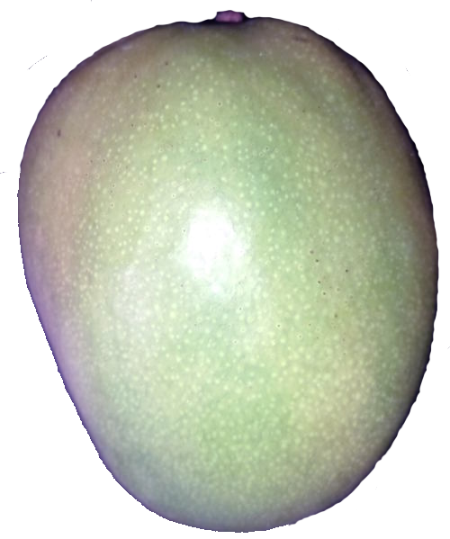
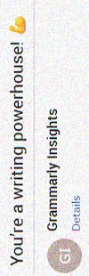

<h1 align="center">Pen & Brush craft &nbsp;&mdash;&nbsp; Technical writing</h1>

<table width="80%" align="center"><tr></tr><tr><td>

✒️&thinsp;**&**&thinsp;🎨
  
</td><td>

[__Documentation__](README+/tech_docu.md)📄 and [__authoring__](README+/tech-authoring.md)🖊️ are two very dissimilar employments of writing and painting skills 
with opposing values of formalism, creativity, envisaging, and styles.

</td></tr></table>

The principled distinction is __*driven*__ vs __*drives*__:

* <mark>Documentation</mark> is **on-demand**/request derivative of a product or service, must follow templates, and shall be (auto-)generated and reused as much as possible.📖\
&nbsp;&nbsp;&nbsp;&nbsp;&nbsp;&nbsp;&nbsp;📖 A strict _User manual_ of hazardous tools is an exemplary story.\
&nbsp;&nbsp;&nbsp;&nbsp;&nbsp;&nbsp;&nbsp;&nbsp;&nbsp;&nbsp;&nbsp;&nbsp;Microsoft [documentation](https://learn.microsoft.com/) follows this line but, honestly, this doesn't help to "🪟<b>Learn</b>".</docu>

* <mark>Authoring</mark> is **initiative**, must take a bird's view of the subject, inspire and explain sophisticated and regulated ideas in an abstractive, friendly, and sometimes informal/playful manner.

<ins>**Documentation**</ins> assumes defined, if not available, subjects (as software applications), while <ins>**authoring**</ins> may begin with a pure idea. (Enough technical oeuvres, such as concepts of relational DBs or REST, were based on "paper" concepts with little or no implementation.)

When it's often a reader's headache to find and study the right <mark>documentation</mark> in any state and grade, with <mark>authoring</mark>, it's a burden for "pensters" to attract the public. 

Sticking to the narrowed vocabulary, repetitions, and cliches are benefactors in <mark>documentation</mark> but <mark>authoring</mark> sins.

Regardless of the mission, significant writing is an **expensive** and **exhausting** exercise. If not a hobby or bondage, it must:

+ [x] have a live, eager auditorium,
+ [x] exceed other ways of teaching,\
(consider quickly sketched presentation, captured video tutorial, or even watercooler talks)
+ [x] be long-term (updated and evolved).

## Vital side effects

<table><tr>
 <td>

Documenting/sketching ideas for even small features mitigates **the impedance between the stretch of imagination and the reality of implementation.**

Namely, formalization and structuring compel us to reexamine and refine concepts, enhance the positive aspects, rectify the negative, and discard unrealistic or meaningless features. 
  
</td>
<td><picture></picture></td>
</tr></table>

## Appendix. Personal disclaimer

<table><tr valign="top">
<td><picture></picture></td>
<td>
 
  «The difficulty of writing <b>English</b> is most tiresome to me.» 
<i>Charles Dickens</i>, 1850 [and me, XXI]

**The writings and collections here are** ...

* The subject of private taste, inclination, vision, and fallacies.\
`//` _It's up to you to look them over or recoil in distaste._
* The subject of continuous delivery (i.e., endless edit and modification).\
`//` _Nevertheless, it's not all blur, and most articles are completed._
* Some opuses may be in the badly readable state of 🚧<samp>draft</samp>🐝\
`//` _Skip them while I do my best to finish._

</td>
</tr></table>

\___________\
🔚 🌘 2023-2025 &rArr; 📂[README+](README+)
