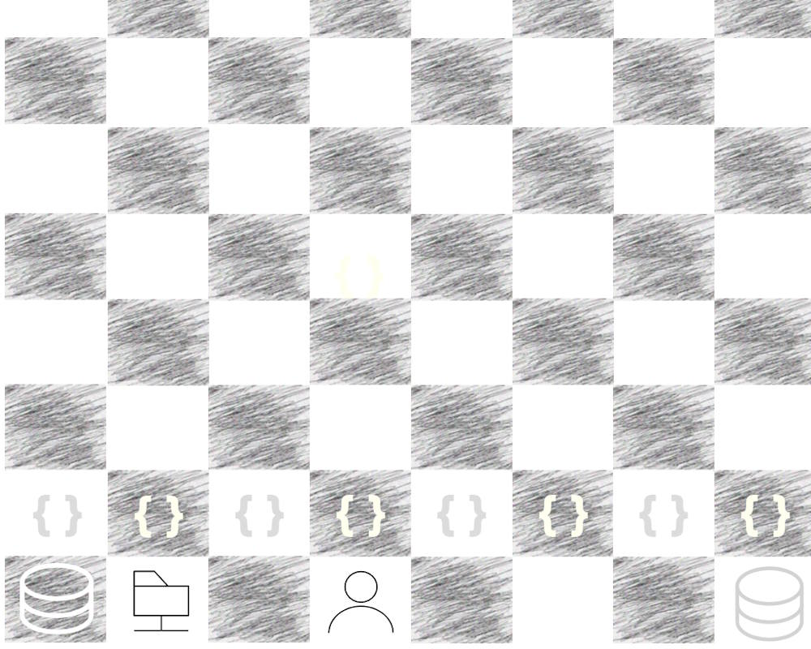

#  &rarr; Rationale &thinsp;.&thinsp;.&thinsp;.

<ins>&nbsp; &nbsp;A metaphor you may skip&nbsp;</ins>&nbsp;.&thinsp;.&thinsp;.

&nbsp; &nbsp; &nbsp;.&thinsp;.&thinsp;. but (thanks) you've clicked.

A cherry-picked <b>metaphor</b> simplifies explanation .(at times even for readers)

#### Figure of chess is a universal figure of speech...

<table><tr valign="top"><td width="50%">

<ins>&thinsp;Who is your opponent in software?&thinsp;</ins>

Users, managers, other developers, or the Architect? None ...

<b><samp>The &thinsp;D&thinsp;E&thinsp;V&thinsp;E&thinsp;L&thinsp;O&thinsp;P&thinsp;M&thinsp;E&thinsp;N&thinsp;T&thinsp; itself⬇️</samp></b>

  

🎇**Win** &thinsp;&mdash;&thinsp; pattern teasers make up frameworks. Breaking changes go light.\
The more realistic **draw** means "the controllable chaos" of development. 

Checked &thinsp;&mdash;&thinsp; principal changes are done with Woodoo programming.

Stalemate — the project works, but it's challenging to add significant features.

**Mate** &thinsp;&mdash;&thinsp; dev stops, support only. The proper time to hand the project over to another team or discuss a remake in other technologies.

_Sacrifices_ mean not team members or customers, but refactoring (to give up a piece of achieved for the better).

\___________\
⬇️ **Why development?** It lures you in with shortcuts and involves you in positional traps: techno details, design trade-offs, etc.

</td><td>
  
♕♛ Learning elementary programming and the rules of the checkered strategy are both fast, enjoyable, and attainable for the masses. 
Starting programming resembles games of neophytes: <i>blitz</i> (wins follow fails), fun, and visibly improving.

♖♜ Understanding and learning principles and check patterns will prevent blunders, but not positional traps of better opponents.\
In a like manner, a keen junior will soon write good pieces of code but shaky solutions.

♗♝ Chess openings rest on studied, memorized decisions and strong theory. In software, it implies IT literacy, computer science, selection of platforms, frameworks, 
and external parts, when experimentation and creativity are abnormal.

♘♞ Then the perception of combinatory vastness and the need to think in several moves lifts the curtain of first naive impressions.\
There are only three "moves" in programming: `AND`, `OR`, `NOT` over bits, but they provide even the bigger than <code><b>&gt;</b>&thinsp;8x8</code> space for fantasies and alternative solutions.

Passion wouldn't be enough to rise much higher &thinsp;&mdash;&thinsp; learning and understanding of theory become essential along with games against stronger opponents. &thinsp;&mdash;&thinsp;
The number of games or written applications won't break the ceiling.👑

  
In chess, theoretical roadmaps and schools lead to higher ratings, ruthlessly administering one's place. <b>Here, the metaphor breaks down.</b> 
Software ways to craftsmanship are inscrutable and assessed by eye.

___________\
👑 <samp>Popular chess servers can brag about living legends (not bots) pausing for sleep only to continue incrementing an astronomical number of games.  Nevertheless their ELO ratings grow slightly above other amateurs.</samp>

</td></tr></table>

The path of _System Engineering_ begins with <b>enthusiasm</b> and goes through (if not ends in) <b>frustration</b>. The latter is inscribed with:

<h3 align="center"><b><samp><mark>&thinsp;Why don't best development practices make great design by themselves?&thinsp;</mark></b></samp> 
(Developing excellent features, feeling the patterns and principles, and writing <a href="../../../QA/README+/code-quality.md">quality code</a>, 
   but expectations end up with achieving just a passable project state.)</h3>

Now veneer the frustration/anxiety facet with <ins>**rhetorical**</ins> _vs._ <ins>**open**</ins> <kbd>&thinsp;<samp><b>I&thinsp;S</b></samp>&thinsp;</kbd>, <kbd>&thinsp;<samp><b>W&thinsp;H&thinsp;Y</b></samp>&thinsp;</kbd>, and <kbd>&thinsp;<samp><b>H&thinsp;O&thinsp;W</b></samp>&thinsp;</kbd> tiles:

<table valign="center" align="center"><tr></tr><tr>
   <td width="34%">Why is <b>experience</b> rater an <b>inhibitor</b> of rapid development❔</td>
   <td width="33%">Why don't bright architectural ideas <b>propagate</b> to development❔</td>
   <td>Why are developers doomed to <b>reinvent</b> decisions&thinsp;/&thinsp;solutions of others❔</td>
</tr><tr>
   <td>Why is getting into big projects a headache and <b>dread</b>❔</td>
   <td>How can the code <b>obfuscate</b> lucid domain logic for reviewers❔</td>
   <td>How can a small <b>change</b> (even syntax sugar) become <i>breaking</i> or even a <b>flaw</b>❔</td>
</tr><tr>
   <td>Why don't many good <b>design decisions</b> survive, and how do bad ones rematerialize in the next endeavors❔</td>
   <td>Why do frankly <b>bad parts</b> of dark code nonetheless fuse to enterprise architecture that works and persists for years❔</td>
   <td>How smart leads <b>pass between</b> augmenting kludges and "conceptualism" utopia❔</td>
</tr></table>

#### And the answer to many <mark>WHY</mark> isn't always or principally a bad design state or lack of resources.

<table><tr><td><picture></picture></td><td>
  
**More (de)motivation:**
  
Successful projects from the neighboring materiality, less patchable and less reversible but much more fragile, may both hearten or intimidate:\
Liquefied gas tankers, skyscrapers, airplane auto-navigation, implants, space telescopes, robotic lines ...

And these are your peers with different backgrounds who created them. «Not gods fired these pots.»
  
</td></tr></table>

<h2 align="center">O&thinsp;U&thinsp;R &thinsp; G&thinsp;O&thinsp;A&thinsp;L  <mark>Bridge development to design</mark></h2>

This requires **abstraction of** software **abstractionism** but with utilitarian intentions: 
detecting what helps and what harms in mundane code (that is, answers the <samp><i>WHY</i></samp>s and <samp><i>HOW</i></samp>s above).

### Objectives

* Keep software as a whole **continuous** "application" of pieces of IT theory and practical decisions,\
(rather than tailored, scattered occasional craft, or the building of sand castles on greenfields, or the _Grand Art_ of perfectionism)
* **Classify** parts, activities, and roles.
* **Think "above"** "rails" and the burden of previous experience.
* **Eliminate the fear** of "high" design decisions.

<h2 align="right"></h2>

 &nbsp; &nbsp; &nbsp;↪️&nbsp;**Rationale** &rarr; [**BIG&nbsp;PICTURE**](../02.BigPict/README.md) &rarr; [Stripes](../03.Stripes/README.md) &rarr; [Forces](../04.Forces/README.md) &rarr; [Roles](../05.Roles/README.md) &rarr; [Factors](../06.Factors/README.md) &rarr; [Wrap&nbsp;up](../07.Wrapping/README.md)

🔚 .. 🌒 ...2024-2025... &nbsp;
