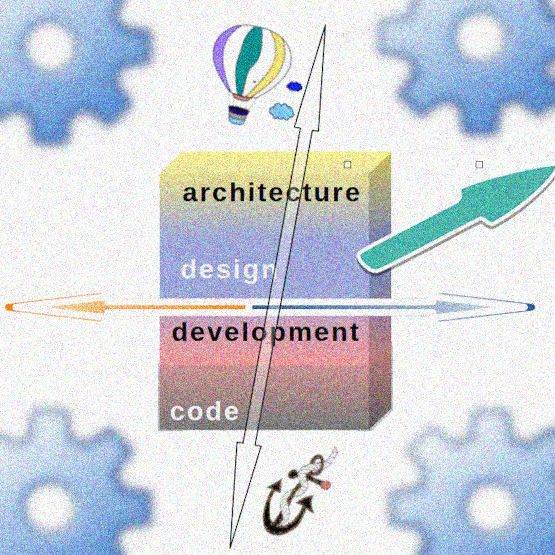

#  &rarr; &thinsp;.&thinsp;.&thinsp;.&thinsp; Big Picture &thinsp;.&thinsp;.&thinsp;.

<table><tr valign="top"><td width="45%">
   
### Big thoughts &nbsp;&mdash;&nbsp; big pictures 

Shallow, childish, or blurred, plane sections or angled, they are better than naked prose and give readers an eagle view.

Let's begin with contours, **intentionally** left without annotations to defy your 3D fantasy.

👆 Before we move further, it would be nice if you could guess or conjure up the forces and factors.\
(❕ They can not and will not match those, as explained below.)

</td><td>
    <picture></picture>
</td></tr></table>

<h2><ins>&nbsp;Forces named&nbsp;</ins></h2>

<table><tr valign="top"><td width="55%">
<picture></picture>
</td><td>

The «<b>tearing X and Y axes</b>» in the intro were for a two-dimensional simplification for a figure of speech.

What seems the first united will be stretched and squeezed.
</td></tr></table>

<h2><ins>&nbsp;Factors exposed&nbsp;</ins></h2>

<table><tr valign="top"><td width="45%">
    
Software isn't raised in a vacuum, and there are agents/external forces:

👯&thinsp;<b>Users</b> - whose wishes you ask direct or get through requirements

🧑‍💼&thinsp;<a href="../../../mngmnt"><b>Management</b></a> &mdash; who shall facilitate and orchestrate the workflow

🧪&thinsp;<a href="../../../QA" title="&nbsp;read-write: QA"><b>Quality Assurance</b></a> &mdash; tests

♾️&thinsp;<b>DevOps</b> &mdash; which must seamleassly deliver end products.
 
  
    
Even if you're a single person on the project, you may take all these roles.

</td><td width="55%">
    <picture></picture>
</td></tr></table>

🚧PENDING: PICTURE WITH TECHNOLOGIES RODS: SEAMLESS vs. BARRIERS and HOLES
   
## Image background

To avoid image overloading, the background wasn't laid - <ins>the sheets of resulting code with data and documentation</ins>.

<h3 align="center">Let's dive deeper into these pictures of <i>art naif</i> in the following chapters...</h3>

## &nbsp;

### &nbsp; [Rationale](../01.Rationale/README.md) &larr; **BIG&nbsp;PICTURE** &rarr; [**S&thinsp;T&thinsp;R&thinsp;I&thinsp;P&thinsp;E&thinsp;S**](../03.Stripes/README.md) &rarr; [Forces](../04.Forces/README.md) &rarr; [Roles](../05.Roles/README.md) &rarr; [Factors](../06.Factors/README.md) &rarr; [Wrap&nbsp;up](../07.Wrapping/README.md) 🔚
