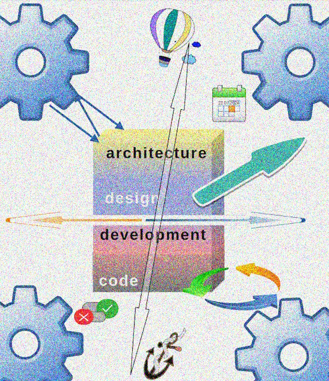

 &nbsp;&nbsp;&nbsp;&nbsp;&nbsp;↪️&nbsp;[Rationale](../01.Rationale/README.md) -> **Big&nbsp;Picture** -> [Stripes](../03.Stripes/README.md) -> [Forces](../04.Forces/README.md) -> [Roles](../05.Roles/README.md) -> [Factors](../06.Factors/README.md) -> [Wrap&nbsp;up](../07.Wrapping/README.md)

---

# The Big Picture

Big thoughts need big ILLU.

Whatever it looks it's better plain text. 

It may come out commonplace, a plane section, angled or blurred, or even childish but it will beat explanation prose and ensure you with an eagle view.

Let's begin with contours, intentionally left not annotated to defy the reader's 3D imagination. It would be nice if she or he could guess or imagine the forces and factors (they ought not to match those, as explained below).

  
🖼️<b><ins>&nbsp;Big outline&nbsp;</ins></b>

<picture> </picture>

## Forces and factors

The <mark>"tearing X and Y axes"</mark> in the intro were a two-dimension simplification for a figure of speech.

  
🖼️<b><ins>&nbsp;Forces annotated&nbsp;</ins></b>
 </picture>

### GLOSSARY

🚧 ... coming soon ... 🚧

## External factors (agents)

  
🖼️<b><ins>&nbsp;Agents annotated&nbsp;</ins></b>
<picture></picture>

### LEGEND

🚧 ... coming soon ... 🚧

## Background

To avoid image overloading, the background wasn't layed - the sheets of resulting code with data and documentation. 

Just imagine them behind the objects.

## What's next

This work of _art naif_ may look juvenile but let's dive deeper into details in the following chapters.

🔚 MK CMN END
