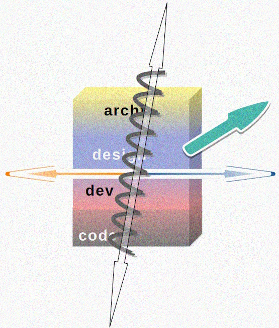
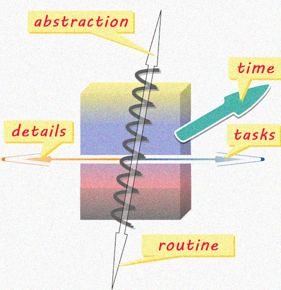

 &nbsp;&nbsp;&nbsp;&nbsp;&nbsp;↪️&nbsp;[Rationale](1.ArcDeco-Rationale.md) -> **Big&nbsp;Picture** -> [Stripes](3.ArcDeco-Stripes.md) -> [Forces](4.ArcDeco-Forces.md) -> [Roles](5.ArcDeco-Roles.md) -> [Wrap&nbsp;up](7.ArcDeco-WrapUp.md)

---

# The Big Picture

Explanation of compound stuff needs a big outline, otherwise, it will be esoteric and duller than planned. 
It may come out commonplace, a plane section, angled or blurred but it will beat hundreds of words and ensure you with vision.

## Forces 

First, let's take proposed  **stripes** and draw forces over them. 

The <mark>"tearing X and Y axes"</mark> in the intro were a two-dimension simplification for a figure of speech. The next outlines (intentionally not annotated) must defy your 3D imagination.

  
🖼️<b><ins>&nbsp;Forces - outlined&nbsp;</ins></b>

   
  
</picture>

Now let me present my vision of these forces, while you may already got your own ideas.

  
🖼️<b><ins>&nbsp;Forces annotated&nbsp;</ins></b>

   
  
</picture>

## Full picture

  
🖼️<b><ins>&nbsp;Big picture in full&nbsp;</ins></b>

   
  
</picture>

---
