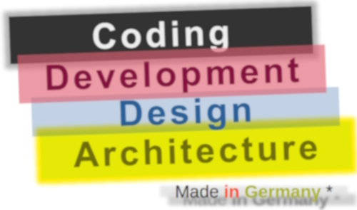
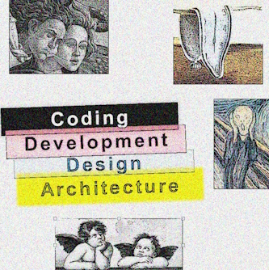
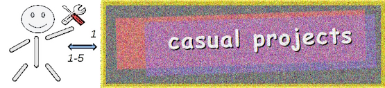

# Software

## What makes it? 

### **In a word - `programming`, in four -** 

<picture></picture>

:de: Inspired by informal interpretation of the German flag: from the **dark** past through the bloody present to the <mark>golden</mark> future.\
&nbsp;&nbsp;&nbsp;&nbsp;(Since `4>3` tearful blue was inserted for Design.)

<ins>&nbsp;<b>More spectrum for requirements, management, testing, and administration?</b>&nbsp;</ins>

 

<table><tr valign="top"><td>
   <picture></picture>
<td/><td>
These are <b>external</b> - optional and not, minor to  strong, <constructive and devastating  (also neutral) — forces, factors, and drives.  
 
Which, culturally speaking, mix, tint, blur, or  shade (if not wash off) the four paints. 
 
Initiative and funding render the canvas.  
Abstraction/math/logic and artistic skills,  domain expertise, and creativity prop the picture.
</td></tr></table>

## Wrapping, ...

**_Coding_**, **_development_**, **_design_**, and **_architecture_** are tied, overlapping, and loosely-ordered role-driven processes.

Many projects' modest size lifetime with banality and, in particular, isolated work on them will shrink the pie to a bar, ... ⬇️\
<picture></picture>\
⬆️... making more theorizing wiredrawn.

### ... but ...

Axes of e**X**pansion and complexit**Y** may tear this patchwork.

**X**: Coercive resource scaling against "horizontal" growth will add to a horrific pile.\
(getting harder and more expensive to evolve and maintain, with little rational heritage except how not to do tips)

**Y**: With stacking up design decisions (as they come) this pile will begin to fall to pieces at a certain height of abstraction.\
(That is, the chaos, inherent to any programming, will become unmanageable.) 

&nbsp;&nbsp;&nbsp;&nbsp;🙋 This said not about megastructures and prize-winning brainteasers (like OS, DBMS, IDE, or gaming engines) but challenges beyond the ordinary:\
&nbsp;&nbsp;&nbsp;&nbsp;&nbsp;&nbsp;&nbsp;&nbsp;&nbsp;&nbsp;&nbsp;&nbsp;new LOB foundation, unfamiliar domains (such as CAD or interpreters), or remakes (original graph base, making async from legacy and dividing modules).

Such menaces encourage us to verbalize the metaphysics of software. 

To distinguish the survey following (at least for the file system) I couldn't find a better tag but a mocking acronym - 
<picture></picture>
(<mark><b>Arc</b></mark>itecture <mark><b>D</b></mark>esign D<mark><b>e</b></mark>velopment <mark><b>Co</b></mark>ding).🎨

&nbsp;&nbsp;&nbsp;&nbsp;🎨 Homonym to Arc&nbsp;Deco - [Arts décoratifs](https://en.wikipedia.org/wiki/Art_Deco). Its introduction a century ago (1925) appeals to make `är-dā-ˈkō` great again [mockery again].

### ... opening ...

<picture></picture> &nbsp;&nbsp;&nbsp;&nbsp;&nbsp;↪️&nbsp;[Rationale](README+/01.Rationale/README.md) -> [Big Picture](README+/02.BigPict/README.md) -> [Stripes](README+/03.Stripes/README.md) -> [Forces](README+/04.Forces/README.md) -> [Roles](README+/05.Roles/README.md) -> [Factors](README+/06.Factors/README.md) -> [Wrap&nbsp;up](README+/07.Wrapping/README.md)
