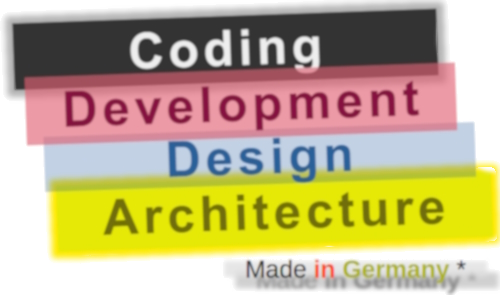

# Software

### is abstraction but ...

## What implements it? 

### In a word &thinsp;&mdash;&thinsp; `programming`, in four &thinsp;&mdash;

<picture></picture>

:de: <samp>Inspired by informal interpretation of the German flag:\
&nbsp; &nbsp; from the **dark** past through the bloody present to the <mark>golden</mark> future.\
&nbsp; &nbsp; (Since `4>3` tearful blue was inserted for Design.)</samp>

<h3>❔<ins>&nbsp;<samp>More spectrum for</samp> requirements<samp>,</samp> management<samp>,</samp> testing, <samp>and</samp> administration</b>&nbsp;</ins>❓</h3>

 

<table><tr valign="top"><td width="40%" align="center"><picture></picture></td>
<td>
   
### These are <mark>external</mark> - optional and not, minor to strong, constructive and devastating (also neutral) — forces, factors, and drives.

#### <samp>Which, culturally speaking, mix, tint, blur, or shade (if not wash off) the four paints.</samp>

### <mark>Initiative</mark> and <mark>funding</mark> prop the picture. 

### <mark>Concepts</mark>&thinsp;/&thinsp;<mark>math</mark>&thinsp;/&thinsp;<mark>logic</mark>, and <mark>domain expertise</mark> prime the canvas.

### Artistic skills with <mark>creativity</mark> animate it.

</td></tr></table>

## Wrapping, ...

**_Coding_**, **_development_**, **_design_**, and **_architecture_** are tied, overlapping, and loosely-ordered role-driven processes.

Many projects' modest size and lifetime, banality, and isolated work on them will shrink the pie to a bar... ⬇️
 <picture></picture> 
⬆️...  <ins>&thinsp; theorization around which will be fetched out of thin air.</ins> ➡️ Thanks for your attention ...

<h2 align="center">... but ...</h3>

#### Axes of e<mark>X</mark>pansion and complexit<mark>Y</mark> may tear this patchwork:🙋

&harr; **<mark>X</mark>**: Coercive resource scaling against "horizontal" growth will add to a horrific pile.\
&nbsp; &nbsp; (getting harder and more expensive to evolve and maintain, with little rational heritage except "how not to do" tips)

&varr; &nbsp;**<mark>Y</mark>**: With stacking up design decisions (as they come), this pile will begin to fall to pieces at a certain height of abstraction.\
&nbsp; &nbsp; (That is, the chaos, inherent to any programming, will become unmanageable.) 

Such menaces encourage us to verbalize the metaphysics of software. 

<h2 align="center">... opening ...</h3>

<picture></picture>&nbsp;(<mark><b>Arc</b></mark>hitecture <mark><b>D</b></mark>esign D<mark><b>e</b></mark>velopment <mark><b>Co</b></mark>ding). 
I couldn't find a better tag but a mocking acronym🎨 to distinguish the following survey (at least for the file system).

\___________\
&nbsp; &nbsp;🙋 <samp>This said not about megastructures and prize-winning brainteasers (like OS, DBMS, IDE, or gaming engines) but challenges beyond the ordinary: 
new LOB foundation, unfamiliar domains (such as CAD or interpreters), or remakes (original graph base, making async from legacy, and dividing modules).</samp>\
&nbsp; &nbsp;🎨 <samp>Homonym to __Arc&nbsp;Deco__ - [Arts décoratifs](https://en.wikipedia.org/wiki/Art_Deco)</samp><b>w</b><samp> (`är-dā-ˈkō`) 
with its comeback, _ca._ a century after its introduction at the _International Exhibition of Modern Decorative and Industrial Arts_ in Paris.</samp>

## What's next

Even great masters didn't paint _magnum opus_ from the first cast but began with the primer. 
Let's roll up our sleeves, take a brush, and with shy strokes put a layer after layer on the canvas of ...\
 &nbsp;➡️&nbsp;[**RATIONALE**](README+/01.Rationale/README.md) &rarr; [Big Picture](../02.BigPict/README.md) &rarr; [Stripes](../03.Stripes/README.md) &rarr; [Forces](../04.Forces/README.md) &rarr; [Roles](../05.Roles/README.md) &rarr; [Factors](../06.Factors/README.md) &rarr; [Wrap&nbsp;up](../07.Wrapping/README.md)

🔚 ... Collage credit: _Alessandro di Mariano di Vanni Filipepi_, _Raffaello Sanzio da Urbino_, _Edvard Munch_, and _Salvador Domingo Felipe Jacinto Dalí i Domènech_
