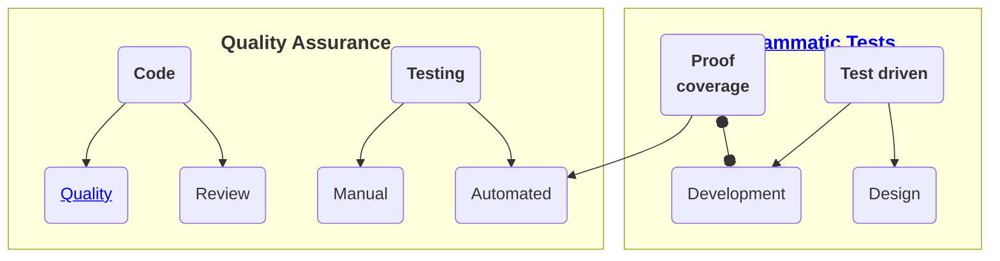

# Software &mdash; Quality Assurance

> **Frivolous, fleeting, and exponential spirit makes the programming inherently and largely error-prone.** 

Software is pure abstraction ether, and its creators have no fear of breaking changes (as close as their fingers to the keyboard). Commits can be rolled back, and there's always a gap until delivery to production (for last-minute fixes or bug introduction).

## What are errors &mdash; Reminder

Errors are not only bugs but poor performance, frustrating user experience, and missing functionality.

// ToWrite: NOTE about the worst of errors

IT Wasn't in REQS

## What makes QA &mdash; Reminder

Natural

Pre

Validation
   In 
   Out

Postfactum

## Natural born quality

There were and will be remarkable projects done from scratch without allotted proof and validation measures (let alone code reviews and test automation) but robust from the first release. 

This may occur in localized high-pro teams of responsible individuals but only underlines the idea of separate software THEME &mdash; __QA__.

Writing [quality code](README+/code-quality.md) must be an objective but teams will be uneven, distributed/fluctuating, and stressed. Add the human nature to sweep problems under the carpet - quite big and thick in the software.

When security risks are a concern other approaches for hacking vulnerability come into play (and devs aren't writing code in a criminal-minded mode).
Project this statement to all other cases where IT pundits don't have all the expertise to test the domain.

## Testing

_Tests_ and _Testing_ are great umbrella terms.

### Manual (spontaneous and planned)

Unlike the olden days with BLIND commits  PUNCHcards most development allow to evaluate its product (in whole or by feature) with every step: just build and run.

This makes the developer the original, most prepared, and, when responsible, most effective and critical tester.

REMARK about KNOWN Qua Projects.

### FORMALIZED TESTS and their automation 

COPY PASTE

Bug searching and quality proofing tests are optional but highly recommended and a natural share of software creation. 

TEst automation is oft misnamed as AUTO, since may come hand in hand.

### Test automation

**Further**↙️:\
|--- [Tests as QA](../tests/asQA)\
|--- [Programming tests](https://github.com/Kyriosity/use-dev/blob/main/README+/tests)

:end: ... but [README+](README+)
