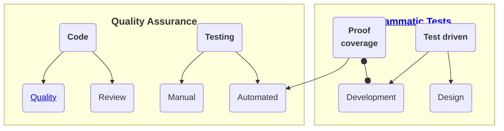

# Software &mdash; Quality Assurance (QA)

<table><tr><td>
 
Software is pure abstraction ether.

 
Frivolous, fleeting, and exponential spirit makes the programming inherently and largely

 
<b><samp>E&thinsp;R&thinsp;R&thinsp;O&thinsp;R&thinsp;-&thinsp;p&thinsp;r&thinsp;o&thinsp;n&thinsp;e</samp></b>
.
</td><td><picture></picture></td><td>
When breaking changes are as close as fingers to the keyboard, commits can be rolled back, and there's always a gap until delivery to production (for last-minute fixes or bug introduction) software is 

<b><samp>Q&thinsp;A&thinsp;-&thinsp;f&thinsp;a&thinsp;t&thinsp;e&thinsp;d&thinsp;.</samp></b>

</td></tr></table>

## Errors

**QA** couldn't exist without errors - the catch-all term which inmates deserved their own [corner](README+/errors/).

## Quality

## Natural born

There were and will be remarkable projects done from scratch without allotted proof and validation measures (let alone code reviews and test automation) but robust from the first release. 
This may (and _may not_) happen in localized high-pro teams of responsible individuals but is an exclusion to underline the must-have of __QA__.

> Writing [quality code](README+/code-quality.md) must be an objective but teams will be uneven, distributed/fluctuating, and stressed. Add the human nature to sweep problems under the carpet - quite big and thick in the software.

## Preliminary

Experience in

+ domain/subjects,
+ tools (as a platform and programming language),
+ fails and retreats (also of others).

When security risks are a concern other approaches for hacking vulnerability come into play (and devs aren't writing code in a criminal-minded mode).
Protrude this statement to all other cases where IT pundits don't have all the expertise to test the domain.

## In process

<table><tr><td><picture></picture></td><td>
 
These are continuous measures within teams:

 <ul>
  <li>Code reviews, pair programming, friendly discussions, and lessons.</li>
  <li>Preferred approaches as <a href="../tests/asDrive/">Test Driven Development</a>.</li>
 <li>Selection of popular or custom <a href="https://github.com/Kyriosity/use-dev/tree/main/README+/frames">guidelines</a> and <a href="https://github.com/Kyriosity/use-dev/tree/main/README%2B/techniques">techniques</a>.</li>
 </ul>
</td></tr></table>

## Produced

### Feedback

Customer feedback is the top mark (not only on the positive scale) and not every user is eager to share it.

### Tests

_Tests_ and _Testing_ are a CENTERPIECE of QA and <ins>&thinsp;w&thinsp;i&thinsp;d&thinsp;e&thinsp;</ins> umbrella terms for the check of code and its products (including documentation). Bug searching and quality proofing tests are optional but highly recommended and a natural share of software creation. 

### Manual (spontaneous and planned)

Opening this page was your manual test. 
 
Unlike the olden days with blind commits of punchcards and tapes most development allows one to evaluate its product (in whole or by feature) with every step and at time: just build and run.

Responsible developers are the primary, most prepared, most effective, and critical testers.

### Programmatic tests

Executable code routines - are the biggest cornerstone of modern QA. Automation of their run - fundament of continuous quality and safety.

\___________\
:end: ... continued in ...  [Errors](README+/errors/)  .&thinsp;.&thinsp;.  [Code quality](README+/code-quality.md) &nbsp;.&thinsp;.&thinsp;.&nbsp; [Tests for QA](../tests/asQA/) &nbsp;...&nbsp; [Pitfalls](README+/QA-pitfalls.md) &nbsp;.&thinsp;.&thinsp;.&nbsp; [TDD](../tests/asDrive)
