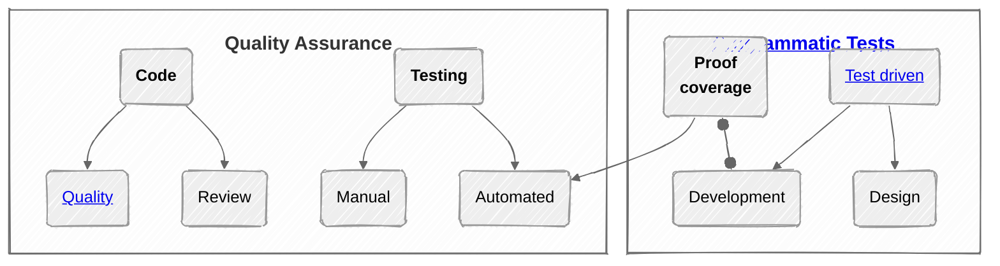

<h1 align="center">Software &nbsp; &mdash; &nbsp; Quality Assurance (QA)</h1>

<table><tr valign="center"><td width="42%">
 
Software is a pure abstraction ether on fragile carriers.
 
The frivolous, fleeting, and exploding spirit of its development makes software inherently and largely
 

<b><samp>E&thinsp;R&thinsp;R&thinsp;O&thinsp;R&thinsp;-&thinsp;p&thinsp;r&thinsp;o&thinsp;n&thinsp;e&thinsp;.</samp></b>

</td><td><picture></picture></td><td width="42%">

Software became an irreplaceable stratum of civilization as technology.

Its applications manage crucial systems of all kinds and must be

<b><samp>S&thinsp;T&thinsp;A&thinsp;B&thinsp;L&thinsp;e&thinsp; </samp>and<samp> &thinsp;R&thinsp;O&thinsp;B&thinsp;U&thinsp;S&thinsp;T&thinsp;.</samp></b>

</td></tr></table>

<h3 align="center">And «<samp>never the twain shall meet</samp>» unless ... <b>Quality Assurance</b>.</h3>

<h2 align="center">Prerequisites</h2>

Knowledge of/Experience in

+ **domain**/subjects,\
`//` or it will be programming "telephone charades" with the customer, or a great overhead of specifications
+ **tools** (as a platform and programming language),\
`//` learning complex technologies on critical projects is a burnout path or/and programming what's already available,
+ **fails** and retreats (preferably of others).

When security risks are a concern, other approaches for hacking vulnerabilities come into play &thinsp;&mdash;&thinsp; and devs aren't writing code in a criminal-minded mode.

This statement applies to all other cases where IT pundits lack the expertise to test the domain.

### Velvet gloves of discipline

Breaking changes as close as fingers to the keyboard, commits that can be rolled back with a click, development/testing playgrounds and sandboxes, ["it works on my machine"](../../pencraft/README+/memes/README+/polyptych_works.md).

What's admissible on "tangible" projects may lead to epic fails on a larger scale.

<h2 align="center">In process</h2>

<table><tr>
 <td>
  <picture></picture></td>
 <td>
 
These are continuous measures within teams:

 <ul>
  <li>Code reviews, pair programming, friendly discussions, and lessons.</li>
  <li>Preferred approaches as <a href="../tests/asDrive/">Test Driven Development</a>.</li>
 <li>Selection of popular or custom <a href="https://github.com/Kyriosity/use-dev/tree/main/README+/frames">guidelines</a> and <a href="https://github.com/Kyriosity/use-dev/tree/main/README%2B/techniques">techniques</a>.</li>
 </ul>
</td>
</tr></table>

<h2 align="center">Retrospective</h2>

### Feedback

<table><tr>
 <td>

Customer/user experience is the top mark (not only on the positive scale), and not every user is eager to share it.

Besides errors, surveys must find out frustration and, even more important &mdash; neglected features.
 
</td>
 <td><picture></picture></td>
</tr></table>

<h2 align="center">🧪Tests📏🪲</h2>

_Tests_ and _Testing_ are a CENTERPIECE of QA and <ins>&thinsp;w&thinsp;i&thinsp;d&thinsp;e&thinsp;</ins> umbrella terms for the check of code and its products (including documentation). Bug searching and quality proofing tests are optional but highly recommended and a natural share of software creation. 

### Manual (spontaneous and planned)

There's no full replacement of manual tests &thinsp;&mdash;&thinsp; only their underestimate

Unlike the olden days with blind commits of punchcards and tapes, most development allows its creators to assess the product (in whole or by feature) with every step and at the same time: just build and run.
 Responsible programmers are the primary, most prepared, most effective, and critical testers.

P.S. Opening this page was your manual test. 

### Programmatic tests

Executable code routines are the biggest cornerstone of modern QA. Automation of their run is fundamental to continuous quality and safety.

### Simulators

IT's more challenging to find an unavailable UI simulator or platform emulator, or virtual machine than a popular one.

## Appendix. Natural born quality

There were and will be remarkable works done from scratch **without** allotted proof and validation measures (let alone code reviews and test automation) **but robust** from the first release. 

This may (but mostly _will not_) happen in localized high-pro teams of responsible individuals, but as an exclusion underlines the need for __QA__.

> Coding cleanly and qualitatively must be the primary goal, but teams will be uneven, distributed/&thinsp;fluctuating, and stressed. Add human nature to sweep problems under the carpet &thinsp;&mdash;&thinsp; one quite big and thick in the software.
<h3 align="center"><ins>&nbsp;bottom line&nbsp;</ins></h3>

**QA** couldn't exist without errors &thinsp;&mdash;&thinsp; the catch-all term, with a dedicated [**corner**](README+/errors/) for its inmates.

\___________\
:end: ... continued in ...  [Errors](README+/errors/)  .&thinsp;.&thinsp;.  [Code quality](README+/code-quality.md) &nbsp;.&thinsp;.&thinsp;.&nbsp; [Tests for QA](../tests/asQA/) &nbsp;...&nbsp; [Pitfalls](README+/QA-pitfalls.md) &nbsp;.&thinsp;.&thinsp;.&nbsp; [TDD](../tests/asDrive)
