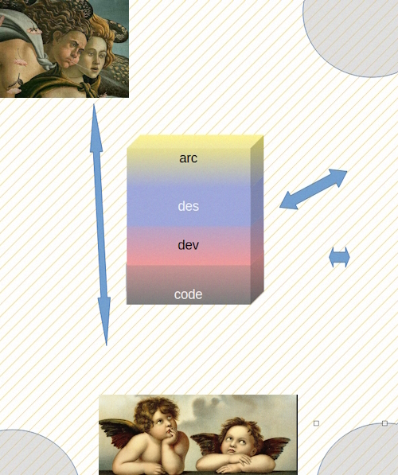

# Arc Deco - Big Picture

The "tearing X and Y axes" in the  intro was a 2D simplification for a figure of speech.

The picture is much more pied for discussion but before you UNFOLD.

<picture>
  
</picture>

  
<ins>&nbsp;FORCES&nbsp;</ins>

