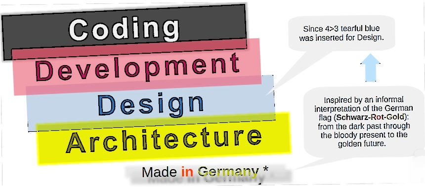
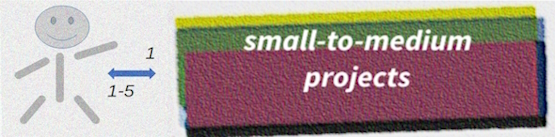

# The creation of software

### **What makes software?** In a word - _development_, in four - 

Add colors for project management, digital artists, DevOps, documentation, testing, and administration?

They are external forces that can be constructive and non- (also neutral). Culturally speaking: mix, tint, blur, or shade (if not wash off) the four paints. 

## Arc DeCo

,Arc - for <b>arc</b>hitecture ,De - for <b>d</b>esign and d<b>e</b>v Co - for <b>co</b>ding

**_Coding_**, **_development_**, **_design_**, and **_architecture_** combine tied, overlapping, and time-unordered processes. 
They may blend to almost a rectangular and imply little discussion and overhead for work.

... but the growth of a project will explode the picture in all dimensions ...

  
<ins>&nbsp;Forces which make the big picture&nbsp;</ins>

TABLE: Left to your imagination <-> Click to get the force

THUMBNAIL

&nbsp;&nbsp;&nbsp;&nbsp;:anchor: Digging deep in code mines, not seeing shining peaks.\
&nbsp;&nbsp;&nbsp;&nbsp;:balloon: Flying in abstraction dreams.

## Objective

## Conclusion, which is the beginning

Immanuel Kant: “Experience without theory is blind, but theory without experience is mere intellectual play."

The intro already involves so many topics, that ...

|- Classisication\
|- Roles share for inclinations\
|- Architecture and architector\
|- 

//////////////// 🚧  BELOW ARE DRAFT NOTES !!! //////////////

Architecture may describe both ARC and VISION ...

Arc and Dev are close to the keyboard while dev and coding are near to the keyboard.

## Behind the explosion sketch

## Impedance

IMPEDANCE, COMMU (look! also impedance here), ROLES (impedance!), GRAVITY vs LEVITY

## Roles

<i>".Many hands make light work"</i>

Thinks not persons but roles.

## Overlapping and communication

<ins>&nbsp;<b>Processes as layers</b>&nbsp;</ins>

Let's see them intermixed

### Persons, roles, or tasks? 

## Subtasks of design

To keep the design thinking (not necessarily implemented in every step)

## Worth of `coding`

Coding is inevitable and everybody should practice it to the proper extent.

Let's first formulate what the coding is and what is different from dev.
Bugs lookup.

# Design - private derivations

## Duties and purposes

Besides the primary specification of software layers, modules, entities, functions, and their [naming](/README+/dev/README+/dev-naming.md/), concerns of design **are**:

+ detection of conceptual collisions:collision:,
+ [partitioning](/README+/dev/design/README+/software-parts/) (data, model, presentation, UI, biz logic),
+ use of [external](/README+/dev/design/README+/software-parts/ext_parts.md) libraries, frameworks, and services,
+ principal language-specific decisions,&nbsp;✋
+ planned audience (roles, groups), 
+ visualization and presentation of modeling (like UML sketches)

&nbsp;&nbsp;&nbsp;&nbsp;&nbsp;&nbsp;:collision: Both unrealistic expectations (as an AI-chat that will fully replace hotline operator, or crack of math problem) and technical bottlenecks (as hi-definition images processing in pure C# or obsolete user platforms).\
&nbsp;&nbsp;&nbsp;&nbsp;&nbsp;&nbsp;✋ I share my C# decisions in [use-dev](https://github.com/Kyriosity/use-dev).

and are **not**: 

- user experience (unless UI or UX is the application subject),
- tongues (unless it's a linguistic app) and assistance,
- versions of languages and platforms,
- ways of authentication/authorization,
- details of implementation, like sort algorithms,
- code and docu management (as management system choice),
- maintenance of design artifacts (docu).

## Options of design

* maintenance of acquired or imaginative [design samples](README+/design_samples.md)

## Pitfalls

Besides trivial perfectionism, self-overestimate, and epic fails the next trivia often undermines the way of design:

RAILs

🚧<ins>&nbsp;<b>Too much low-level share</b>&nbsp;</ins>

// TO BE explained
  
  Burden of
  
Is a counter-part of high-level

🚧<ins>&nbsp;<b>Too little middle-level share</b>&nbsp;</ins>

// TO BE explained
Is a counter-part of high-level

It's about DIVERSION

🚧<ins>&nbsp;<b>Surrenders admitted as compromises</b>&nbsp;</ins>

// TO BE explained

🚧<ins>&nbsp;<b>"Tunnel vision"</b>&nbsp;</ins>

// TO BE explained

🚧<ins>&nbsp;<b>Degradation to formalism</b>&nbsp;</ins>

// TO BE explained

"Everything is designed. Few things are designed well." – Brian Reed

Bright architecture is paved by shattered illusions, painfully deadlocks and hard rework which finally and magically reveal straight ways.

.Design shortcuts and rebates finally make kludge

🚧 ... TO BE WRITTEN ... 🚧

