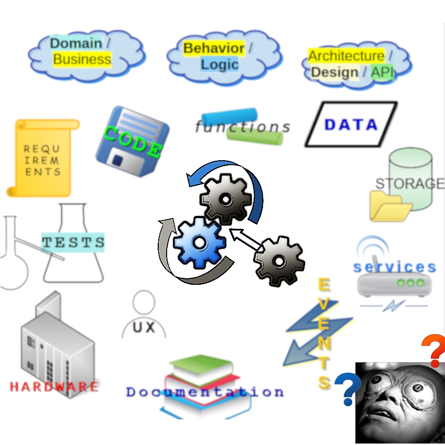
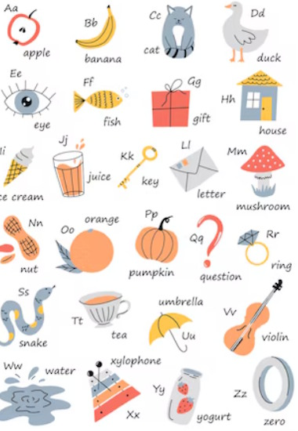

# Software creation &mdash; Drives

What guides programming minds (and how) is a separate IT discipline. _Test-Driven Development_, _Domain-Driven Design_, and _Event-Driven Architecture_ are only a few household names for approaches. Also _functional programming_ is a driven approach.

<ins>&nbsp;<b>Fancying more items on both sides of <samp>DRIVEN</samp> will scheme a grotesque gearbox&thinsp;:</b>&nbsp;</ins>

 

<picture></picture>

⬆️&thinsp;<mark><b>Let's figure out what to do with this mess...</b>&thinsp;⬇️</mark>

## Drive and let drive

Let's reserve individual surveys of <ins><b>&thinsp;<samp>ONE-WAY</samp> 1&thinsp;:&thinsp;1&thinsp;</b></ins> to voluminous books and techno-evangelists. They do a great job of formalization (including methodologies) and popularizing exclusive approaches, which may prevail in particular initiatives.

Let's be free of dogmas and  isolated combinations. The easiest path is to conjure up the items (from the picture above) around a task and develop it with approaches in mind.🙋

The arduous trail is to draw arrows in the picture,  play with their direction, and prioritize (this also means erasing some). Then continue designing names, categories, and programmatic structures.

\_______\
&nbsp;&nbsp;&nbsp;&nbsp;&nbsp;🙋 This read isn't a doctrine now. You are free to dump it now (unless you want to spare hours of rambling in courses and books.

### Your gearbox has ... <samp>REVERSE</samp>

Consider any approach's counter "rotation," regardless of how twisted it looks first. For example, _Development-Driven Tests_ are nothing else than **test coverage** (e.g. for planning and automation).

<samp><b>REVERSE ENGINEERING</b></samp> is ... _Code-Driven-Design_, and _Design Driven Requirements_ can be percieved as Documentation.

🚧🚧🚧... more EXAMPLES coming ... 🚧🚧🚧

### Filter out...

For any particular application, some drives will drop out themselves (like UX for DB), but not all the remaining combinations shall drive and some may be detrimental.

For example, Development Driven/Crippled Design from the gross use of _Test Driven Development_.

##  Domain drive

### ... for all

<table><tr valign="top"><td width="25%"><picture>
  
</picture> 
<i>Bounded Contexts</i>
</td><td>

If <i>domain-driven</i> is a distinct approach there must be alternatives without that. And I <b>doubt there are</b>...

Software as a phenomenon abstracts domains, explicitly or implicitly, nothing else. Domain Drive is a permanent force (like gravitation of abstractions).

One of the motives and benefits of object-oriented design is that it directly maps to domains, though one may break it with wrong and overladen hierarchies and bad naming.

<blockquote>
DDD-tempered code is adverse to names such as <code>utility</code>, <code>service</code>, <code>handler</code>, or <code>data</code> (unless these are conventions of platforms/frameworks).
</blockquote>

<b>I can't help bringing even more heresy:</b>

<b>D&thinsp;D&thinsp;D&thinsp;</b> is so innate that studying it is like learning the alphabet of spoken tongues. Flipped in the mirror and with deep analysis of segments.

</td></tr></table>

#### R&thinsp;E&thinsp;V&thinsp;E&thinsp;R&thinsp;S&thinsp;E&nbsp; there?

**<mark>&thinsp;Y&thinsp;e&thinsp;s&thinsp;</mark>**, remember the aphorism «_Computers solve problems that we didn't have without them_»? That's definitely about _Operating Systems_ - the product of <i><b>Hardware</b></i>+<i><b>Software</b>-Driven-Domain</i>.

Many other systems are projections of rudimentary software possibilities before large-scale computerization: social networks, E-Mail, and blockchains. And less corresponding to the term 
<ins>CMS</ins>, <ins>CRM</ins>, and <ins>ERP</ins> (as SAP).

<table><tr><td>☝️</td><td>

<b>Reverse D&thinsp;D&thinsp;D can go on usual projects with a "remake" of legacy software as an archetype.</b>

You may recall success stories when leading-edge IT platforms inspired ideas, use cases, and features, that had never been discussed before and users/customers loved them .

</td></tr></table>

## Test drive

**T&thinsp;D&thinsp;D** is the oldest, still most talked over and practiced approach and earned its own corner, no, hall&thinsp;!, in the [Tests area](../../tests).

To summarize

1) Test Driven **Development** and Test Driven **Design** are branching approaches.
2) Tests better qualify not as drives but as tools for Driven Development and Design.

### Wrap up

This was a sketch, that shall be enhanced with references to live projects.

## Appendix. PRACT DESIGN

\___________\
🔚  ... borrowed images credit: [The Outer Limits.The&nbsp;Mutant, 1964](https://www.imdb.com/title/tt0667845/?ref_=ttep_ep25), [FREEP1K](FREEP!K (freepik.com))
