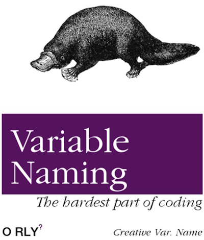

# Software &mdash; Naming and categorization

<i>"...In the beginning was the Word"
</i>
 

<table><tr valign="top"><td>
</td><td>
  
<b>Denomination of <ins>both</ins> categories and titles is a pivotal but underrated and neglected activity in every methodology.</b>

  
In software, it looks like granted when names with categories smoothly guide through the design and make coding intuitive.

 
Otherwise, wading through the thorns of poorly named and labyrinths of badly categorized code, abatis of docu developers will curse application complexity, learning curve, technologies used, and fate but at least the naming.

</td></tr></table>

## How to name...

### as usual

The prevalent naming is a derivative of the development, which

❌ rests on programmatic "false-domain" (as `Helper.Get(..)`, `Utils.Do(...)`, `Service.Find(...)`, and other no-brainers),\
❌ leaves "construction waste" of temporary names, placeholders,\
❌ spreads umbrella terms and horizontally swelling folders,\
❌ spawns long names and shallow categories (`AddTableReservation()`),\
❌ interferes with existing domain and functional naming,\
❌ contains jargon and slang.

### as crucial

The naming of libraries, packages (assemblies), folders, classes, methods/functions, and even non-public _vars_ must be a **№1** challenge and involve the whole team:family: in discussions. 

The inevitable and noticeable expenses will pay off with the formation of ***lingua franca*** throughout the team and project, and ...
  
+ shared comprehension of a domain, collaboration, and indeed bound team,
+ genuine design and self-descriptive code,
+ inspiration for behavior/domain-driven design,
+ escape from heaps of docs📒,
+ mitigated tension to get into a project for newcomers,
+ comfy navigation in the source code (beginning from <kbd>CTRL+F</kbd>).

&nbsp;&nbsp;&nbsp;&nbsp;&nbsp;&nbsp;:family: The team means not only developers and managers but customers, testers with end users.\
&nbsp;&nbsp;&nbsp;&nbsp;&nbsp;&nbsp;📒 reqs/specs, DoU, meetings protocols, and primers - hard to follow but easy to misunderstand or forget but mostly neglected

You may see it as [domain-driven design](../drive/README.md#Domain-drive).

## Categorization

Categorization (classification) is much more profound than breaking collocations and sentences and building the folder hierarchy. &mdash; It makes the structural frame of sound abstractions.

// ToDescribe: Thinking in tags

## Wrapping up

Even top teams under time pressure and brakes on perfectionism would be barely proud of their implementation of naming. Furthermore, the naming (as [code quality](../../QA/README+/code-quality.md)) will never be perfect, but efforts to improve them must be continuous and genuine.

## Appendix. Posers

Some sitations with naming can be harder than difficult.

### Impedance with inherited domain names

// ToDescribe:

### Active or passive voice

`document.print(device)` vs. `device.print(document)`

// ToDescribe:

\___________

🔚 ... 📂[README+](README+)
