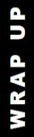

# Design &nbsp;&mdash;&nbsp; Samples♟️<samp>🧮</samp>🎨🧱

The planning and presentation of general-purpose software features require a pictorial and encouraging background. We'll often rely on the next samples:

# <a id="chess"/>♟️&thinsp;<ins>C<samp>&thinsp;H&thinsp;E&thinsp;S&thinsp;S</samp></ins> &nbsp;&mdash;&nbsp; [<samp>Math<samp>](#math) &nbsp;&mdash;&nbsp; [<samp>Images</samp>](#images) &nbsp;&mdash;&nbsp; [<samp>Stills</samp>](#stills)

Chess speaks for itself <i><b>Hans Moke Niemann</b>, GM, 2022</i>

This popular board strategy of all time, with fast-to-learn rules, renders a favorable playground for software logic.  Other traits are...

### Reversibility: full and plain

The conventional record of moves allows one to track a finished or in-progress game back to any point. The _reverse_ is just a specular move (with the recovery of taken figures).

### Value-action substitution

A game "macro" can be either moves (*actions* that change the board) or alternating board layout (*value*, which moves result). 
The layout can be reproduced from moves and vice versa, thus mixed notation can also serve (though extraordinarily).

### Multiuser

Chess assumes two players (i.e., a multiuser application), who make moves in turn or decide to end the game, but there's a judge and timer, who follow the game and may change its progress.
Thus, any action (start, move, resign, undo) requires the approval or notification of others.

### Multi-value note of the _move_

Various actors set async props of a move/action:

+ player, arbiter &rarr; move/action notation
+ clock &rarr; timestamp
+ player &rarr; comment* (optional)
+ engine/expert &rarr; assessment* (optional)

### Duration, size, and space

Playing chess is predictably finite:1234:, while any initiative may unleash the figures, _8x8_ layout, or time control and result in perpetual movement.\
&nbsp; &nbsp; 🔢&nbsp;Theory and rules limit moves to 5`949 with prevailing numbers on practice far below fivescore.

Concise notation of moves and layout could allow IBM&nbsp;305 RAMAC in 1957 to maintain and output an archive of all known tournaments.

## &nbsp;
# <a id="math"/>[<samp>Chess</samp>](#chess) &nbsp;&mdash;&nbsp; 🧮&thinsp;<ins>M<samp>&thinsp;A&thinsp;T&thinsp;H<samp></ins> &nbsp;&mdash;&nbsp; [<samp>Images</samp>](#images) &nbsp;&mdash;&nbsp; [<samp>Stills</samp>](#stills)

«<b>&thinsp;A&thinsp;l&thinsp;l &nbsp; i&thinsp;s &nbsp; N&thinsp;u&thinsp;m&thinsp;b&thinsp;e&thinsp;r</b>&thinsp;» <i><ins>Πυθαγόρας</ins></i>

The study of logic and **math** with its formalism has predetermined programming. As hardware could run decent algebra instructions, low- and high-level languages on it could render fundamental mathematical functions for programmers.

More specific functions can be found in external libraries, and if not, are the subject of tailored development: from a casual task for non-mathematicians to scientific theses (as some _computer-assisted-proofs_). 

* Arguments and results of functions are not only numbers but also compound and highly abstract structures. 
* A simple or not formula may spare loads of modification storage and still be swift. 
* Contrariwise long or resource-consuming calculations can serve as _proof-of-work_, performance tests, and simulation of load.

### Reversibility

Codes may rely on mathematical *invertibility* (to undo and browse changes) while [one-way functions](https://en.wikipedia.org/wiki/One-way_function)<b>w</b> may suit for trace or hack safety.

Value differences may suggest a mathematical operation to reproduce, or disclose a function (e.g., one point for an exponent, and two for a line).

### Optimization

Parallelization (multi-threading) of algorithms, when applicable, tangibly speeds up calculations even on mediocre two-core machines.

## &nbsp;
# <a id="images"/>[<samp>Chess</samp>](#math) &nbsp;&mdash;&nbsp; [<samp>Math<samp>](#math) &nbsp;&mdash;&nbsp; 🎨&thinsp;<ins>I<samp>&thinsp;M&thinsp;A&thinsp;G&thinsp;E&thinsp;S</samp></ins> &nbsp;&mdash;&nbsp; [<samp>Stills</samp>](#stills)

,When I am in a painting .I'm not aware of what I'm doing <i><b>Jackson Pollock</b> (1912-1956) </i>

Editor of **raster images** is the richest and most multifaceted support for thinking in application design: presentation, processing, and persistence. 
All three of these ask for optimization (equally logical and tricky).

Maps of pixels range from grayscale thumbnails to giant high-density multi-layered canvases or animations. 

### Changes

Changes on canvas differ from unique artistic strokes to strict procedures and may apply to the whole image, its masked parts, selected colors, or layers. 
Actions vary from simple (flip, rotate) to highly processed retouching or effects.

## &nbsp;
# <a id="stills"/>[<samp>Chess</samp>](#chess) &nbsp;&mdash;&nbsp; [<samp>Math</samp>](#math) &nbsp;&mdash;&nbsp; [<samp>Images<samp>](#images) &nbsp;&mdash;&nbsp; 🧱&thinsp;<ins>S<samp>&thinsp;T&thinsp;I&thinsp;L&thinsp;L&thinsp;S</samp></ins>

In some mysterious way woods have 
.never seemed to me to be <mark><b>static</b></mark> things 
;In physical terms, I move through them 
,yet in metaphysical ones 
.they seem to move through me 
___________ 
<b>John Fowles</b> (1926-2005), <i>(post)modernist</i>

**First and foremost**, software design asks for <ins>"static" plain bare figures</ins>, which make core models. The preceding samples are more in motion ("dynamic") &mdash; they have properties and hierarchies but are more demonstrative of processes that change them.

"Static" models can be altered and async too, but they must demonstratively represent hierarchies, parametrization, and initialization. 

Writing/books may be a perfect case, and the neighbor repo use-dev➡️ explores how to make them [more flexible](https://github.com/Kyriosity/use-dev/blob/main/README+/techniques/README+/polymorphism+/README+/prop_shift.md) and implements them in [AbcModels](https://github.com/Kyriosity/use-dev/tree/main/src/TuttiFrutti/AbcModels).

---

<table><tr><td><picture></picture></td><td>

Developers can select a sample or model that fits the features under development and implement (or reuse) prototypes with tests. 

However, put them all together on the mental green field of a growing application to plan:

+ multitasking,
+ multi-cultural,
+ undo-redo,
+ conversions.

and mix them (e.g., async undo-redo,  or multi-culture as units).

</td></tr></table>

\___________\
🔚 🌕 2023-2025 ..
