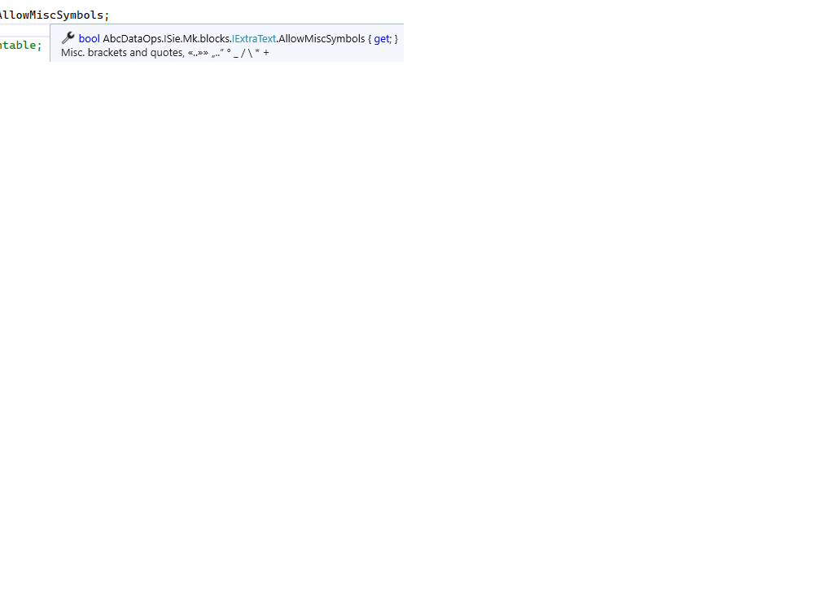

# Code _`// Comments`_

Compilers don't read comments (or design documents)  and neither do many programmers (consistently). 
<a href="https://github.com/isocpp/CppCoreGuidelines/blob/master/CppCoreGuidelines.md#p1-express-ideas-directly-in-code">C++ Core Guidelines</a>

,<i>When you feel the need to write a comment first try to refactor the code so that .any comment becomes superfluous</i> 
 <a href="../../../pencraft/README+/quotes/README+/contributors/README.md#Kent-Beck">Kent Beck</a>, "Refactoring", <b><i>1999</i></b>

___________

When code resembles a manuscript  consider writing the documentation.

> **Comments can be eye-catching and essential, but signal design inconsistency and poor naming.**🙋

Carefully written [quality code](../../QA/README+/code-quality.md) is self-descriptive by nature and needs no epistolary clarification🙋, 
and even abracadabra in _regex_ processors can be broken down into figurative methods and variables. 

However, rehearsed names of classes, functions, arguments, and properties bloat many (if not the majority) files of prominent (and lesser-known) contributors on Git (or elsewhere)📄.

Accompanied by info and copyright©️ headers and footers. 

\___________\
&nbsp; &nbsp; &nbsp; &nbsp; 🙋 <samp>This statement is for high-level declarative languages.</samp>\
&nbsp; &nbsp; &nbsp; &nbsp; 📄 <samp>Sometimes on a single purpose to enlarge the number of committed lines.</samp>\
&nbsp; &nbsp; &nbsp; &nbsp; ©️ <samp>As if there were no license agreement or such a spell may prohibit impudent copy-paste.</samp>

## ❗Breaking exclusion &thinsp;&mdash;&thinsp; Nota bene

Some members require clarification, e.g. _natural number_ **may** include zero. A name may specify it (`IsNaturalNonzero` / `IsNaturalOrZero`). 
This can't be a solution for cases such as `RemovePunctiation()`: what symbols exactly shall include `«»»` (guillemets), is `_` punctuation, ...?

Tests shall fragment distinctions but are not comfortable for hints and unavailable through API, services, or, generally speaking, interfaces.

> **The comment docu can be necessary to appear as a hint.**

Such comments shall be reserved for interfaces.

<picture></picture>

## Indulgences

🔷 First and foremost, descriptive comments and blocks of them in **demo tests** &thinsp;&mdash;&thinsp; to serve as guides for devs and presentations for users. 

Other valid points are:
 
+ stamps on auto-generated stuff,
+ bizarre workarounds (especially for third-party bugs),
+ courtesy of Q&A sites,
+ worthy tricks that harm readability,
+ code snippets in documentation,
+ informal notes on test data,
+ domain-explaining quotes from sources like a wiki,
+ explanation of voids **when** significant (`intentionally left blank`, `this class must be void`)
 
One other distinct and legitimate niche is [comment-driven development](https://en.wikipedia.org/wiki/Comment_programming)<b>w</b> (though it's more fun).

Comments may be anchored theses for documentation, if you can effectively support two-way updates.

### Commenting the code out

Switching off code lines is a usual manipulation, but committing one requires a comment at least that it was on purpose. It might be just three slashes `///` or a team may decide on acronyms like:

&nbsp; &nbsp; `///DEL` — delete after review\
&nbsp; &nbsp; `///ALT` — alternative implementation \
&nbsp; &nbsp; `///ERR` — doesn't work\
&nbsp; &nbsp; `///EXC` — causes an exception\
&nbsp; &nbsp; `///IDEA` — It was a fast sketch which one may simplify or elaborate\
&nbsp; &nbsp; `///LOL` — i did it for lulz

\___________\
 🔚 🌘 2023-2025 ..
