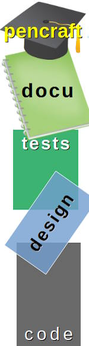
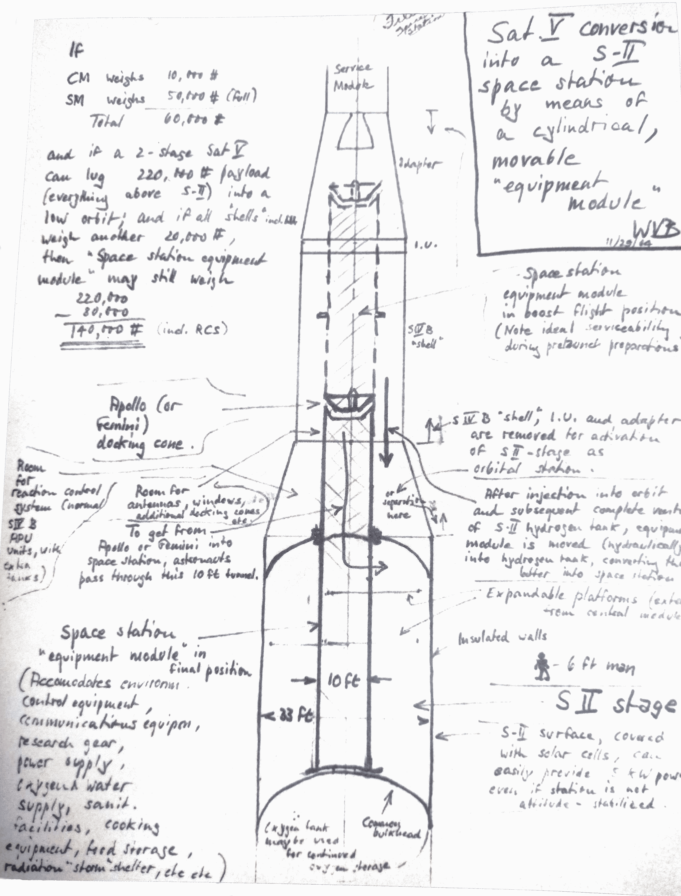

# Software&nbsp;&nbsp;&mdash;&nbsp;&nbsp;Design&nbsp;&nbsp;&mdash;&nbsp;&nbsp;Documentation

[Quality code](../../QA/README+/code-quality.md) with profound and thoroughly categorized [names](../../design/names) must explain design brainchilds in intuitive manner. 
Liably written [design-defining-tests](../../design/drive/) must smoothly introduce them. And nothing is more suitable for reverse engineering (manual or automatic) than source code. 

This combination alone will gradually become tougher and steeper (until it hits the wall of the perfectionism exponent) and won't reveal remarkable design/architecture intentions. 
It's warped to unfold the big canvas of abstractions.

In reality, the code will be partly or greatly obscure and tests will lack clarity and both &mdash; seamless categorization. 
Code prose and time will bury grand (no sarcasm intended) design decisions <mark>unless highlighted with a pen</mark>.

Explorers may also overestimate weak decisions and search for deep meaning in shallow parts.

**That's why software design needs documentation, which must be a creative stratum between code readability and dev team lore.**

<h2 align="center">Recording ⏺️ design ⏹️</h2>

<table><tr valign="top"><td><picture></picture></td><td>

Even if there's extensive user guidance, even the best quality application code needs a fluent explanation: 

* engaging intro,
* navigation to source code,
* clues to common and own patterns and templates used,
* known design compromises, drawbacks, and "props" [props as supports].

The higher the level and more concise (yet complete) the documentation &mdash; the better. Nobody will maintain volumes of papers up-to-date, and the rare will read them thoroughly.

### Log&thinsp;/&thinsp;Blog

Accurate and meaningful commit comments can make a skeleton of the design log. Theoretically automated, but practically, there will be too many mixed entries with white noise.

Just a daily (semi-weekly) log (or blog) on notable decisions could help document the pace of design. 
  
</td></tr></table>

### F.&thinsp;A.&thinsp;Q.

Continuous ratification of design decisions (incl. rejection) in the form of Question-Answer will compose a useful and concise user/developer document. 

### Diagrams and presentations

**Any text document (except F.A.Q.) over a few pages will be a boring blur without drawings, diagrams, and presentations.**

There are elaborate methodologies and tools (to remember classical IBM Rational Rose and RUP) to evolve a project in UML and other diagrams. 
However, they cost time, restrain presentation, stick the vision to **2D** (literally and metaphorically), and prompt to input of redundant details. Mutual synchronization with code will make matters even worse.

The compromise is to maintain top diagrams with modest detailing. Make presentations with and root documentation from them. 

<ins>&nbsp;Don't be shy with sketches. Look like NASA engineers charted it in 1960s:&nbsp</ins>

&nbsp;
  
<picture akign="center"></picture>

Sketch of a space station. Image source: NASA archives.

\_________

## Whiteboard

Fast, simple sketches resting on multiple fictitious axes (horizontal grouping, aggregation/inheritance hierarchies, timeline) could be enough and broader in all senses. 

They may start on a whiteboard🔲 during a casual discussion and, as "figures" take shape, be recorded in (vector) graphics tools of choice and skills. 

\_________

&nbsp;&nbsp;&nbsp;&nbsp;🔲 Can anything be better than a whiteboard? The glass board! It allows one not only to look at the design from an unusual side but also attach various backgrounds (e.g., previous printout). _Trace paper_ is a compact individual variant.

<h2 align="center">Past sketches</h2>

**Easy come, easy go.** 
Quick live whiteboard silhouetting is **very potent for understanding the new**, but if stored as snapshots without 
shaping🗜️, trimming✂️, and attributing🍒, they will be only trash for "future generations".

The latter aren't routines but intellectual, lasting, and accurate tasks of design and modeling.

\_________

&nbsp; &nbsp; 🗜️ <samp>Visualize artifacts on boars as recognized entities and connections.</samp>\
&nbsp; &nbsp; ✂️ <samp>Remove (join) redundant elements and visual noize.</samp>\
&nbsp; &nbsp; 🍒 <samp>Systematically classify and name artifacts.

## Summary

1. Docu shortage will obfuscate substantial concepts and require essential efforts to (re)gain focus on a software part later.🔖. 
2. Instead of being a side-effect of development docu shall be an acknowledged task, requiring resources and enthusiasm.
3. Docu shall evolve along with software for accuracy and mutual contribution.

&nbsp; &nbsp; 🔖 <samp>You are self the consumer&nbsp;**#1** of this product - it's only a week to lose a grasp on the "unfocused" design part.</samp>

## Wrap up. Sync with code!

> ❗ The most important note was reserved for the end.

**No excuse for the docu missing references to the implementation**, _viz._ code. Not every feature or class, but entry points.

As an example in progress, see ➡️[use-dev](https://github.com/Kyriosity/use-dev/).

## Appendix 1/2. Artistic images (sounds, videos)

Applying aesthetic traits to attribute images or enliven the text highly motivates readers when done with taste and bounds. Highly recommended as memory "anchors" on difficult subjects.

## Appendix 2/2. Alternatives to documentation

### Video tutorial - Screen capture

"A picture is worth a thousand words", and the shortest video is made up of thousands of them. That's the absolute winner in the snap of design. 

When a release is ripe, it will take half an hour per module (app) to switch the screen snap on, explore the code, and commentate impromptu.📹 Then an hour or some to review and record a much better version.\
&nbsp;&nbsp;&nbsp;&nbsp;📹 Tools for screen capture are available as freeware.

Yes, it's a kind of documentation (or source for) but it is rather peculiar.

### Coding under guidance

Arbitrarily, the most effective and fastest way to introduce a project is to make new programmers code a feature under the guidance of an experienced developer (with a domain expert).

It's not a _pair programming_ and must be in no way the opposite of "watch&thinsp;&&thinsp;learn".

Disadvantage: it's a one-time exercise that takes hours from most competent team members.

Taking advantage of the disadvantage: everybody learns how to present the design and see its strong and weak sides.

\___________\
🔚 ... **Continued in ✒️[P<samp>ENCRAFT</samp>](../../../pencraft/README.md)**. ... 🌘 2023-2025
