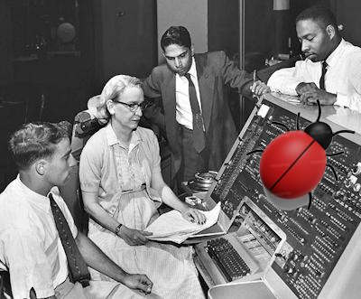

# Software &mdash; Programmatic tests

<table><tr valign="top"><td><picture></picture> 
<a href="../../pencraft/README+/quotes/README+/contributors/README.md#Grace-Hopper">Mrs.&nbsp;Grace Hopper</a>, grandma of COBOL and <b>debugging</b>, at UNIVAC&nbsp;<b>I</b>, ~1960
</td><td>

<b>Programmatic tests, as an idea💡, appeared together with high-level languages. 
They are a unique part of the software: optional but integral.</b>

Test projects don't contribute to product value but are the same essential as the core code. 

Tests are versatile since they can be applied to any extent and direction and for differing purposes. They can follow any practice and methodology, even - no tests at all.

💡As writing software program which only task is to examine another program.
   
<blockquote><b>Programmatic ≠ automated.</b> They are the subject of automation when applicable and justified.</blockquote>
</td></tr></table>

Getting started with testing is a no-brainer:

+ **It's simple** because it needs neither special skills nor following prescribed processes. (You can adhere to a methodology later.)
+ The start requires a minimum - tests can be written in the same or other programming language as their subject, even without a framework.\
(A bare call to a function/method/proc with none or some arguments and log/throw an error if the result doesn't match expectations.)
+ Popular and mostly free test frameworks, libraries, and auxiliaries equip one enough to develop unrestricted:\
Templates, tests doubles for missing functionality, data mocks (like pseudo-production data), and end-device simulation.

<b>Tests are a huge umbrella term and here we are at the first principal branching:</b>

<table><tr><td>
  
<b>TESTS for</b> <h3><a href="asQA/"><samp><ins>&nbsp;Q&thinsp;U&thinsp;A&thinsp;L&thinsp;I&thinsp;T&thinsp;Y&nbsp;&nbsp;I&thinsp;N&thinsp;S&thinsp;U&thinsp;R&thinsp;A&thinsp;N&thinsp;C&thinsp;E&nbsp;</ins></samp></a></h3>

</td><td><picture></picture></td><td>
  
<b>TESTS as</b> <h3><a href="asDrive/"><b><ins>&nbsp;<samp>C&thinsp;R&thinsp;E&thinsp;A&thinsp;T&thinsp;I&thinsp;O&thinsp;N&nbsp;&nbsp;D&thinsp;R&thinsp;I&thinsp;V&thinsp;E</samp>&nbsp;</ins></b></a></h3>

</td></tr></table>

\___________\
:end: ... (image credits: Unknown author - Flickr: Grace Hopper and UNIVAC, Freepik.com - the bug)
