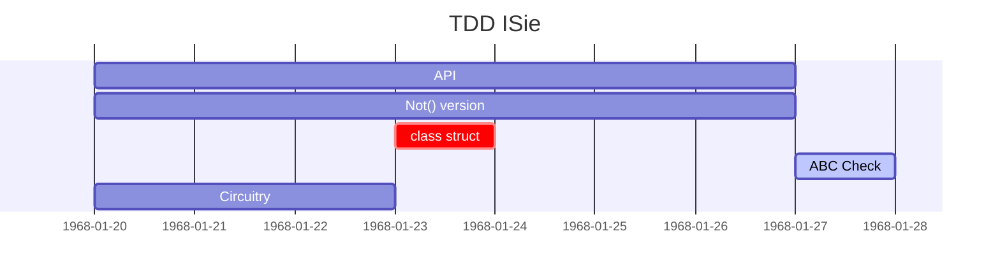

# Test Drive&nbsp;&nbsp;&rarr;&nbsp;&nbsp;Big Watershed

<table><tr valign="center"><td align="center">🌧️🌦️⛈️🌨️🌧️🌫️
<picture></picture>
   
rainy midsummer 2024

</td><td>
I was bicycling to hear a casual <b>TD<mark>D</mark></b> lecture as doubts crept in &mdash; where am I going:

   
Must this <mark><b>D</b></mark> be for <b><i>Design</i></b> or <b><i>Development</i></b>❓

It wasn't about the destination of this ride, but the principal divergence. 
For the record, the title of the lecture resonated with my anxiety:  "Failed with TDD? Here you know why."

Mystery solved: it was <a href="https://en.wikipedia.org/wiki/Test-driven_development">Test Driven <b>Development</b></a><b>w</b>.

   
<b>b&thinsp;u&thinsp;t ...

</td><td><picture></picture></td></tr></table>

The de-abbreviation raised another doubt: where's _Design_? &mdash; I actively searched by <kbd>**T&thinsp;D&thinsp;D**</kbd> and fairly retrospected the found&nbsp;...🙋 

Presentations and lectures favored _development_ with _design_ as a natural🌵 spin-off, not much bothering about distinction and some exploited both terms interchangeably. 
Books and tutorials showed up inclined to techniques, patterns, and testing frameworks.

Test-driven Development, fine for discourses, bootcamps, and `class`<samp>es</samp>, and encouraging to start features, didn't set forth for me to design just a mediocre project: hypothetical or tried.

&nbsp;&nbsp;&nbsp;&nbsp;🙋 Albeit being energetic in the recherche I couldn't go through the best part of treatises. There must be better findings, and there could be better alternating conclusions.\
&nbsp;&nbsp;&nbsp;&nbsp;🌵 <b>Natural</b> since any complete snippet can't escape design or must fit into the given.

<table align="center"><tr></tr><tr><td><ins>&thinsp;
   The initial </ins><mark><b><code>O&thinsp;R</code></b></mark><ins>-question was answered first </ins><code><b>A&thinsp;N&thinsp;D</b></code><ins> and then refined to </ins><code><b>X&thinsp;O&thinsp;R</b></code><ins>
&thinsp;</ins></td></tr></table>

<h2 align="center">Could I explain my shismatic take?</h2>

<ins><b>&nbsp;This shadow of doubt was from the <samp>RISING</samp>&nbsp;&nbsp;R&thinsp;I&thinsp;D&thinsp;G&thinsp;E, dividing syntax and implementation behind it&thinsp;:&nbsp;</b></ins>🖼️

&nbsp;

<picture></picture>

<!-- pic --!>
<!--                                               WATERSHED CANVAS        --!>
<!-- pic --!>

Design vs. Development are too dissimilar and contradictory to rotate on the same axis even admitting [evolutionary phenomenon](https://en.wikipedia.org/wiki/Continuous_design)<b>w</b>. 
Even if it's the same project and team, test tools/framework, and skills/techniques to write tests and implement code behind.

<table><tr><td width="50%" align="center"><b>🧪 Test ⚙️ DESIGN</b> <mark><b>Δ</b></mark> </td><td align="center">🧪 <b>Test</b> ⚙️ <b>DEVELOPMENT</b> <mark><b>δ</b></mark></td></tr><tr>
   <td>
<samp><b>W&thinsp;H&thinsp;A&thinsp;T&nbsp;&nbsp;t&thinsp;o&nbsp;&nbsp;d&thinsp;e&thinsp;v&thinsp;e&thinsp;l&thinsp;o&thinsp;p</b></samp>

   </td><td>
<samp><b>H&thinsp;O&thinsp;W&nbsp;&nbsp;t&thinsp;o&nbsp;&nbsp;i&thinsp;m&thinsp;p&thinsp;l&thinsp;e&thinsp;m&thinsp;e&thinsp;n&thinsp;t</b></samp></td></td>
</tr><tr valign="top"><td>
   <ul>
      <li><b>Grope</b> concepts and get a hands-on feeling on subjects🖋️</li>
      <li><b>Couple</b> design fantasies with the tech-stack materiality</li>
      <li><b>Define</b> skeleton functionality to vitalize</li>
      <li><b>Evaluate</b> and pick patterns/templates and, in some cases, languages/platforms</li>
      <li><b>Discuss</b> ideas, naming, and logic with consultants and users</li>
   </ul>
  
🖋️ all the same: API sketch, bookkeeping artifacts or superhero <i>ViewModel</i>

   </td><td>
   <ul>
      <li><b>Reality check</b> of design</li>
      <li><b>Prototype</b> the vital funcaionality</li>
      <li>Estimate and if reasonable provide <b>alternatives</b> of functionality and libraries/framework</li>
      <li><b>Granulate</b> dev items and functions</li>
      <li> Fill design with working code and its alternatives</li>
      <li>Give continuous <b>feedback</b> on passes and bottlenecks</li>
   </ul></td></tr>
         <!--             MODE: VOLATILE vs. STABLE      --!>
<tr><td align="center" colspan="2"><b>M&thinsp;o&thinsp;d&thinsp;e</b></td></tr><tr valign="top"><td>
<b>Volatile</b>

Design tests and code behind will inevitably come through approximations and changes.

   
Hasty decision - NO</p?
         </td><td>
<b>Stabilizing</b>

   Implementation must be done on defined tasks.</td></tr>
</td></tr>
     <!--              INTERFACES and CLASSES     --!>
<tr><td colspan="2" align="center"><b>"C&thinsp;o&thinsp;d&thinsp;e&nbsp;&nbsp;b&thinsp;e&thinsp;h&thinsp;i&thinsp;n&thinsp;d"</b></td></tr>
<tr valign="top"><td>
<b>Interfaces</b>
Markup and qualifiers.

Define general interfaces and back them with test doubles
</td>
<td>
<b>Interfaces</b>
Working interfaces</td>
</tr><tr></tr>
          <!--          TEST DOUBLES    --!><tr></tr>
<tr><td align="center" colspan="2"><b>T&thinsp;e&thinsp;s&thinsp;t&nbsp;&nbsp;d&thinsp;o&thinsp;u&thinsp;b&thinsp;l&thinsp;e&thinsp;s</b></td></tr>
<tr><td>

Tests and the code behind them must intensively utilize doubles (mocks, dummies, stubs) and ugly but fast implementation shortcuts (possible in most languages). When procs get fixed contours and stabilize - these doubles may GRANULATE tasks for development: test-driven or not.

</td><td>
   
Use of the test double must be limited to indispensable (stubbing a remote service or unavailable data) and diagnose helpers (as spies).

        <!--            CHECKLIST    -->
</td></tr><tr><td align="center" colspan="2"><b>C&thinsp;h&thinsp;e&thinsp;c&thinsp;k&thinsp;l&thinsp;i&thinsp;s&thinsp;t</b></td></tr>
<tr valign="top"><td>
<b>Pass</b>

Compilable syntax demos are enough.

Non-compilable too to exclude wrong calls.
  
Tests can remain for a demo and serve as a documentation frame.
</td>
<td>
<b>Checklist</b>

Exact success and fail scenarios.

<li>define failing scenarios</li></td></tr>
           <!--            SO EASY ?    --!>
<tr><td align="center" colspan="2"><h3>Is that so handy&thinsp;?</h3></td>
</tr></table>
<!--                                             NOT SO EASY     --!>

<ins>&nbsp;<b>Unfortunately <samp>NOT</samp>&thinsp;:</b>&nbsp;</ins>🖼️

&nbsp;
   

<picture></picture>

An aerial photo of divergent ridges and contreforts would be a more precise picture but then I'd be the first to leave this narrative because of overcomplexity.

We took the two extremes: API definition vs. coding.  nitty-gritty

\___________

<h3 align="center">Is it ugly or idealistic? Neither!</h3>

<h2 id="TDD-ISie" align="center">Reconcile by example: TDD ⭐I&thinsp;S&thinsp;<samp>I&thinsp;E</samp>⭐</h2>

Let's take an [ISIe](https://github.com/Kyriosity/use-dev/tree/main/README%2B/parts/_ext/ISie) example

       🚧🐝🚧 .. WORK IN PROGRESS .. 🚧🐝🚧

SPIN-OFFS: TESTS MULTIFEED

## Wrap up. Advantages

### Separation of duties

Needs no introduction but to stress a couple of points:

+ It can match personal inclinations (even of a single person depending on mood)
+ Adjust/swap layers of logic

### Fast effective tasks and feedback.

\___________
 
🔚 &nbsp;🌒 2024-2025  ... images: kyriosity ...

