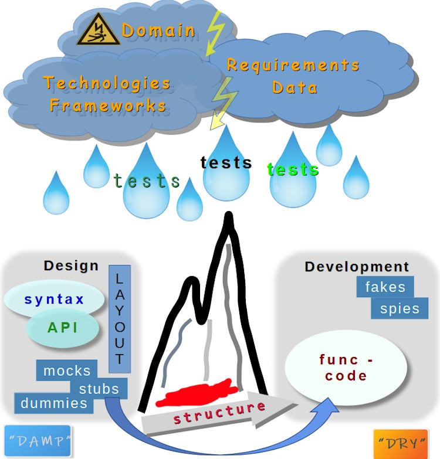
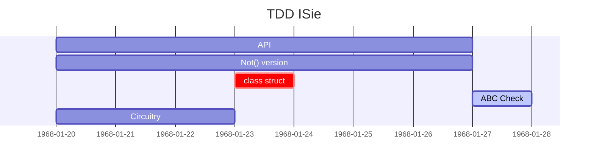

# Test Drive&nbsp;&nbsp;&rarr;&nbsp;&nbsp;Big Watershed

<table><tr valign="center"><td align="center">🌧️🌦️⛈️🌨️🌧️🌫️
<picture></picture>
   
rainy midsummer 2024

</td><td>
I was bicycling to hear a casual <b>TD<mark>D</mark></b> lecture as doubts crept in &mdash; where am I going:

   
Must this <mark><b>D</b></mark> be for <b><i>Design</i></b> or <b><i>Development</i></b>❓

It wasn't about the destination of this ride, but the principal divergence. 
For the record, the title of the lecture resonated with my anxiety:  "Failed with TDD? Here you know why."

Mystery solved: it was <a href="https://en.wikipedia.org/wiki/Test-driven_development">Test Driven <b>Development</b></a><b>w</b>.

   
<b>b&thinsp;u&thinsp;t ...

</td><td><picture></picture></td></tr></table>

The de-abbreviation raised another doubt: where's _Design_? &mdash; I actively searched by <kbd>**T&thinsp;D&thinsp;D**</kbd> and fairly retrospected the found&nbsp;...🙋 

Presentations and lectures favored _development_ with _design_ as a natural🌵 spin-off, not much bothering about distinction and some exploited both terms interchangeably. 
Books and tutorials showed up inclined to techniques, patterns, and testing frameworks.

Test-driven Development, fine for discourses, bootcamps, and `class`<samp>es</samp>, and encouraging to start features, didn't set forth for me to design just a mediocre project: hypothetical or tried.

&nbsp;&nbsp;&nbsp;&nbsp;🙋 Albeit being energetic in the recherche I couldn't go through the best part of treatises. There must be better findings, and there could be better alternating conclusions.\
&nbsp;&nbsp;&nbsp;&nbsp;🌵 <b>Natural</b> since any complete snippet can't escape design or must fit into the given.

<table align="center"><tr></tr><tr><td> &nbsp;&nbsp;&nbsp;<ins>&thinsp;
   The initial </ins><mark><b><code>O&thinsp;R</code></b></mark><ins>-question was answered first </ins><code><b>A&thinsp;N&thinsp;D</b></code><ins> and then refined to </ins><code><b>X&thinsp;O&thinsp;R</b></code><ins>
&thinsp;</ins>&nbsp;&nbsp;&nbsp; &nbsp;</td></tr></table>

<h2 align="center">Could I explain my shismatic take?</h2>

<ins><b>&nbsp;This shadow of doubt was from the <samp>RISING</samp>&nbsp;&nbsp;R&thinsp;I&thinsp;D&thinsp;G&thinsp;E, dividing syntax and implementation behind it&thinsp;:&nbsp;</b></ins>🖼️

&nbsp;

<picture></picture>

<!-- pic --!>
<!--                                               WATERSHED CANVAS        --!>
<!-- pic --!>

Design vs. Development are too dissimilar and contradictory to rotate on the same axis even admitting [evolutionary phenomenon](https://en.wikipedia.org/wiki/Continuous_design)<b>w</b>. 
Even if it's the same project and team, test tools/framework, and skills/techniques to write tests and implement code behind.

<table><tr><td width="50%" align="center"><b>🧪 Test ⚙️ DESIGN</b> <mark><b>Δ</b></mark> </td><td align="center">🧪 <b>Test</b> ⚙️ <b>DEVELOPMENT</b> <mark><b>δ</b></mark></td></tr><tr>
   <td>
<samp><b>W&thinsp;H&thinsp;A&thinsp;T&nbsp;&nbsp;t&thinsp;o&nbsp;&nbsp;d&thinsp;e&thinsp;v&thinsp;e&thinsp;l&thinsp;o&thinsp;p</b></samp>

   </td><td>
<samp><b>H&thinsp;O&thinsp;W&nbsp;&nbsp;t&thinsp;o&nbsp;&nbsp;i&thinsp;m&thinsp;p&thinsp;l&thinsp;e&thinsp;m&thinsp;e&thinsp;n&thinsp;t</b></samp></td></td>
</tr><tr valign="top"><td>
   <ul>
      <li><b>Grope</b> concepts and get a hands-on feeling on subjects🖋️</li>
      <li><b>Prototype</b> the vital funcaionality</li>
      <li><b>Couple</b> design fantasies with the tech-stack materiality</li>
      <li><b>Define</b> skeleton functionality to vitalize</li>
      <li><b>Evaluate</b> and pick patterns/templates and, in some cases, languages/platforms</li>
      <li><b>Discuss</b> ideas, naming, and logic with consultants, users, and other devs</li>
   </ul>
  
🖋️ all the same: API sketch, bookkeeping artifacts or superhero <i>ViewModel</i>

   </td><td>
   <ul>
      <li><b>Reality check</b> of design</li>
      <li>Estimate and if reasonable provide <b>alternatives</b> of functionality and libraries/framework</li>
      <li><b>Granulate</b> dev items and functions</li>
      <li> Fill design with <b>working</b> code and its alternatives</li>
      <li>Give continuous <b>feedback</b> on passes and bottlenecks</li>
      
___________

      
Feedback stitches are incredibly valuable to prevent Design and Dev come apart.

   </ul></td>
</tr>
         <!--             MODE: VOLATILE vs. FREEZE      --!>
<tr>
   <td align="center" colspan="2"><b>M&thinsp;o&thinsp;d&thinsp;e</b></td></tr><tr valign="top"><td>
<b>Volatile</b>

Design tests and code behind will inevitably come through iterations and breaking changes.

   
There's a chamber for creativity and experimentation but not hasty decisions (which will massively backlash).</p?
         </td><td>
<b>Freezing</b>

   
Efforts shall be oriented towards the working code.

 Imperfections, flaws, and locks can be prioritized and addressed later.

</td></tr>
         <!--              C O D E   B E H I N D     --!>
<tr>
   <td colspan="2" align="center"><b>"&thinsp;C&thinsp;o&thinsp;d&thinsp;e&nbsp;&nbsp;&nbsp;b&thinsp;e&thinsp;h&thinsp;i&thinsp;n&thinsp;d&thinsp;"</b></td></tr>
<tr valign="top"><td>

Define general <b>interfaces</b> and abstract classes and back them with test doubles.

   
Define non-functional markup/qualifier interfaces.

   
Write general entry routines as <i>builders</i>.

   
Any functional code "below the surface" can appear dead end and be erased later.

     </td><td>

Granulate <b>interfaces</b> and create "technical" interfaces and classes.

   
Implement interfaces and abstract classes.

   
Code classes and methods under strict guidelines (as public SOLID or <a href="https://github.com/Kyriosity/use-dev/tree/main/README+/frames">custom rules</a>).

</td></tr>
          <!--          TEST DOUBLES    --!>
<tr>
<td align="center" colspan="2"><b>T&thinsp;e&thinsp;s&thinsp;t&nbsp;&nbsp;&nbsp;&nbsp;d&thinsp;o&thinsp;u&thinsp;b&thinsp;l&thinsp;e&thinsp;s</b></td></tr>
<tr valign="top"><td>

Tests and the code behind them must intensively utilize all possible doubles (mocks, dummies, stubs) and ugly but fast implementation shortcuts (available in the language).

When design stabilizes these doubles will be development tasks: test-driven or not.

</td><td>
   
Shall implement test doubles sketched by design.

   
Use of new test double must be limited to indispensable (stubbing a remote service or unavailable data) and diagnose helpers (as spies).
</td>
</tr>
        <!--            CHECKLIST    -->
<tr>
<td align="center" colspan="2"><b>C&thinsp;h&thinsp;e&thinsp;c&thinsp;k&thinsp;l&thinsp;i&thinsp;s&thinsp;t</b></td></tr>
<tr valign="top"><td>
   
✔️&thinsp;Compilable syntax demos are enough.

✔️&thinsp;Non-compilable too &mdash; <a href="https://github.com/Kyriosity/use-dev/blob/main/README+/tests/README+/prog_tests-semantics.md#non-comp-calls">on purpose</a>.

      
✔️&thinsp;<b>Optional</b>: light backup functionality (like stubs covering <i>nulls</i>).

   
✔️&thinsp;Top logical categorization of tests

   
✔️&thinsp;Define contours of test data

   
_________

  
Tests (demos) can remain for guidance and serve as a documentation frame.
</td>
<td>
   
✔️&thinsp;Lay out test data

   
✔️&thinsp;Exact success and fail scenarios.

   
✔️&thinsp;Write tests for these scenarios with proper <a href="https://github.com/Kyriosity/use-dev/tree/main/README+/tests">techniques</a>

      
✔️&thinsp;Code implementation of tests.

✔️&thinsp;Categorization of implementation

✔️&thinsp;Blueprint of test coverage

   
_________

   
☑️<ins><b>&nbsp;Functioning parts of applications.&nbsp;</b></ins>

</td></tr>
           <!--            SO EASY?    --!>
<tr><td align="center" colspan="2"><h3>Is that so handy&thinsp;?</h3></td>
</tr>
       </table>
<!--          NOT SO EASY     --!>

___________ <b>HOLD ON ...</b> ___________

&nbsp;
   

<picture></picture>

We lined up two extremes above: API definition _vs._ coding.

In reality: besides development jobs, modeling attempts will reveal parallel or sub-level cascades of design tasks.

To make matters worse, an aerial photo of divergent ridges and contrеforts would even better represent drains of tasks.\
(But then I'd be the first to leave scarred this narrative because of overcomplexity.)

The course will also unveil tasks of higher or parallel level but they will be either enjoyable hassle or separate headaches.

\___________</b>

<h3 align="center">So sophisticated and idealistic? Neither!</h3>

<h2 id="TDD-ISie" align="center">Reconcile by example: TDD ⭐I&thinsp;S&thinsp;<samp>I&thinsp;E</samp>⭐</h2>

Let's take an [ISIe](https://github.com/Kyriosity/use-dev/tree/main/README%2B/parts/_ext/ISie) example, which started with designing and redesigning API builders.

       🚧🐝🚧 .. WORK IN PROGRESS .. 🚧🐝🚧

SPIN-OFFS: TESTS MULTIFEED

## Wrap up. Advantages

### Separation of duties

It needs no introduction but to stress a couple of points:

+ Match personal inclinations (even of a single person depending on mood).
+ Present the concept ASAP.
+ Adjust/swap layers of logic.

### Effective definitions of tasks and feedback

### Team practice

### Motivation to TDD

\___________
 
🔚 &nbsp;🌒 2024-2025  ... images: kyriosity ...

