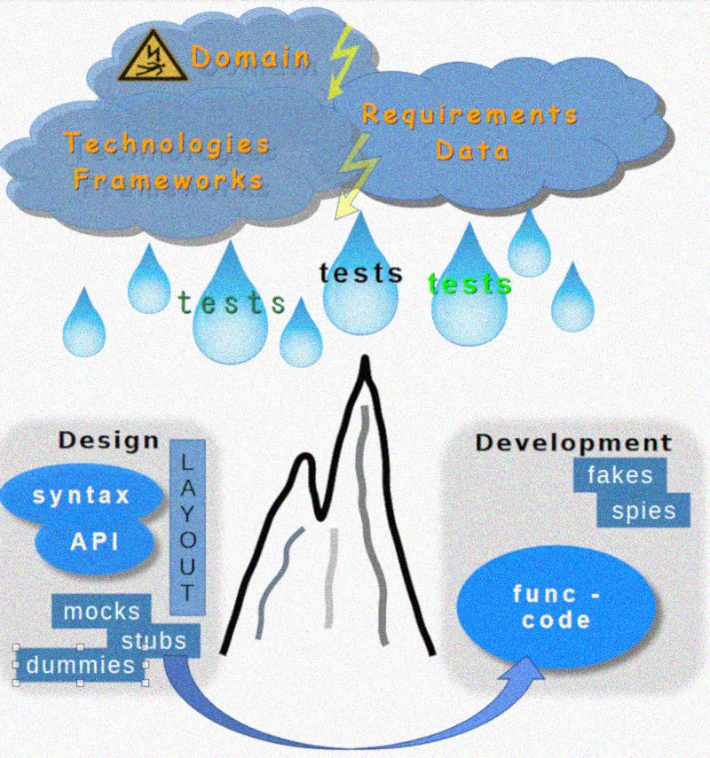

# Test Drive &mdash; Big Watershed

<table><tr valign="top"><td>
<picture></picture>    
</td><td>
On a rainy July day I was bicycling to  a random lecture on <b>TD<mark>D</mark></b> and a doubt crept in &mdash; where am I going:

   
Must this <mark><b>D</b></mark> be for <b><i>Design</i></b> or <b><i>Development</i></b>❓

It wasn't about the destination of this ride, but the principal divergence. 
For the record, the title of the lecture resonated with my anxiety:  "Failed with TDD? Here you know why."

 And yes, it was <a href="https://en.wikipedia.org/wiki/Test-driven_development">Test Driven <b>Development</b></a><b>w</b>.

</td></tr></table>

The de-abbreviation raised another doubt: where's _Design_? &mdash; I actively searched by <kbd>**T&thinsp;D&thinsp;D**</kbd> and fairly retrospected the found&nbsp;...

Presentations and lectures favored _development_ with design as a natural🌵 derivative, not much bothering about distinction and some even exploited both terms interchangeably. Books and tutorials inclined more toward techniques, patterns, and testing frameworks.

&nbsp;&nbsp;&nbsp;&nbsp;🙋 Albeit being energetic in the recherche I couldn't go through the best part of treatises. There must be better findings, and there could be better alternating conclusions.\
&nbsp;&nbsp;&nbsp;&nbsp;🌵 **Natural** since any complete snippet can't escape design or must fit into the given. 

EVOLUTIONARY AND THE KEY PROBLEM 
PARALLEL to ARC w/ LINK to ESSAY

However, TDD(development), which was fine for discourses, bootcamps, and `classes`, and encouraged to start features, didn't set forth for me to design just a mediocre project: hypothetical or tried.

The evolutionary design wasn't the answer too 

> The initial <mark>`OR`</mark>-question was answered first `AND` and then `XOR`.

## Could I explain my shismatic take?

<ins><b>&nbsp;This shadow of doubt was from the rising ridge, dividing syntax and implementation behind it:&nbsp;</b></ins>

<picture></picture>

### Test Driven Design

T⚙️DeS

Let's think of tests as a superb conductor (or proxy) of [design drives](../../) - domain, behavior, data, hardware model, whatsoever - to... 

+ grope concepts and get a hands-on feeling on subjects (all the same: bookkeeping artifacts or superhero _viewmodel_),
+ vitalize skeleton functionality, evaluate trends and risks,
+ couple design fantasies with the tech-stack materiality,
+ evaluate and pick more suited libraries, frameworks, and, in some cases, languages/platforms,
+ discuss ideas, naming, and logic with consultants and users.

> "Design tests" must define **what** to develop</ins>. 

These tests and the code behind them must intensively utilize doubles (mocks, dummies, stubs) and ugly but fast implementation shortcuts (possible in most languages). When procs get fixed contours and stabilize - these doubles may GRANULATE tasks for development: test-driven or not.

### Test Driven Development: T⚙️DeV

Use of the test double must be limited to indispensable (stubbing a remote service or unavailable data) and diagnose helpers (as spies).

### OVERLAP ?

There's no room for compromise: implementation before design will POOR the abstraction-poor !!!_Code Driven Design_!!!, which quality will degrade with complexity.

WHAT INTERCEPT's DOES NOT OVERLAP. WHAT COOPERATES do not DEPENDs

## Wrap up

What made matters worse was revealing that this ridge is among others on the design topology. This triggered the painful rewrite of much stuff, starting from ⚙️[drives](../../../../software/design/drive) **but** let's not get sidetracked for now.

SUBRIDGE

> These could be the same project and team, test tools/framework, and skills/techniques to write tests, but...\
>  **Design vs. Development are too dissimilar and contradictory to rotate on the same axis.**

This meditation revealed for me something more -- all TDD now being more BUZ than PRAXIS. BUT THIS IS COMPLETELY ANOTHER STORY.

## Appendix. Undo-Redo as case

<picture></picture>
[Reversible](https://github.com/Kyriosity/use-dev/tree/main/README+/projects/Rvrs)

FRAGMENTATION of ACTION (LONG PAINT)

<table><tr /><tr><td width=50%><b>T e s t ⚙️ <samp>D E S I G N</samp></b>&nbsp;&nbsp;&nbsp;(<b>T⚙️De<mark>S</mark></b>)</td>
  <td><b>T e s t ⚙️ <samp>D E V E L O P M E N T</samp></b>&nbsp;&nbsp;&nbsp;(<b>T⚙️De<mark>V</mark></b>)</td></tr><tr valign="top"><td>asdasdasd</td><td>
  Tests are the first strokes of code. Maybe experimental or even alternatives in miscellaneous languages and frameworks/libraries.
</td></tr></table>

 🔚 &nbsp;🌘 kyriosity 2024...
