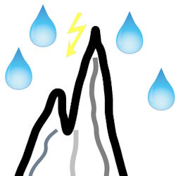

# Software Creation &mdash; Drives &mdash; Tests

<b>,TDD is easy .I started it over 100 times</b> <i>(.Mark Twain</i> would say)

The hypothesis to write tests not only _a posteriori_ to validate available and running code but also prior - to guide development - can be rooted back to the 1950s.👴\
&nbsp;&nbsp;&nbsp;&nbsp;👴 One of the best retrospectives is in [You won't believe how old TDD is](https://arialdomartini.wordpress.com/2012/07/20/you-wont-believe-how-old-tdd-is/)🔗.

**Tests make abstract matters tactile and feasible.** Simplicity and versatility make **TDD** superb for insight into fuzzy topics (almost any new application, novel development, or features). 

Tests are superconductors of design drives - domain, behavior, data, hardware model, - whatsoever.

Sorry to interrupt this idyll narrative but can't help speaking about the next branching:

<table align="center"><tr><td>
  
<ins>&thinsp;TEST DRIVEN <b>DESIGN</b>&thinsp;</ins>

   
<mark><b>&thinsp;What to develop&thinsp;</b></mark>

  
TD<b>Δ</b>&nbsp;&nbsp;&nbsp;TDDe<b>S</b>&nbsp;&nbsp;&nbsp;🧪⚙️<b>Δ</b>

</td><td><h3 align="center">
  <a href="README+/!TestDrive-Big_Watershed.md"><picture></picture> 
    <ins>&thinsp;T&thinsp;D&thinsp;D&nbsp;&nbsp;&nbsp;W&thinsp;A&thinsp;T&thinsp;E&thinsp;R&thinsp;S&thinsp;H&thinsp;E&thinsp;D&thinsp;</b></ins></a>
</h3>
  </td><td>
  
<ins>&thinsp;TEST DRIVEN <b>DEVELOPMENT</b>&thinsp;</ins>

    
<mark><b>&thinsp;How to implement&thinsp;</b></mark>

  
TD<b>d</b>&nbsp;&nbsp;&nbsp;TDDe<b>V</b>&nbsp;&nbsp;&nbsp;🧪⚙️<b>δ</b>

  </td></tr></table>

\___________\
🔚 🌙 2024-2025
